# trtutils

[](https://pypi.org/pypi/trtutils/)

[](https://www.codefactor.io/repository/github/justincdavis/trtutils)


A high-level Python interface for TensorRT inference, providing a simple and unified way to run arbitrary TensorRT engines. This library abstracts away the complexity of CUDA memory management, binding management, and engine execution, making it easy to perform inference with any TensorRT engine.

## Features

- Simple, high-level interface for TensorRT inference
- Automatic CUDA memory management, CUDA graphs, and pagelocked/unified memory
- Support for arbitrary TensorRT engines, on CUDA 11, 12, and 13 with the corresponding TensorRT versions
- Engine building from ONNX, including strongly typed, DLA, and quantized builds
- Ready-to-use image models: detection, classification, depth estimation, and hand-object interaction
- CPU, CUDA, and TensorRT preprocessing with built-in postprocessing
- Model download and ONNX export for many popular architectures
- Benchmarking, profiling, and NVTX instrumentation (with Jetson energy/power metrics)
- Comprehensive type hints and documentation

## Installation

trtutils does not pull in CUDA or TensorRT by itself, install the extra matching
your CUDA version:

```bash
# CUDA 13 / Jetpack 7
pip install "trtutils[cu13]"

# CUDA 12 / Jetpack 6
pip install "trtutils[cu12]"

# CUDA 11 / Jetpack 5
pip install "trtutils[cu11]"
```

On Jetson devices, TensorRT is provided by Jetpack, so use the matching `jp5`,
`jp6`, or `jp7` extra instead, which installs `cuda-python` only.

Additional extras:

```bash
# ONNX graph utilities used by the builder
pip install "trtutils[onnx]"

# Quantization CLI/API tools
pip install "trtutils[quantize]"

# SAHI (sliced inference) integration
pip install "trtutils[sahi]"

# Numba JIT acceleration for CPU operations
pip install "trtutils[jit]"

# Development
pip install "trtutils[dev]"
```

## Quick Start

### Basic Engine Usage

The `TRTEngine` class provides a simple interface for running any TensorRT engine:

```python
from trtutils import TRTEngine

# Load your TensorRT engine
engine = TRTEngine("path_to_engine")

# Get input specifications
print(engine.input_shapes)  # Expected input shapes
print(engine.input_dtypes)  # Expected input data types

# Run inference
inputs = read_your_data()
outputs = engine.execute(inputs)
```

### End-to-End Image Models

`Detector`, `Classifier`, `DepthEstimator`, and `HandInteractionDetector` bundle
preprocessing and postprocessing around an engine:

```python
import cv2

from trtutils.image import Detector

detector = Detector("yolov8n.engine", warmup=True, preprocessor="cuda")

image = cv2.imread("image.jpg")
bboxes = detector.end2end([image])[0]
```

### Command Line

```bash
# download a model and export to ONNX
python3 -m trtutils download --model yolov8n --output yolov8n.onnx

# build an engine
python3 -m trtutils build --onnx yolov8n.onnx --output yolov8n.engine --fp16

# benchmark it
python3 -m trtutils benchmark --engine yolov8n.engine --iterations 1000
```

See the [CLI reference](https://justincdavis.github.io/trtutils/cli.html) for
all commands (`benchmark`, `build`, `build_yolo`, `build_dla`, `quantize`,
`detect`, `classify`, `inspect`, `profile`, `download`, `trtexec`, and more).

## Supported Models

The models listed in the [documentation](https://justincdavis.github.io/trtutils/models.html) are officially supported for inference, including the YOLO family (v3, v5, v7 through v13, v26, YOLOX), DETR-based detectors (RT-DETR v1/v2/v3, D-FINE, DEIM, DEIMv2, RF-DETR), torchvision classifiers, DepthAnything V1/V2/V3, and HOI-DETR/Hands23.

## Documentation

For detailed documentation, including advanced usage, examples, and API reference, visit our [documentation site](https://justincdavis.github.io/trtutils/).

## Examples

Check out our [examples directory](examples/) for more detailed usage examples, including:
- Basic engine usage
- End-to-end image models (detection, classification, depth estimation)
- Engine building and quantization
- Benchmarking and profiling utilities

## Performance

| Device            | YOLOv8m                                                                 | YOLOv8n                                                                 |
|-------------------|-------------------------------------------------------------------------|-------------------------------------------------------------------------|
| OrinAGX-64GB      | 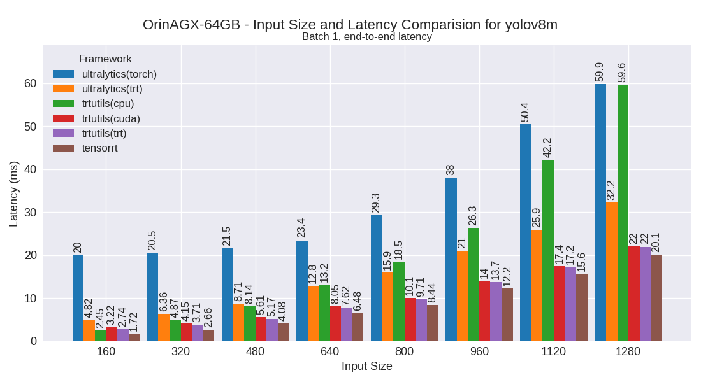       | 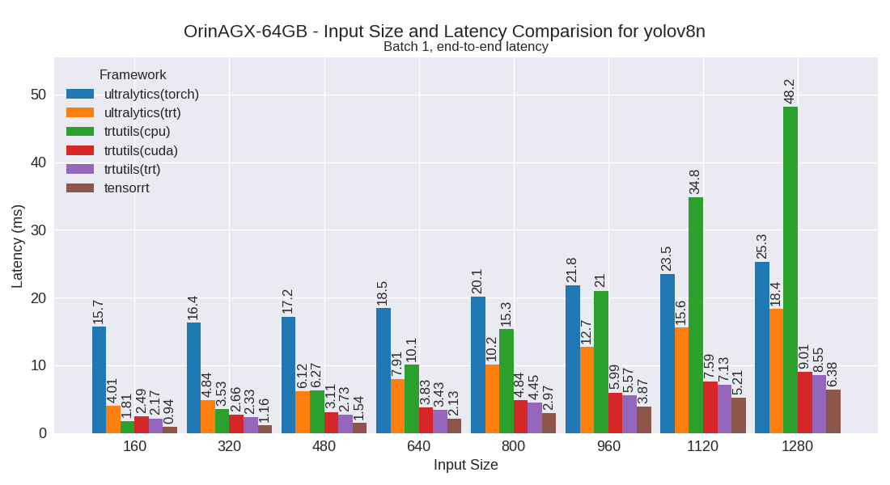       |
| OrinAGX-32GB      | 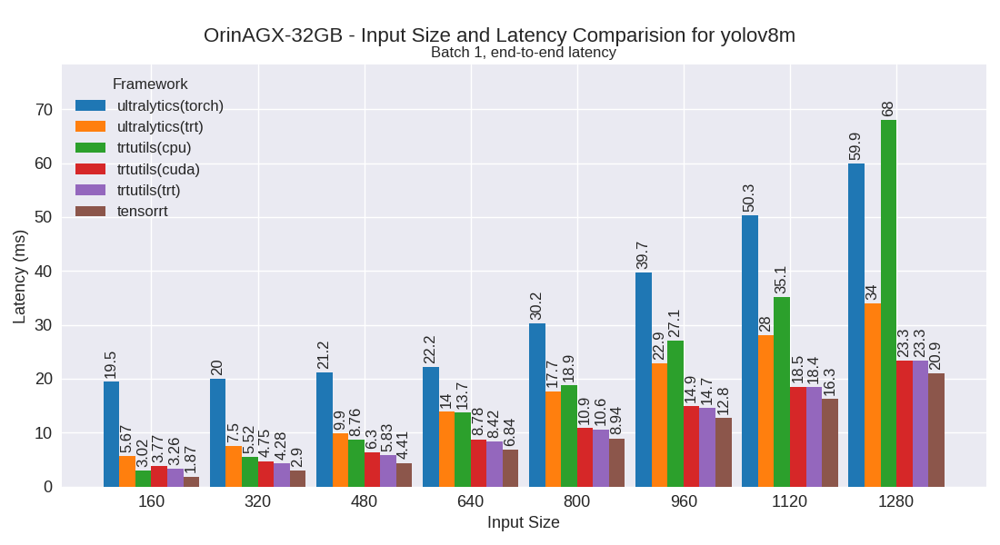       | 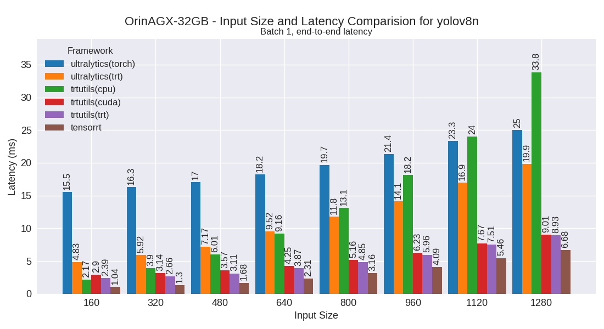       |
| OrinNX-16GB       | 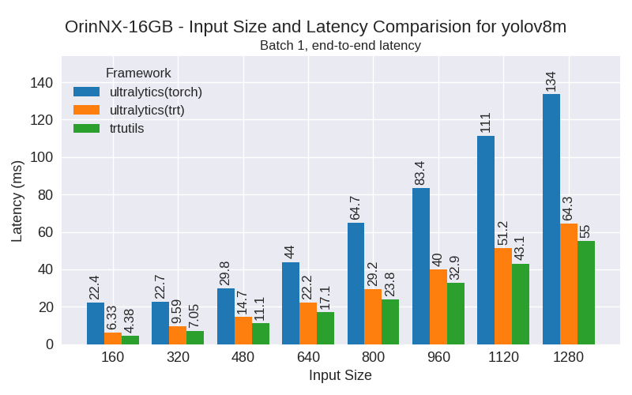         | 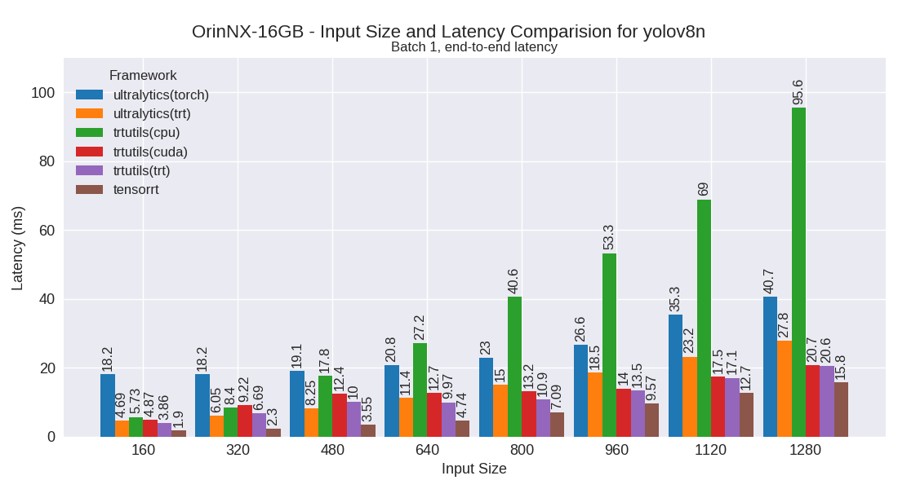        |
| OrinNano-8GB      | 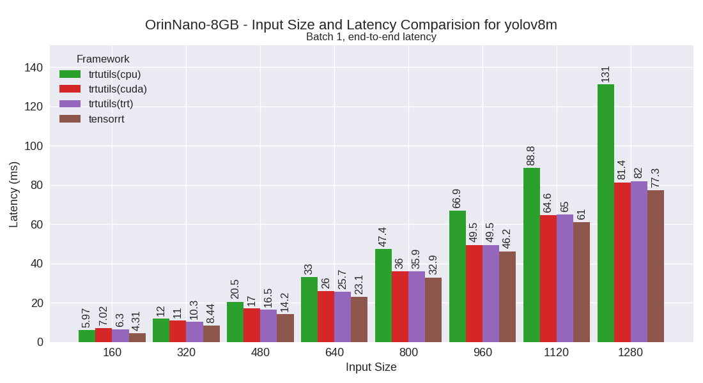       | 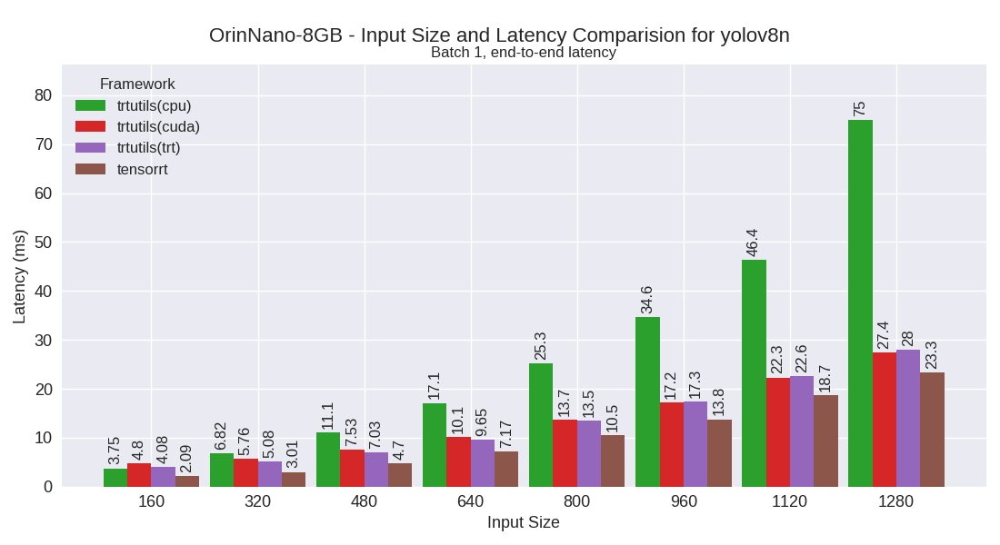       |
| XavierNX-8GB      | 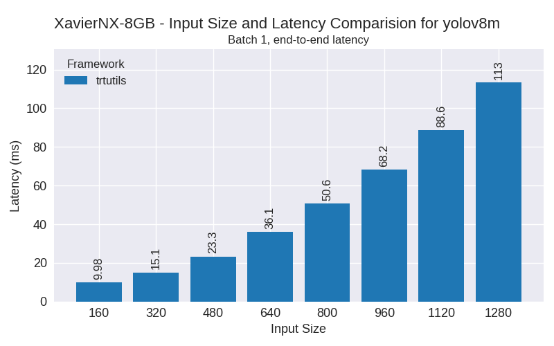       | 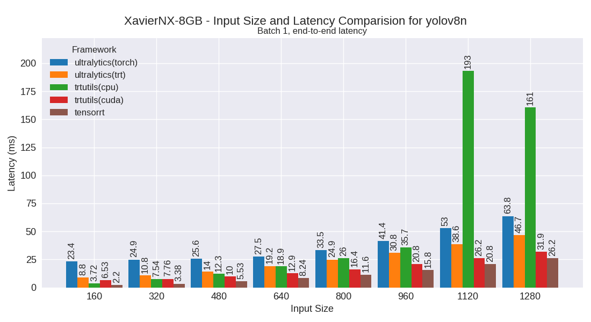       |
| 3090              | 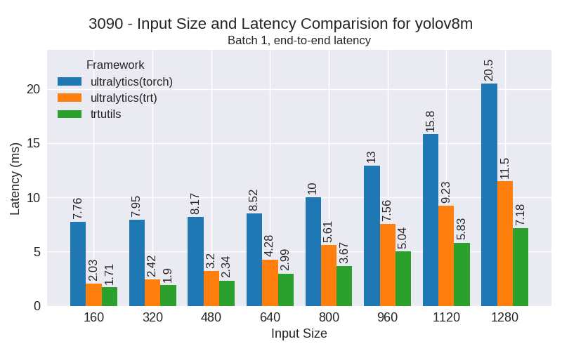                       | 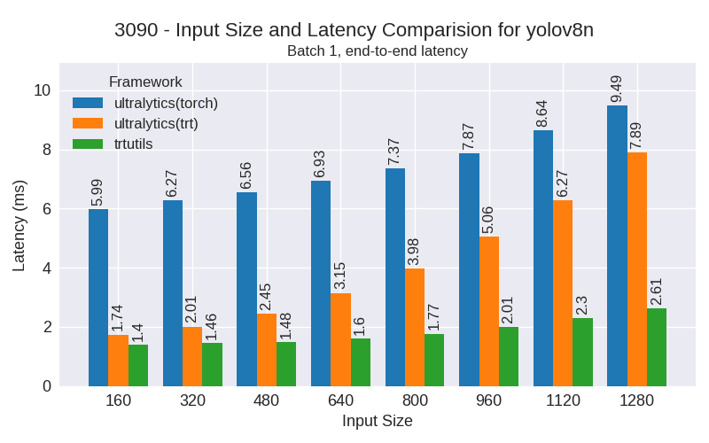                       |
| 3080Ti            | 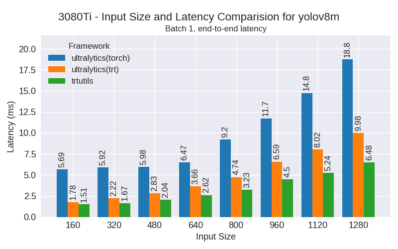                   | 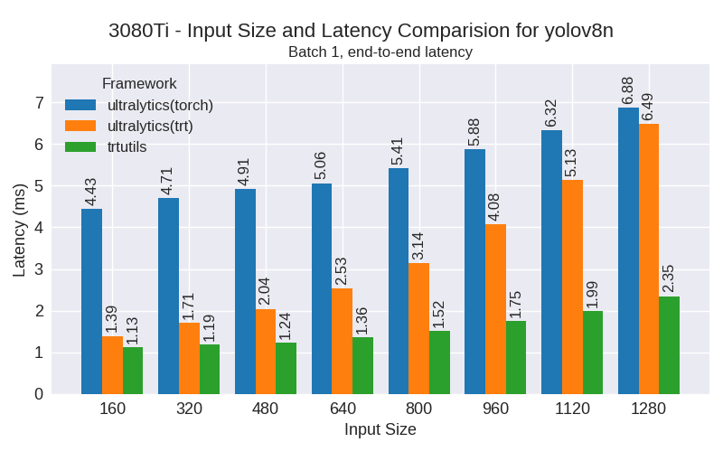                   |
| TitanRTX          | 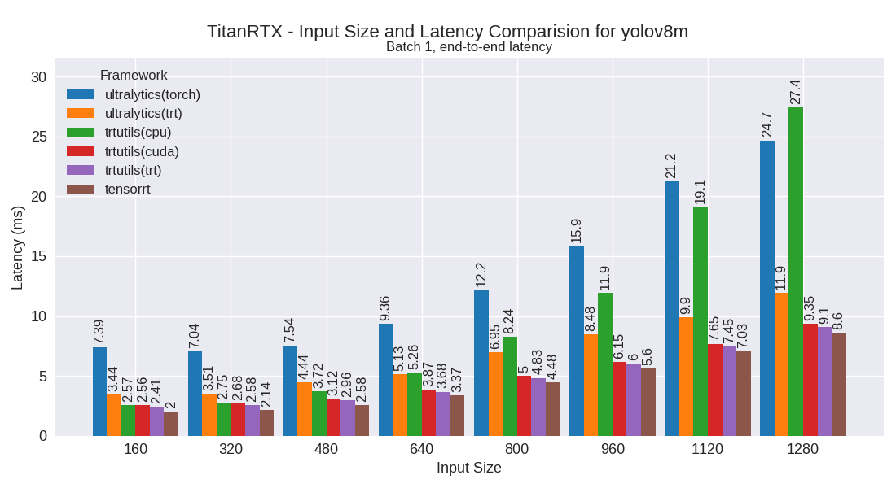               | 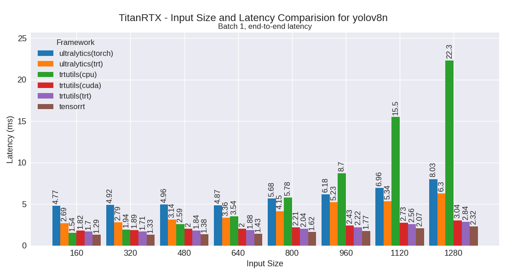               |

## License

This project is licensed under the MIT License - see the LICENSE file for details.
