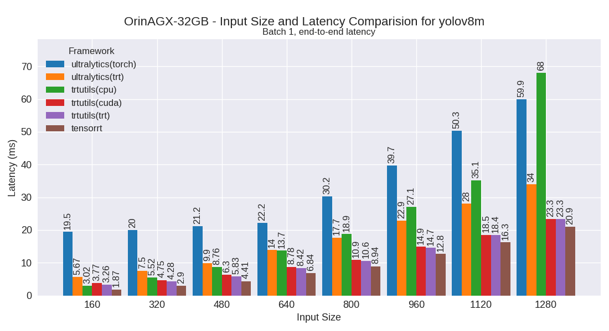
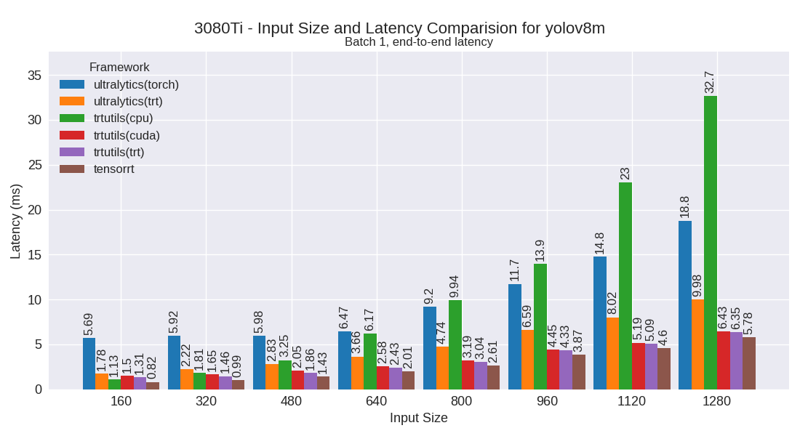
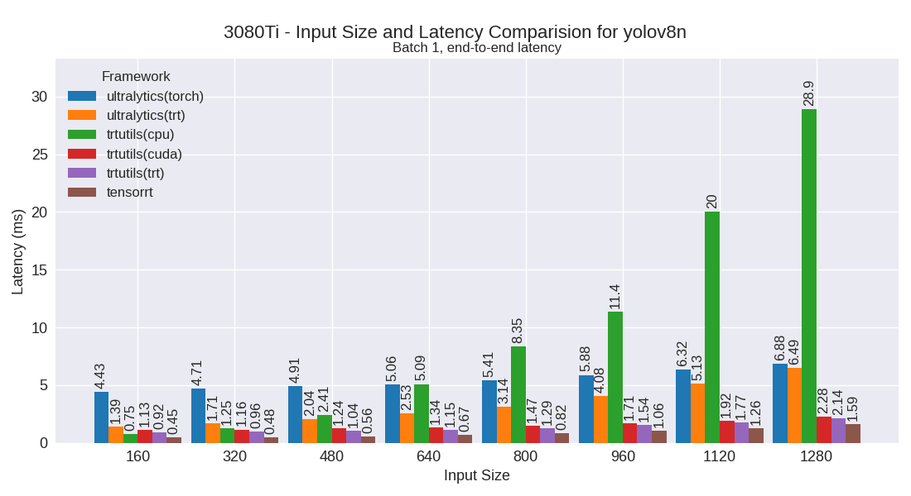

# trtutils

[](https://pypi.org/pypi/trtutils/)

[](https://www.codefactor.io/repository/github/justincdavis/trtutils)


<!--  -->

A high-level Python interface for TensorRT inference, providing a simple and unified way to run arbitrary TensorRT engines. This library abstracts away the complexity of CUDA memory management, binding management, and engine execution, making it easy to perform inference with any TensorRT engine.

## Features

- Simple, high-level interface for TensorRT inference
- Automatic CUDA memory management
- Support for arbitrary TensorRT engines
- Built-in preprocessing and postprocessing capabilities
- Comprehensive type hints and documentation
- Support for both basic engine execution and end-to-end model inference

## Quick Start

### Basic Engine Usage

The `TRTEngine` class provides a simple interface for running any TensorRT engine:

```python
from trtutils import TRTEngine

# Load your TensorRT engine
engine = TRTEngine("path_to_engine")

# Get input specifications
print(engine.input_shapes)  # Expected input shapes
print(engine.input_dtypes)  # Expected input data types

# Run inference
inputs = read_your_data()
outputs = engine.execute(inputs)
```

## Installation

```bash
pip install trtutils
```

For additional features, you can install optional dependencies:

```bash
# For JIT compiler
pip install "trtutils[jit]"

# For development
pip install "trtutils[dev]"
```

## Documentation

For detailed documentation, including advanced usage, examples, and API reference, visit our [documentation site](https://trtutils.readthedocs.io/).

## Examples

Check out our [examples directory](examples/) for more detailed usage examples, including:
- Basic engine usage
- End-to-end model inference
- YOLO model implementation
- Benchmarking utilities

## Performance

| Device            | YOLOv8m                                                                 | YOLOv8n                                                                 |
|-------------------|-------------------------------------------------------------------------|-------------------------------------------------------------------------|
| OrinAGX-64GB      |        |        |
| OrinAGX-32GB      |        |        |
| OrinNX-16GB       |          |         |
| OrinNano-8GB      |        |        |
| XavierNX-8GB      |        |        |
| 3080Ti            |                    |                    |
| TitanRTX          |                |                |

## License

This project is licensed under the MIT License - see the LICENSE file for details.
