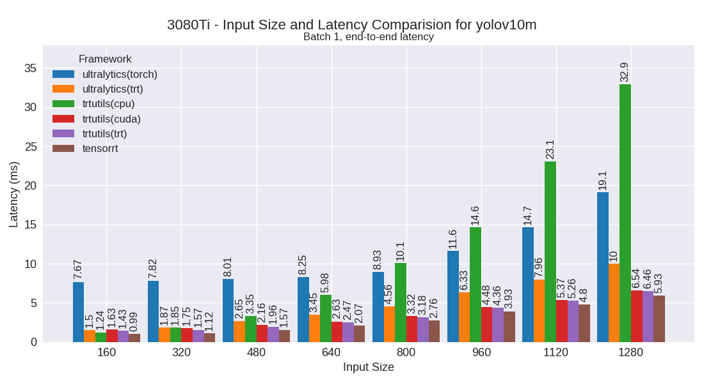
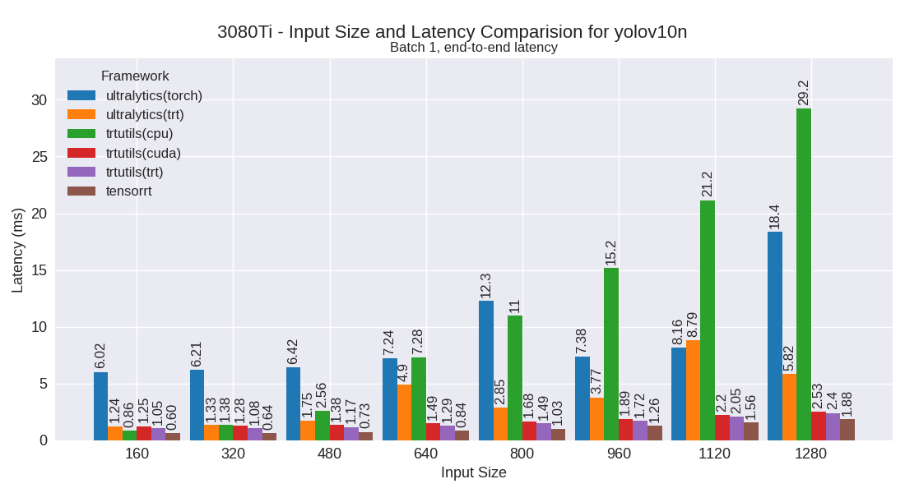
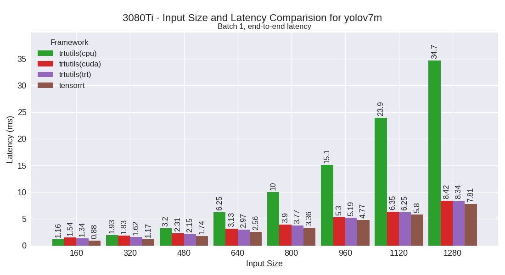
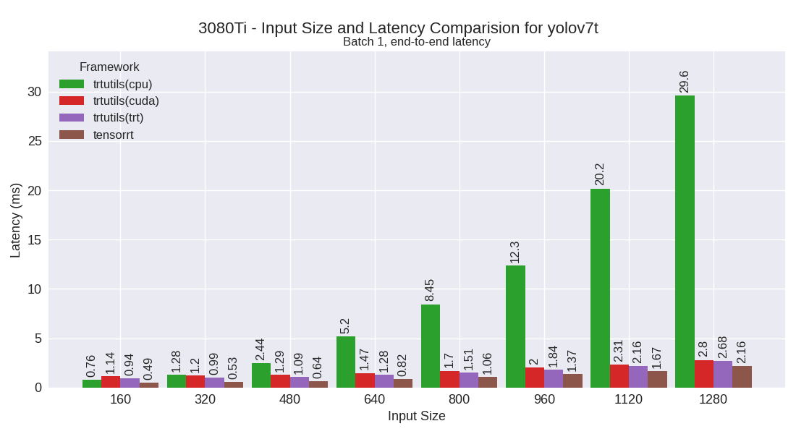
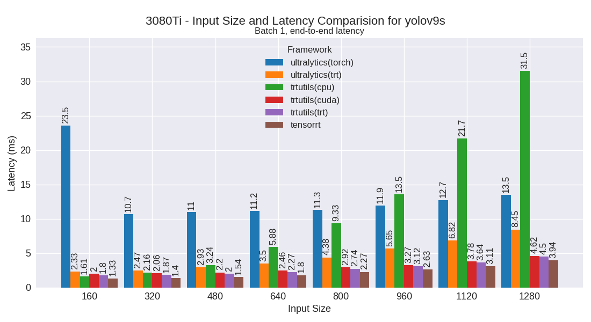

3080Ti
======

3080Ti in a workstation with Intel 12900K CPU

This section contains benchmarking results for various YOLO models on the 3080Ti platform.

Performance Plots
-----------------

The following plots show the performance comparison between different YOLO models and frameworks:

yolov10m
~~~~~~~~

yolov10n
~~~~~~~~

yolov10s
~~~~~~~~

yolov7m
~~~~~~~~

yolov7t
~~~~~~~~

yolov8m
~~~~~~~~

.. image:: ../../benchmark/plots/3080Ti/yolov8m.png
   :alt: yolov8m performance plot
   :align: center

yolov8n
~~~~~~~~

.. image:: ../../benchmark/plots/3080Ti/yolov8n.png
   :alt: yolov8n performance plot
   :align: center

yolov8s
~~~~~~~~

yolov9m
~~~~~~~~

.. image:: ../../benchmark/plots/3080Ti/yolov9m.png
   :alt: yolov9m performance plot
   :align: center

yolov9s
~~~~~~~~

yolov9t
~~~~~~~~

yoloxm
~~~~~~~~

yoloxn
~~~~~~~~

yoloxs
~~~~~~~~

yoloxt
~~~~~~~~

Performance Table
-----------------

The following table shows detailed performance metrics for all tested models:

.. csv-table:: Performance Metrics
   :header: Framework,Model,Input Size,Mean (ms),Median (ms),Min (ms),Max (ms)
   :widths: 10,10,10,10,10,10,10

   trtutils,yolov10n,160,1.3,1.3,1.2,1.7
   trtutils,yolov10n,320,1.3,1.3,1.3,1.5
   trtutils,yolov10n,480,1.4,1.4,1.4,1.6
   trtutils,yolov10n,640,1.5,1.5,1.5,1.8
   trtutils,yolov10n,800,1.7,1.7,1.7,2.0
   trtutils,yolov10n,960,2.0,2.0,1.9,2.2
   trtutils,yolov10n,1120,2.3,2.3,2.3,2.5
   trtutils,yolov10n,1280,2.7,2.7,2.6,2.9
   trtutils,yolov10s,160,1.3,1.3,1.3,1.7
   trtutils,yolov10s,320,1.4,1.4,1.4,7.5
   trtutils,yolov10s,480,1.6,1.6,1.6,1.8
   trtutils,yolov10s,640,1.8,1.8,1.8,2.2
   trtutils,yolov10s,800,2.2,2.2,2.2,2.4
   trtutils,yolov10s,960,2.7,2.7,2.6,2.8
   trtutils,yolov10s,1120,3.2,3.2,3.1,3.4
   trtutils,yolov10s,1280,4.0,4.0,3.8,4.1
   trtutils,yolov10m,160,1.6,1.6,1.6,2.0
   trtutils,yolov10m,320,1.8,1.8,1.7,2.0
   trtutils,yolov10m,480,2.2,2.2,2.1,2.3
   trtutils,yolov10m,640,2.6,2.6,2.6,2.9
   trtutils,yolov10m,800,3.3,3.3,3.2,3.5
   trtutils,yolov10m,960,4.5,4.5,4.2,4.9
   trtutils,yolov10m,1120,5.4,5.4,5.1,5.6
   trtutils,yolov10m,1280,6.6,6.6,6.0,6.9
   trtutils,yolov9t,160,1.9,1.9,1.9,2.3
   trtutils,yolov9t,320,2.0,2.0,2.0,2.2
   trtutils,yolov9t,480,2.2,2.2,2.1,3.0
   trtutils,yolov9t,640,2.2,2.2,2.1,2.5
   trtutils,yolov9t,800,2.4,2.3,2.3,2.6
   trtutils,yolov9t,960,2.8,2.7,2.6,4.1
   trtutils,yolov9t,1120,3.4,3.4,3.0,4.5
   trtutils,yolov9t,1280,3.7,3.7,3.4,5.0
   trtutils,yolov9s,160,2.0,2.0,2.0,2.3
   trtutils,yolov9s,320,2.1,2.1,2.1,2.3
   trtutils,yolov9s,480,2.2,2.2,2.2,2.4
   trtutils,yolov9s,640,4.7,4.6,3.7,6.7
   trtutils,yolov9s,800,3.4,3.1,2.9,5.9
   trtutils,yolov9s,960,3.4,3.4,3.3,3.5
   trtutils,yolov9s,1120,3.9,3.9,3.7,4.0
   trtutils,yolov9s,1280,5.8,5.8,5.0,6.6
   trtutils,yolov9m,160,1.9,1.9,1.9,2.3
   trtutils,yolov9m,320,2.2,2.1,2.1,2.5
   trtutils,yolov9m,480,2.6,2.6,2.5,2.9
   trtutils,yolov9m,640,3.3,3.3,3.2,3.5
   trtutils,yolov9m,800,4.1,4.0,3.9,4.2
   trtutils,yolov9m,960,5.3,5.3,4.9,5.5
   trtutils,yolov9m,1120,6.3,6.3,5.8,6.6
   trtutils,yolov9m,1280,8.0,8.0,7.2,8.3
   trtutils,yolov8n,160,1.1,1.1,1.1,1.5
   trtutils,yolov8n,320,1.2,1.2,1.2,1.5
   trtutils,yolov8n,480,1.2,1.2,1.2,1.4
   trtutils,yolov8n,640,1.4,1.4,1.3,1.6
   trtutils,yolov8n,800,1.5,1.5,1.5,1.8
   trtutils,yolov8n,960,1.8,1.8,1.7,2.0
   trtutils,yolov8n,1120,2.0,2.0,2.0,2.2
   trtutils,yolov8n,1280,2.3,2.3,2.3,2.6
   trtutils,yolov8s,160,1.2,1.2,1.2,1.5
   trtutils,yolov8s,320,1.3,1.3,1.3,1.5
   trtutils,yolov8s,480,1.5,1.5,1.4,1.7
   trtutils,yolov8s,640,1.7,1.7,1.7,2.0
   trtutils,yolov8s,800,2.0,2.0,1.9,2.2
   trtutils,yolov8s,960,2.4,2.4,2.3,2.6
   trtutils,yolov8s,1120,2.8,2.8,2.7,3.0
   trtutils,yolov8s,1280,3.6,3.6,3.4,3.8
   trtutils,yolov8m,160,1.5,1.5,1.5,1.8
   trtutils,yolov8m,320,1.7,1.7,1.6,1.9
   trtutils,yolov8m,480,2.0,2.0,2.0,2.2
   trtutils,yolov8m,640,2.6,2.6,2.5,2.8
   trtutils,yolov8m,800,3.2,3.2,3.1,3.4
   trtutils,yolov8m,960,4.5,4.5,4.2,4.7
   trtutils,yolov8m,1120,5.2,5.2,4.8,5.4
   trtutils,yolov8m,1280,6.5,6.5,5.8,6.7
   trtutils,yolov7t,160,1.2,1.1,1.1,1.6
   trtutils,yolov7t,320,1.2,1.2,1.2,1.5
   trtutils,yolov7t,480,1.3,1.3,1.3,1.6
   trtutils,yolov7t,640,1.5,1.5,1.5,1.8
   trtutils,yolov7t,800,1.7,1.7,1.7,2.0
   trtutils,yolov7t,960,2.1,2.1,2.0,2.3
   trtutils,yolov7t,1120,2.4,2.4,2.3,2.6
   trtutils,yolov7t,1280,2.9,2.9,2.8,3.1
   trtutils,yolov7m,160,1.5,1.5,1.5,1.8
   trtutils,yolov7m,320,1.8,1.8,1.8,2.0
   trtutils,yolov7m,480,2.3,2.3,2.3,2.5
   trtutils,yolov7m,640,3.2,3.2,3.0,3.4
   trtutils,yolov7m,800,3.9,3.9,3.7,4.1
   trtutils,yolov7m,960,5.4,5.4,4.9,5.8
   trtutils,yolov7m,1120,6.5,6.5,5.8,6.8
   trtutils,yolov7m,1280,8.6,8.6,7.7,9.1
   trtutils,yoloxt,160,1.2,1.2,1.2,1.5
   trtutils,yoloxt,320,1.3,1.3,1.3,1.6
   trtutils,yoloxt,480,1.6,1.6,1.6,1.8
   trtutils,yoloxt,640,2.0,2.0,1.9,2.2
   trtutils,yoloxt,800,2.5,2.5,2.4,2.8
   trtutils,yoloxt,960,3.1,3.1,3.1,3.4
   trtutils,yoloxt,1120,3.7,3.7,3.7,4.1
   trtutils,yoloxt,1280,4.6,4.6,4.6,4.9
   trtutils,yoloxn,160,1.2,1.2,1.2,1.5
   trtutils,yoloxn,320,1.3,1.3,1.3,2.0
   trtutils,yoloxn,480,1.6,1.6,1.5,1.8
   trtutils,yoloxn,640,1.9,1.9,1.9,2.2
   trtutils,yoloxn,800,2.3,2.3,2.3,2.7
   trtutils,yoloxn,960,2.9,2.9,2.8,3.2
   trtutils,yoloxn,1120,3.4,3.4,3.4,3.8
   trtutils,yoloxn,1280,4.2,4.2,4.1,4.5
   trtutils,yoloxs,160,1.2,1.2,1.2,1.5
   trtutils,yoloxs,320,1.4,1.4,1.3,1.7
   trtutils,yoloxs,480,1.7,1.7,1.6,1.8
   trtutils,yoloxs,640,2.1,2.1,2.1,2.4
   trtutils,yoloxs,800,2.6,2.6,2.6,2.9
   trtutils,yoloxs,960,3.3,3.3,3.3,3.6
   trtutils,yoloxs,1120,4.0,4.0,4.0,4.4
   trtutils,yoloxs,1280,5.2,5.2,5.1,5.4
   trtutils,yoloxm,160,1.5,1.5,1.4,2.1
   trtutils,yoloxm,320,1.7,1.7,1.7,2.0
   trtutils,yoloxm,480,2.2,2.2,2.2,2.4
   trtutils,yoloxm,640,2.8,2.8,2.8,3.0
   trtutils,yoloxm,800,3.7,3.7,3.7,4.1
   trtutils,yoloxm,960,5.2,5.2,5.1,5.4
   trtutils,yoloxm,1120,6.2,6.2,6.0,6.4
   trtutils,yoloxm,1280,7.6,7.6,7.3,7.8
   ultralytics(trt),yolov10n,160,1.2,1.2,1.2,1.4
   ultralytics(trt),yolov10n,320,1.3,1.3,1.3,1.5
   ultralytics(trt),yolov10n,480,1.7,1.7,1.7,1.9
   ultralytics(trt),yolov10n,640,4.9,4.7,4.2,6.8
   ultralytics(trt),yolov10n,800,2.9,2.8,2.8,3.0
   ultralytics(trt),yolov10n,960,3.8,3.7,3.6,5.8
   ultralytics(trt),yolov10n,1120,8.8,8.5,7.3,17.2
   ultralytics(trt),yolov10n,1280,5.8,5.8,5.8,5.9
   ultralytics(trt),yolov10s,160,1.2,1.2,1.2,1.3
   ultralytics(trt),yolov10s,320,1.5,1.5,1.5,1.6
   ultralytics(trt),yolov10s,480,2.1,2.1,2.0,2.3
   ultralytics(trt),yolov10s,640,2.7,2.7,2.7,2.9
   ultralytics(trt),yolov10s,800,3.5,3.5,3.4,4.0
   ultralytics(trt),yolov10s,960,4.5,4.5,4.5,4.9
   ultralytics(trt),yolov10s,1120,5.8,5.8,5.7,6.1
   ultralytics(trt),yolov10s,1280,7.5,7.5,7.4,7.8
   ultralytics(trt),yolov10m,160,1.5,1.5,1.5,1.6
   ultralytics(trt),yolov10m,320,1.9,1.9,1.8,2.0
   ultralytics(trt),yolov10m,480,2.6,2.6,2.6,2.7
   ultralytics(trt),yolov10m,640,3.4,3.4,3.4,3.5
   ultralytics(trt),yolov10m,800,4.6,4.6,4.5,4.8
   ultralytics(trt),yolov10m,960,6.3,6.3,6.3,7.0
   ultralytics(trt),yolov10m,1120,8.0,8.0,7.9,8.4
   ultralytics(trt),yolov10m,1280,10.0,10.0,9.9,10.3
   ultralytics(trt),yolov9t,160,2.1,2.1,2.0,2.2
   ultralytics(trt),yolov9t,320,2.3,2.3,2.3,2.6
   ultralytics(trt),yolov9t,480,2.7,2.7,2.7,3.2
   ultralytics(trt),yolov9t,640,3.2,3.2,3.2,3.6
   ultralytics(trt),yolov9t,800,4.0,4.0,3.9,5.5
   ultralytics(trt),yolov9t,960,5.0,4.9,4.9,5.8
   ultralytics(trt),yolov9t,1120,6.2,6.2,6.1,7.1
   ultralytics(trt),yolov9t,1280,7.6,7.6,7.5,8.6
   ultralytics(trt),yolov9s,160,2.3,2.3,2.3,2.5
   ultralytics(trt),yolov9s,320,2.5,2.5,2.4,2.6
   ultralytics(trt),yolov9s,480,2.9,2.9,2.9,3.0
   ultralytics(trt),yolov9s,640,3.5,3.5,3.4,3.6
   ultralytics(trt),yolov9s,800,4.4,4.4,4.3,4.8
   ultralytics(trt),yolov9s,960,5.7,5.6,5.6,5.8
   ultralytics(trt),yolov9s,1120,6.8,6.8,6.7,7.1
   ultralytics(trt),yolov9s,1280,8.5,8.4,8.3,8.7
   ultralytics(trt),yolov9m,160,2.1,2.1,2.0,2.2
   ultralytics(trt),yolov9m,320,2.5,2.5,2.5,2.7
   ultralytics(trt),yolov9m,480,3.3,3.3,3.2,3.4
   ultralytics(trt),yolov9m,640,4.2,4.2,4.1,4.3
   ultralytics(trt),yolov9m,800,5.4,5.4,5.3,5.6
   ultralytics(trt),yolov9m,960,7.1,7.1,7.0,7.3
   ultralytics(trt),yolov9m,1120,9.1,9.1,9.0,9.3
   ultralytics(trt),yolov9m,1280,11.4,11.4,11.2,11.8
   ultralytics(trt),yolov8n,160,1.4,1.4,1.4,1.5
   ultralytics(trt),yolov8n,320,1.7,1.7,1.7,1.8
   ultralytics(trt),yolov8n,480,2.0,2.0,2.0,2.5
   ultralytics(trt),yolov8n,640,2.5,2.5,2.5,2.9
   ultralytics(trt),yolov8n,800,3.1,3.1,3.1,3.3
   ultralytics(trt),yolov8n,960,4.1,4.1,4.0,4.2
   ultralytics(trt),yolov8n,1120,5.1,5.1,5.1,5.3
   ultralytics(trt),yolov8n,1280,6.5,6.5,6.4,6.6
   ultralytics(trt),yolov8s,160,1.5,1.5,1.4,1.6
   ultralytics(trt),yolov8s,320,1.8,1.8,1.8,1.8
   ultralytics(trt),yolov8s,480,2.2,2.2,2.2,2.3
   ultralytics(trt),yolov8s,640,2.8,2.8,2.8,2.9
   ultralytics(trt),yolov8s,800,3.5,3.5,3.5,3.6
   ultralytics(trt),yolov8s,960,4.7,4.7,4.6,5.0
   ultralytics(trt),yolov8s,1120,5.8,5.8,5.7,6.1
   ultralytics(trt),yolov8s,1280,7.5,7.5,7.4,7.8
   ultralytics(trt),yolov8m,160,1.8,1.8,1.8,1.9
   ultralytics(trt),yolov8m,320,2.2,2.2,2.2,2.4
   ultralytics(trt),yolov8m,480,2.8,2.8,2.8,2.9
   ultralytics(trt),yolov8m,640,3.7,3.7,3.6,3.9
   ultralytics(trt),yolov8m,800,4.7,4.7,4.7,5.0
   ultralytics(trt),yolov8m,960,6.6,6.6,6.5,6.9
   ultralytics(trt),yolov8m,1120,8.0,8.0,7.9,8.3
   ultralytics(trt),yolov8m,1280,10.0,10.0,9.9,10.3
   ultralytics(torch),yolov10n,160,6.0,5.9,5.9,6.7
   ultralytics(torch),yolov10n,320,6.2,6.2,6.2,6.4
   ultralytics(torch),yolov10n,480,6.4,6.4,6.4,6.5
   ultralytics(torch),yolov10n,640,7.2,7.3,6.8,10.5
   ultralytics(torch),yolov10n,800,12.3,14.2,7.2,17.8
   ultralytics(torch),yolov10n,960,7.4,7.4,7.3,7.7
   ultralytics(torch),yolov10n,1120,8.2,8.1,7.8,10.9
   ultralytics(torch),yolov10n,1280,18.4,18.5,14.1,46.2
   ultralytics(torch),yolov10s,160,6.2,6.2,6.2,6.5
   ultralytics(torch),yolov10s,320,6.5,6.5,6.5,6.6
   ultralytics(torch),yolov10s,480,6.8,6.7,6.6,8.4
   ultralytics(torch),yolov10s,640,6.9,6.9,6.8,7.5
   ultralytics(torch),yolov10s,800,7.4,7.4,7.3,7.6
   ultralytics(torch),yolov10s,960,8.1,8.0,7.8,12.4
   ultralytics(torch),yolov10s,1120,8.6,8.6,8.6,9.1
   ultralytics(torch),yolov10s,1280,10.4,10.4,10.3,10.5
   ultralytics(torch),yolov10m,160,7.7,7.7,7.6,8.2
   ultralytics(torch),yolov10m,320,7.8,7.8,7.7,8.5
   ultralytics(torch),yolov10m,480,8.0,8.0,7.9,8.3
   ultralytics(torch),yolov10m,640,8.3,8.3,8.1,8.6
   ultralytics(torch),yolov10m,800,8.9,8.9,8.8,9.1
   ultralytics(torch),yolov10m,960,11.6,11.6,11.5,11.9
   ultralytics(torch),yolov10m,1120,14.7,14.7,14.5,15.1
   ultralytics(torch),yolov10m,1280,19.1,19.1,18.9,21.1
   ultralytics(torch),yolov9t,160,11.0,10.8,9.9,12.6
   ultralytics(torch),yolov9t,320,10.0,10.0,9.7,10.8
   ultralytics(torch),yolov9t,480,10.2,10.1,10.0,11.5
   ultralytics(torch),yolov9t,640,10.3,10.3,10.2,11.2
   ultralytics(torch),yolov9t,800,11.0,10.9,10.7,12.3
   ultralytics(torch),yolov9t,960,11.6,11.5,11.4,13.1
   ultralytics(torch),yolov9t,1120,25.2,26.5,12.5,30.5
   ultralytics(torch),yolov9t,1280,13.1,13.0,12.9,14.7
   ultralytics(torch),yolov9s,160,23.5,23.6,16.6,31.7
   ultralytics(torch),yolov9s,320,10.7,10.6,10.5,13.3
   ultralytics(torch),yolov9s,480,11.0,11.0,10.8,11.3
   ultralytics(torch),yolov9s,640,11.2,11.1,11.0,11.8
   ultralytics(torch),yolov9s,800,11.3,11.3,11.2,12.3
   ultralytics(torch),yolov9s,960,11.9,11.9,11.8,12.3
   ultralytics(torch),yolov9s,1120,12.7,12.7,12.6,13.2
   ultralytics(torch),yolov9s,1280,13.5,13.4,13.3,14.0
   ultralytics(torch),yolov9m,160,8.7,8.7,8.6,9.4
   ultralytics(torch),yolov9m,320,8.9,8.9,8.8,9.5
   ultralytics(torch),yolov9m,480,9.1,9.1,9.0,10.1
   ultralytics(torch),yolov9m,640,9.3,9.3,9.1,9.8
   ultralytics(torch),yolov9m,800,10.4,10.4,10.4,11.2
   ultralytics(torch),yolov9m,960,13.3,13.3,13.2,13.7
   ultralytics(torch),yolov9m,1120,16.3,16.3,16.1,16.6
   ultralytics(torch),yolov9m,1280,21.7,21.7,21.4,23.5
   ultralytics(torch),yolov8n,160,4.4,4.4,4.4,4.8
   ultralytics(torch),yolov8n,320,4.7,4.7,4.7,4.8
   ultralytics(torch),yolov8n,480,4.9,4.9,4.9,5.5
   ultralytics(torch),yolov8n,640,5.1,5.1,5.0,5.1
   ultralytics(torch),yolov8n,800,5.4,5.4,5.4,5.6
   ultralytics(torch),yolov8n,960,5.9,5.9,5.8,6.4
   ultralytics(torch),yolov8n,1120,6.3,6.3,6.2,6.7
   ultralytics(torch),yolov8n,1280,6.9,6.9,6.8,7.1
   ultralytics(torch),yolov8s,160,4.6,4.6,4.5,4.9
   ultralytics(torch),yolov8s,320,4.9,4.9,4.8,5.2
   ultralytics(torch),yolov8s,480,5.0,5.0,4.9,5.7
   ultralytics(torch),yolov8s,640,5.1,5.1,5.1,5.3
   ultralytics(torch),yolov8s,800,5.5,5.5,5.4,5.6
   ultralytics(torch),yolov8s,960,6.1,6.1,6.0,6.3
   ultralytics(torch),yolov8s,1120,8.0,8.0,7.9,8.4
   ultralytics(torch),yolov8s,1280,9.3,9.3,9.2,9.6
   ultralytics(torch),yolov8m,160,5.7,5.7,5.6,6.2
   ultralytics(torch),yolov8m,320,5.9,5.9,5.9,6.3
   ultralytics(torch),yolov8m,480,6.0,6.0,5.9,6.3
   ultralytics(torch),yolov8m,640,6.5,6.5,6.4,7.0
   ultralytics(torch),yolov8m,800,9.2,9.2,9.1,9.6
   ultralytics(torch),yolov8m,960,11.7,11.7,11.6,11.9
   ultralytics(torch),yolov8m,1120,14.8,14.8,14.6,15.2
   ultralytics(torch),yolov8m,1280,18.8,18.8,18.6,19.1
