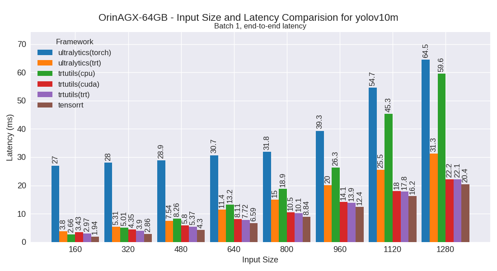
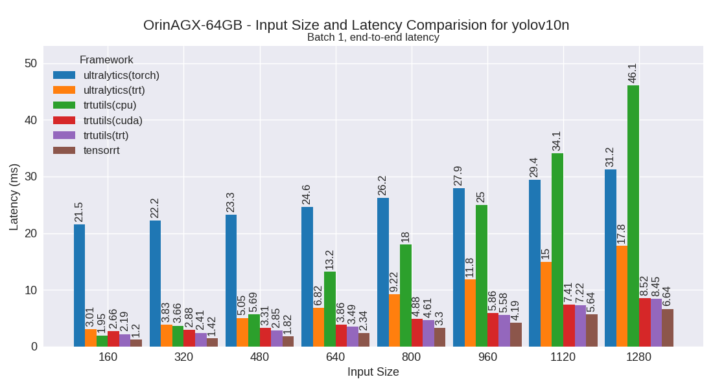
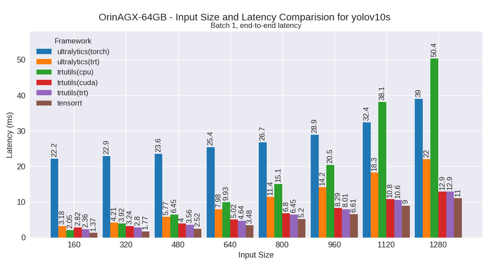
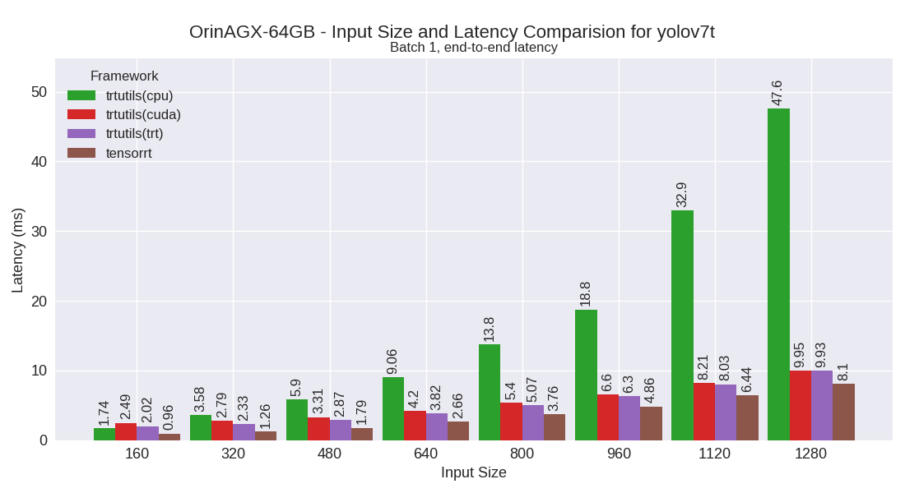
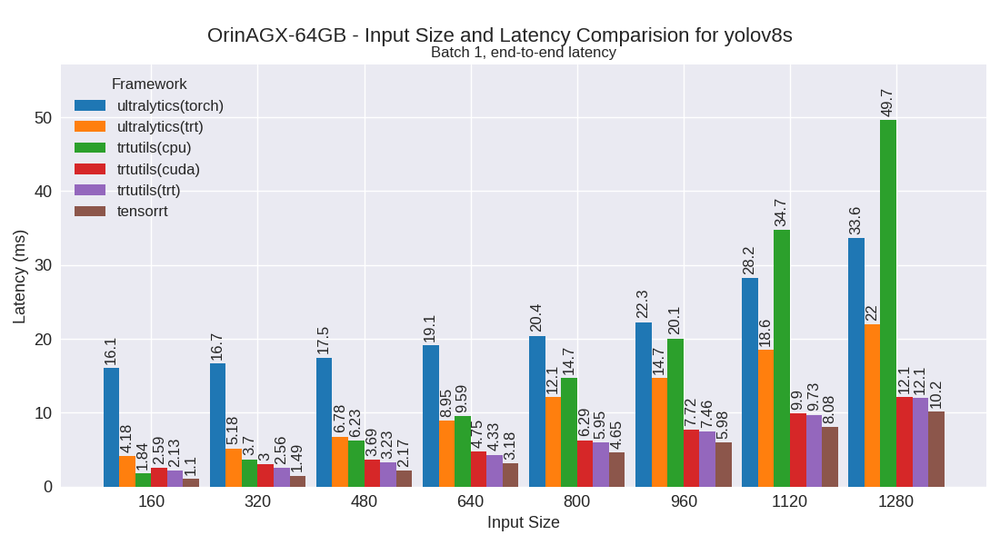
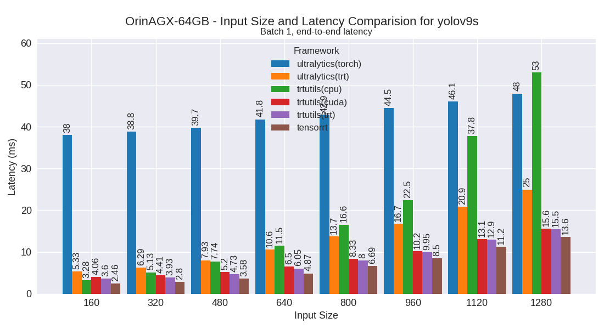
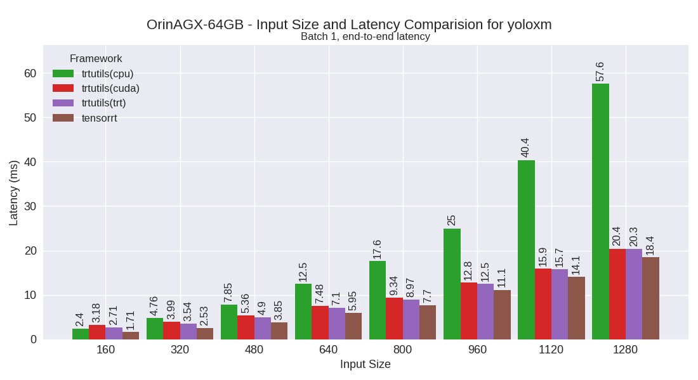
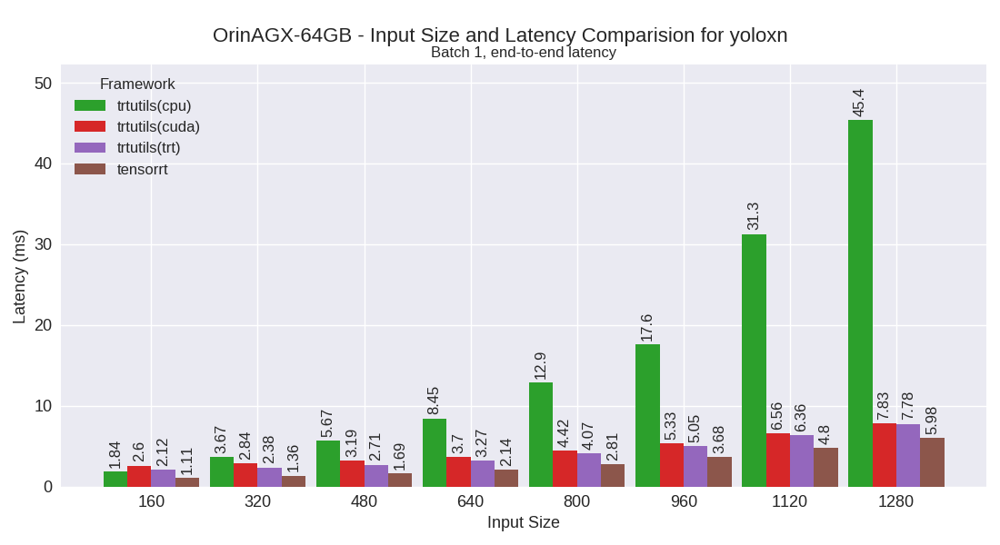

OrinAGX-64GB
============

Developer Kit with Jetpack 6

This section contains benchmarking results for various YOLO models on the OrinAGX-64GB platform.

Performance Plots
-----------------

The following plots show the performance comparison between different YOLO models and frameworks:

yolov10m
~~~~~~~~

yolov10n
~~~~~~~~

yolov10s
~~~~~~~~

yolov7m
~~~~~~~~

yolov7t
~~~~~~~~

yolov8m
~~~~~~~~

.. image:: ../../benchmark/plots/OrinAGX-64GB/yolov8m.png
   :alt: yolov8m performance plot
   :align: center

yolov8n
~~~~~~~~

.. image:: ../../benchmark/plots/OrinAGX-64GB/yolov8n.png
   :alt: yolov8n performance plot
   :align: center

yolov8s
~~~~~~~~

yolov9m
~~~~~~~~

yolov9s
~~~~~~~~

yolov9t
~~~~~~~~

yoloxm
~~~~~~~~

yoloxn
~~~~~~~~

yoloxs
~~~~~~~~

yoloxt
~~~~~~~~

Performance Table
-----------------

The following table shows detailed performance metrics for all tested models:

.. csv-table:: Performance Metrics
   :header: Framework,Model,Input Size,Mean (ms),Median (ms),Min (ms),Max (ms)
   :widths: 10,10,10,10,10,10,10

   tensorrt,yolov10n,160,1.2,1.2,1.2,1.2
   tensorrt,yolov10n,320,1.4,1.4,1.4,1.8
   tensorrt,yolov10n,480,1.8,1.8,1.8,1.8
   tensorrt,yolov10n,640,2.3,2.3,2.3,2.6
   tensorrt,yolov10n,800,3.3,3.3,3.3,3.4
   tensorrt,yolov10n,960,4.2,4.2,4.2,4.6
   tensorrt,yolov10n,1120,5.6,5.6,5.6,5.7
   tensorrt,yolov10n,1280,6.7,6.7,6.6,6.7
   tensorrt,yolov10s,160,1.4,1.4,1.3,1.4
   tensorrt,yolov10s,320,1.8,1.8,1.8,1.8
   tensorrt,yolov10s,480,2.5,2.5,2.5,3.1
   tensorrt,yolov10s,640,3.5,3.5,3.5,3.9
   tensorrt,yolov10s,800,5.2,5.2,5.2,5.5
   tensorrt,yolov10s,960,6.6,6.6,6.6,6.6
   tensorrt,yolov10s,1120,9.0,9.0,9.0,9.0
   tensorrt,yolov10s,1280,11.0,11.0,11.0,11.1
   tensorrt,yolov10m,160,1.9,1.9,1.9,2.0
   tensorrt,yolov10m,320,2.8,2.8,2.8,2.9
   tensorrt,yolov10m,480,4.3,4.3,4.3,20.1
   tensorrt,yolov10m,640,6.6,6.6,6.5,6.7
   tensorrt,yolov10m,800,8.8,8.8,8.8,8.9
   tensorrt,yolov10m,960,12.4,12.4,12.4,12.5
   tensorrt,yolov10m,1120,16.2,16.2,16.1,16.2
   tensorrt,yolov10m,1280,20.3,20.3,20.2,20.9
   tensorrt,yolov9t,160,2.3,2.3,2.3,2.4
   tensorrt,yolov9t,320,2.5,2.5,2.5,2.6
   tensorrt,yolov9t,480,3.0,3.0,3.0,3.0
   tensorrt,yolov9t,640,3.8,3.8,3.8,3.9
   tensorrt,yolov9t,800,5.0,5.0,5.0,5.1
   tensorrt,yolov9t,960,6.3,6.3,6.2,6.6
   tensorrt,yolov9t,1120,8.1,8.1,8.0,8.1
   tensorrt,yolov9t,1280,9.8,9.8,9.8,9.9
   tensorrt,yolov9s,160,2.5,2.5,2.4,3.0
   tensorrt,yolov9s,320,2.8,2.8,2.8,2.9
   tensorrt,yolov9s,480,3.6,3.6,3.5,3.6
   tensorrt,yolov9s,640,4.9,4.9,4.9,5.1
   tensorrt,yolov9s,800,6.7,6.7,6.7,6.8
   tensorrt,yolov9s,960,8.4,8.4,8.4,8.5
   tensorrt,yolov9s,1120,11.2,11.2,11.2,11.2
   tensorrt,yolov9s,1280,13.6,13.6,13.6,13.7
   tensorrt,yolov9m,160,2.5,2.5,2.5,2.5
   tensorrt,yolov9m,320,3.6,3.6,3.6,3.6
   tensorrt,yolov9m,480,5.3,5.3,5.3,5.4
   tensorrt,yolov9m,640,8.5,8.5,8.5,8.5
   tensorrt,yolov9m,800,12.3,12.3,12.3,12.4
   tensorrt,yolov9m,960,15.9,15.9,15.8,15.9
   tensorrt,yolov9m,1120,21.1,21.1,21.0,21.2
   tensorrt,yolov9m,1280,28.4,28.4,28.3,28.9
   tensorrt,yolov8n,160,0.9,0.9,0.9,1.0
   tensorrt,yolov8n,320,1.2,1.2,1.2,1.2
   tensorrt,yolov8n,480,1.5,1.5,1.5,1.6
   tensorrt,yolov8n,640,2.1,2.1,2.1,2.2
   tensorrt,yolov8n,800,3.0,3.0,3.0,3.3
   tensorrt,yolov8n,960,3.9,3.9,3.8,4.2
   tensorrt,yolov8n,1120,5.2,5.2,5.2,5.2
   tensorrt,yolov8n,1280,6.4,6.4,6.4,6.4
   tensorrt,yolov8s,160,1.1,1.1,1.1,1.1
   tensorrt,yolov8s,320,1.5,1.5,1.5,1.5
   tensorrt,yolov8s,480,2.2,2.2,2.2,2.2
   tensorrt,yolov8s,640,3.2,3.2,3.2,3.5
   tensorrt,yolov8s,800,4.6,4.6,4.6,5.1
   tensorrt,yolov8s,960,5.9,5.9,5.9,6.0
   tensorrt,yolov8s,1120,8.1,8.1,8.1,8.1
   tensorrt,yolov8s,1280,10.1,10.1,10.1,10.2
   tensorrt,yolov8m,160,1.7,1.7,1.7,1.7
   tensorrt,yolov8m,320,2.6,2.6,2.6,2.7
   tensorrt,yolov8m,480,4.1,4.1,4.0,4.5
   tensorrt,yolov8m,640,6.4,6.4,6.4,6.5
   tensorrt,yolov8m,800,8.4,8.4,8.4,8.6
   tensorrt,yolov8m,960,12.2,12.2,12.1,12.3
   tensorrt,yolov8m,1120,15.5,15.5,15.5,15.6
   tensorrt,yolov8m,1280,20.0,20.0,19.9,20.5
   tensorrt,yolov7t,160,1.0,1.0,1.0,1.0
   tensorrt,yolov7t,320,1.2,1.2,1.2,1.3
   tensorrt,yolov7t,480,1.8,1.8,1.8,1.8
   tensorrt,yolov7t,640,2.7,2.6,2.6,3.0
   tensorrt,yolov7t,800,3.7,3.7,3.7,4.1
   tensorrt,yolov7t,960,4.8,4.8,4.8,5.2
   tensorrt,yolov7t,1120,6.4,6.4,6.4,6.5
   tensorrt,yolov7t,1280,8.1,8.1,8.0,8.1
   tensorrt,yolov7m,160,1.9,1.9,1.9,1.9
   tensorrt,yolov7m,320,3.0,3.0,3.0,3.0
   tensorrt,yolov7m,480,4.8,4.8,4.7,4.8
   tensorrt,yolov7m,640,7.6,7.6,7.6,7.7
   tensorrt,yolov7m,800,11.1,11.1,11.0,11.6
   tensorrt,yolov7m,960,14.7,14.7,14.7,14.8
   tensorrt,yolov7m,1120,19.6,19.6,19.6,20.1
   tensorrt,yolov7m,1280,25.1,25.0,24.9,25.8
   tensorrt,yoloxt,160,1.1,1.1,1.1,1.1
   tensorrt,yoloxt,320,1.4,1.4,1.4,1.4
   tensorrt,yoloxt,480,1.9,1.9,1.9,2.0
   tensorrt,yoloxt,640,2.7,2.7,2.7,2.7
   tensorrt,yoloxt,800,3.7,3.7,3.6,3.7
   tensorrt,yoloxt,960,4.9,4.9,4.9,5.0
   tensorrt,yoloxt,1120,6.4,6.4,6.3,6.4
   tensorrt,yoloxt,1280,8.1,8.1,8.1,8.1
   tensorrt,yoloxn,160,1.1,1.1,1.1,1.2
   tensorrt,yoloxn,320,1.4,1.4,1.4,1.4
   tensorrt,yoloxn,480,1.7,1.7,1.7,1.7
   tensorrt,yoloxn,640,2.1,2.1,2.1,2.2
   tensorrt,yoloxn,800,2.8,2.8,2.8,3.1
   tensorrt,yoloxn,960,3.6,3.6,3.6,3.7
   tensorrt,yoloxn,1120,4.8,4.8,4.8,4.9
   tensorrt,yoloxn,1280,6.0,6.0,6.0,6.1
   tensorrt,yoloxs,160,1.2,1.2,1.2,1.2
   tensorrt,yoloxs,320,1.5,1.5,1.5,1.5
   tensorrt,yoloxs,480,2.1,2.1,2.1,2.5
   tensorrt,yoloxs,640,3.1,3.1,3.1,3.4
   tensorrt,yoloxs,800,4.3,4.3,4.3,4.7
   tensorrt,yoloxs,960,5.6,5.6,5.5,5.6
   tensorrt,yoloxs,1120,7.4,7.4,7.4,7.5
   tensorrt,yoloxs,1280,9.3,9.3,9.3,9.4
   tensorrt,yoloxm,160,1.7,1.7,1.7,1.7
   tensorrt,yoloxm,320,2.5,2.5,2.5,3.0
   tensorrt,yoloxm,480,3.8,3.8,3.8,3.9
   tensorrt,yoloxm,640,5.9,5.9,5.9,6.0
   tensorrt,yoloxm,800,7.7,7.7,7.7,8.3
   tensorrt,yoloxm,960,11.1,11.1,11.1,11.2
   tensorrt,yoloxm,1120,14.1,14.1,14.0,14.4
   tensorrt,yoloxm,1280,18.4,18.3,18.2,19.3
   trtutils(trt),yolov10n,160,2.2,2.2,2.2,3.0
   trtutils(trt),yolov10n,320,2.5,2.5,2.4,3.0
   trtutils(trt),yolov10n,480,2.9,2.9,2.9,3.6
   trtutils(trt),yolov10n,640,3.6,3.6,3.5,4.1
   trtutils(trt),yolov10n,800,4.7,4.7,4.6,5.4
   trtutils(trt),yolov10n,960,5.8,5.8,5.7,6.4
   trtutils(trt),yolov10n,1120,7.4,7.4,7.4,8.0
   trtutils(trt),yolov10n,1280,8.7,8.7,8.7,9.3
   trtutils(trt),yolov10s,160,2.5,2.5,2.4,3.0
   trtutils(trt),yolov10s,320,2.9,2.9,2.8,3.4
   trtutils(trt),yolov10s,480,3.7,3.7,3.6,4.3
   trtutils(trt),yolov10s,640,4.8,4.8,4.8,5.4
   trtutils(trt),yolov10s,800,6.7,6.6,6.6,7.4
   trtutils(trt),yolov10s,960,8.2,8.2,8.2,8.9
   trtutils(trt),yolov10s,1120,10.9,10.9,10.8,11.5
   trtutils(trt),yolov10s,1280,13.1,13.1,13.1,13.8
   trtutils(trt),yolov10m,160,3.1,3.1,3.0,3.7
   trtutils(trt),yolov10m,320,4.0,4.0,4.0,4.6
   trtutils(trt),yolov10m,480,5.5,5.5,5.4,6.1
   trtutils(trt),yolov10m,640,7.9,7.9,7.8,8.6
   trtutils(trt),yolov10m,800,10.3,10.3,10.2,11.1
   trtutils(trt),yolov10m,960,14.0,14.0,14.0,14.7
   trtutils(trt),yolov10m,1120,18.1,18.1,18.0,18.7
   trtutils(trt),yolov10m,1280,22.4,22.4,22.3,23.1
   trtutils(trt),yolov9t,160,3.6,3.6,3.5,4.3
   trtutils(trt),yolov9t,320,3.8,3.8,3.7,4.3
   trtutils(trt),yolov9t,480,4.3,4.3,4.2,5.0
   trtutils(trt),yolov9t,640,5.1,5.1,5.1,5.8
   trtutils(trt),yolov9t,800,6.4,6.4,6.4,7.2
   trtutils(trt),yolov9t,960,8.0,8.0,7.9,8.6
   trtutils(trt),yolov9t,1120,10.0,10.0,10.0,10.7
   trtutils(trt),yolov9t,1280,12.0,12.0,11.9,12.6
   trtutils(trt),yolov9s,160,3.7,3.7,3.7,4.6
   trtutils(trt),yolov9s,320,4.0,4.0,4.0,4.6
   trtutils(trt),yolov9s,480,4.8,4.8,4.8,5.6
   trtutils(trt),yolov9s,640,6.2,6.2,6.2,6.9
   trtutils(trt),yolov9s,800,8.2,8.2,8.2,9.1
   trtutils(trt),yolov9s,960,10.1,10.1,10.0,10.8
   trtutils(trt),yolov9s,1120,13.2,13.2,13.1,13.8
   trtutils(trt),yolov9s,1280,15.8,15.8,15.7,16.4
   trtutils(trt),yolov9m,160,3.7,3.7,3.7,4.4
   trtutils(trt),yolov9m,320,4.8,4.8,4.8,5.4
   trtutils(trt),yolov9m,480,6.6,6.6,6.5,7.3
   trtutils(trt),yolov9m,640,9.8,9.7,9.7,10.5
   trtutils(trt),yolov9m,800,13.8,13.8,13.7,14.6
   trtutils(trt),yolov9m,960,17.5,17.5,17.5,18.5
   trtutils(trt),yolov9m,1120,23.0,23.0,23.0,23.6
   trtutils(trt),yolov9m,1280,30.6,30.6,30.5,31.2
   trtutils(trt),yolov8n,160,2.2,2.2,2.1,2.8
   trtutils(trt),yolov8n,320,2.3,2.3,2.3,2.9
   trtutils(trt),yolov8n,480,2.7,2.7,2.7,3.4
   trtutils(trt),yolov8n,640,3.4,3.4,3.4,4.1
   trtutils(trt),yolov8n,800,4.4,4.4,4.4,5.6
   trtutils(trt),yolov8n,960,5.6,5.6,5.5,6.2
   trtutils(trt),yolov8n,1120,7.1,7.1,7.1,7.7
   trtutils(trt),yolov8n,1280,8.5,8.5,8.5,9.3
   trtutils(trt),yolov8s,160,2.3,2.3,2.2,2.8
   trtutils(trt),yolov8s,320,2.7,2.7,2.6,3.3
   trtutils(trt),yolov8s,480,3.4,3.4,3.4,4.2
   trtutils(trt),yolov8s,640,4.5,4.5,4.5,5.5
   trtutils(trt),yolov8s,800,6.2,6.1,6.1,7.0
   trtutils(trt),yolov8s,960,7.6,7.6,7.6,8.4
   trtutils(trt),yolov8s,1120,10.0,10.0,10.0,10.7
   trtutils(trt),yolov8s,1280,12.3,12.3,12.3,13.1
   trtutils(trt),yolov8m,160,2.9,2.9,2.8,3.5
   trtutils(trt),yolov8m,320,3.8,3.8,3.8,4.4
   trtutils(trt),yolov8m,480,5.3,5.3,5.3,6.1
   trtutils(trt),yolov8m,640,7.8,7.8,7.8,8.6
   trtutils(trt),yolov8m,800,9.9,9.9,9.9,10.9
   trtutils(trt),yolov8m,960,13.9,13.9,13.9,14.6
   trtutils(trt),yolov8m,1120,17.5,17.5,17.4,18.2
   trtutils(trt),yolov8m,1280,22.3,22.3,22.1,23.0
   trtutils(trt),yolov7t,160,2.2,2.1,2.1,2.7
   trtutils(trt),yolov7t,320,2.5,2.5,2.4,2.9
   trtutils(trt),yolov7t,480,3.0,3.0,2.9,3.6
   trtutils(trt),yolov7t,640,4.0,4.0,3.9,4.6
   trtutils(trt),yolov7t,800,5.3,5.2,5.2,6.1
   trtutils(trt),yolov7t,960,6.5,6.5,6.5,7.2
   trtutils(trt),yolov7t,1120,8.3,8.3,8.3,9.1
   trtutils(trt),yolov7t,1280,10.2,10.2,10.1,11.0
   trtutils(trt),yolov7m,160,3.0,3.0,3.0,3.6
   trtutils(trt),yolov7m,320,4.2,4.2,4.2,4.8
   trtutils(trt),yolov7m,480,6.0,6.0,5.9,6.6
   trtutils(trt),yolov7m,640,9.0,9.0,8.9,9.6
   trtutils(trt),yolov7m,800,12.6,12.6,12.5,13.7
   trtutils(trt),yolov7m,960,16.4,16.4,16.4,17.1
   trtutils(trt),yolov7m,1120,21.6,21.6,21.6,22.2
   trtutils(trt),yolov7m,1280,27.3,27.4,27.0,28.0
   trtutils(trt),yoloxt,160,2.2,2.2,2.2,2.8
   trtutils(trt),yoloxt,320,2.6,2.5,2.5,3.0
   trtutils(trt),yoloxt,480,3.1,3.1,3.0,3.8
   trtutils(trt),yoloxt,640,4.0,4.0,4.0,4.7
   trtutils(trt),yoloxt,800,5.1,5.1,5.1,5.9
   trtutils(trt),yoloxt,960,6.6,6.6,6.6,7.2
   trtutils(trt),yoloxt,1120,8.2,8.2,8.2,9.0
   trtutils(trt),yoloxt,1280,10.2,10.2,10.1,11.0
   trtutils(trt),yoloxn,160,2.3,2.3,2.3,3.2
   trtutils(trt),yoloxn,320,2.5,2.5,2.4,3.3
   trtutils(trt),yoloxn,480,2.8,2.8,2.8,3.7
   trtutils(trt),yoloxn,640,3.4,3.4,3.4,4.1
   trtutils(trt),yoloxn,800,4.3,4.3,4.2,5.0
   trtutils(trt),yoloxn,960,5.3,5.3,5.3,5.9
   trtutils(trt),yoloxn,1120,6.7,6.6,6.6,7.3
   trtutils(trt),yoloxn,1280,8.1,8.1,8.0,8.7
   trtutils(trt),yoloxs,160,2.3,2.3,2.2,2.8
   trtutils(trt),yoloxs,320,2.6,2.6,2.6,3.1
   trtutils(trt),yoloxs,480,3.3,3.3,3.2,4.0
   trtutils(trt),yoloxs,640,4.4,4.4,4.3,5.0
   trtutils(trt),yoloxs,800,5.8,5.8,5.7,6.6
   trtutils(trt),yoloxs,960,7.2,7.2,7.2,7.8
   trtutils(trt),yoloxs,1120,9.3,9.3,9.2,9.9
   trtutils(trt),yoloxs,1280,11.4,11.4,11.4,12.1
   trtutils(trt),yoloxm,160,2.8,2.8,2.8,3.3
   trtutils(trt),yoloxm,320,3.7,3.7,3.6,4.1
   trtutils(trt),yoloxm,480,5.0,5.0,5.0,5.7
   trtutils(trt),yoloxm,640,7.2,7.2,7.2,7.9
   trtutils(trt),yoloxm,800,9.2,9.1,9.1,10.0
   trtutils(trt),yoloxm,960,12.8,12.7,12.7,13.4
   trtutils(trt),yoloxm,1120,16.0,15.9,15.9,16.5
   trtutils(trt),yoloxm,1280,20.7,20.8,20.3,21.4
   trtutils(cuda),yolov10n,160,2.7,2.7,2.7,3.7
   trtutils(cuda),yolov10n,320,2.9,2.9,2.9,3.6
   trtutils(cuda),yolov10n,480,3.5,3.4,3.4,3.9
   trtutils(cuda),yolov10n,640,4.1,4.1,4.1,4.7
   trtutils(cuda),yolov10n,800,5.2,5.2,5.2,6.1
   trtutils(cuda),yolov10n,960,6.3,6.3,6.3,7.0
   trtutils(cuda),yolov10n,1120,8.0,8.0,8.0,8.7
   trtutils(cuda),yolov10n,1280,9.3,9.3,9.2,10.0
   trtutils(cuda),yolov10s,160,2.8,2.8,2.8,3.6
   trtutils(cuda),yolov10s,320,3.2,3.2,3.2,3.8
   trtutils(cuda),yolov10s,480,4.1,4.0,4.0,4.4
   trtutils(cuda),yolov10s,640,5.2,5.2,5.1,5.7
   trtutils(cuda),yolov10s,800,7.1,7.0,7.0,7.8
   trtutils(cuda),yolov10s,960,8.7,8.7,8.6,9.3
   trtutils(cuda),yolov10s,1120,11.3,11.3,11.3,11.9
   trtutils(cuda),yolov10s,1280,13.6,13.6,13.5,14.3
   trtutils(cuda),yolov10m,160,3.4,3.4,3.4,3.9
   trtutils(cuda),yolov10m,320,4.3,4.3,4.3,4.9
   trtutils(cuda),yolov10m,480,5.8,5.8,5.8,6.3
   trtutils(cuda),yolov10m,640,8.3,8.3,8.2,9.0
   trtutils(cuda),yolov10m,800,10.7,10.7,10.6,11.6
   trtutils(cuda),yolov10m,960,14.5,14.5,14.4,15.1
   trtutils(cuda),yolov10m,1120,18.5,18.5,18.4,19.4
   trtutils(cuda),yolov10m,1280,22.8,22.8,22.7,23.7
   trtutils(cuda),yolov9t,160,3.9,3.9,3.8,4.7
   trtutils(cuda),yolov9t,320,4.0,4.0,4.0,4.6
   trtutils(cuda),yolov9t,480,4.6,4.6,4.5,5.2
   trtutils(cuda),yolov9t,640,5.5,5.5,5.5,6.1
   trtutils(cuda),yolov9t,800,6.8,6.8,6.8,7.6
   trtutils(cuda),yolov9t,960,8.4,8.4,8.3,9.0
   trtutils(cuda),yolov9t,1120,10.5,10.5,10.4,11.1
   trtutils(cuda),yolov9t,1280,12.4,12.4,12.4,13.1
   trtutils(cuda),yolov9s,160,4.0,4.0,4.0,4.7
   trtutils(cuda),yolov9s,320,4.4,4.4,4.3,5.0
   trtutils(cuda),yolov9s,480,5.2,5.2,5.1,5.8
   trtutils(cuda),yolov9s,640,6.6,6.6,6.6,7.2
   trtutils(cuda),yolov9s,800,8.6,8.6,8.6,9.6
   trtutils(cuda),yolov9s,960,10.5,10.5,10.5,11.1
   trtutils(cuda),yolov9s,1120,13.6,13.6,13.5,14.3
   trtutils(cuda),yolov9s,1280,16.3,16.3,16.2,17.2
   trtutils(cuda),yolov9m,160,4.1,4.0,4.0,4.7
   trtutils(cuda),yolov9m,320,5.1,5.1,5.1,5.7
   trtutils(cuda),yolov9m,480,6.9,6.9,6.8,7.5
   trtutils(cuda),yolov9m,640,10.2,10.2,10.1,10.8
   trtutils(cuda),yolov9m,800,14.2,14.2,14.1,14.9
   trtutils(cuda),yolov9m,960,18.0,18.0,17.9,18.7
   trtutils(cuda),yolov9m,1120,23.5,23.5,23.4,24.2
   trtutils(cuda),yolov9m,1280,31.1,31.1,31.0,31.6
   trtutils(cuda),yolov8n,160,2.5,2.5,2.4,3.4
   trtutils(cuda),yolov8n,320,2.7,2.7,2.6,3.2
   trtutils(cuda),yolov8n,480,3.1,3.1,3.1,3.6
   trtutils(cuda),yolov8n,640,3.8,3.8,3.8,4.4
   trtutils(cuda),yolov8n,800,4.8,4.8,4.8,5.6
   trtutils(cuda),yolov8n,960,6.0,6.0,6.0,6.6
   trtutils(cuda),yolov8n,1120,7.6,7.6,7.5,8.2
   trtutils(cuda),yolov8n,1280,9.0,9.0,9.0,9.7
   trtutils(cuda),yolov8s,160,2.6,2.6,2.5,3.3
   trtutils(cuda),yolov8s,320,3.0,3.0,2.9,3.7
   trtutils(cuda),yolov8s,480,3.8,3.8,3.7,4.3
   trtutils(cuda),yolov8s,640,4.9,4.9,4.8,5.6
   trtutils(cuda),yolov8s,800,6.6,6.6,6.5,7.4
   trtutils(cuda),yolov8s,960,8.1,8.1,8.0,8.8
   trtutils(cuda),yolov8s,1120,10.5,10.5,10.4,11.2
   trtutils(cuda),yolov8s,1280,12.8,12.8,12.7,13.7
   trtutils(cuda),yolov8m,160,3.2,3.2,3.2,3.9
   trtutils(cuda),yolov8m,320,4.1,4.1,4.1,4.8
   trtutils(cuda),yolov8m,480,5.7,5.7,5.6,6.2
   trtutils(cuda),yolov8m,640,8.2,8.2,8.1,8.9
   trtutils(cuda),yolov8m,800,10.3,10.3,10.3,11.3
   trtutils(cuda),yolov8m,960,14.3,14.3,14.2,15.1
   trtutils(cuda),yolov8m,1120,17.9,17.9,17.9,18.7
   trtutils(cuda),yolov8m,1280,22.7,22.7,22.6,23.9
   trtutils(cuda),yolov7t,160,2.5,2.5,2.4,3.1
   trtutils(cuda),yolov7t,320,2.8,2.8,2.7,3.3
   trtutils(cuda),yolov7t,480,3.3,3.3,3.3,3.8
   trtutils(cuda),yolov7t,640,4.3,4.3,4.3,4.9
   trtutils(cuda),yolov7t,800,5.7,5.7,5.6,6.4
   trtutils(cuda),yolov7t,960,6.9,6.9,6.9,7.5
   trtutils(cuda),yolov7t,1120,8.7,8.7,8.7,9.4
   trtutils(cuda),yolov7t,1280,10.6,10.6,10.6,11.6
   trtutils(cuda),yolov7m,160,3.3,3.3,3.3,3.8
   trtutils(cuda),yolov7m,320,4.5,4.5,4.5,5.1
   trtutils(cuda),yolov7m,480,6.3,6.3,6.3,6.8
   trtutils(cuda),yolov7m,640,9.4,9.4,9.3,10.0
   trtutils(cuda),yolov7m,800,13.0,13.0,12.9,13.9
   trtutils(cuda),yolov7m,960,16.8,16.8,16.8,17.6
   trtutils(cuda),yolov7m,1120,22.0,22.0,21.9,22.7
   trtutils(cuda),yolov7m,1280,27.8,27.9,27.5,28.7
   trtutils(cuda),yoloxt,160,2.5,2.5,2.5,3.3
   trtutils(cuda),yoloxt,320,2.9,2.9,2.9,3.4
   trtutils(cuda),yoloxt,480,3.5,3.5,3.4,3.9
   trtutils(cuda),yoloxt,640,4.4,4.4,4.4,5.0
   trtutils(cuda),yoloxt,800,5.5,5.5,5.5,6.3
   trtutils(cuda),yoloxt,960,7.0,7.0,7.0,7.6
   trtutils(cuda),yoloxt,1120,8.7,8.7,8.6,9.3
   trtutils(cuda),yoloxt,1280,10.7,10.7,10.6,11.6
   trtutils(cuda),yoloxn,160,2.6,2.6,2.6,3.7
   trtutils(cuda),yoloxn,320,2.8,2.8,2.8,3.7
   trtutils(cuda),yoloxn,480,3.2,3.2,3.2,3.8
   trtutils(cuda),yoloxn,640,3.8,3.8,3.8,4.4
   trtutils(cuda),yoloxn,800,4.7,4.7,4.6,5.5
   trtutils(cuda),yoloxn,960,5.7,5.7,5.7,6.4
   trtutils(cuda),yoloxn,1120,7.1,7.1,7.1,7.8
   trtutils(cuda),yoloxn,1280,8.5,8.5,8.5,9.3
   trtutils(cuda),yoloxs,160,2.6,2.6,2.6,3.2
   trtutils(cuda),yoloxs,320,3.0,3.0,2.9,3.5
   trtutils(cuda),yoloxs,480,3.7,3.6,3.6,4.2
   trtutils(cuda),yoloxs,640,4.8,4.8,4.7,5.4
   trtutils(cuda),yoloxs,800,6.2,6.2,6.1,6.9
   trtutils(cuda),yoloxs,960,7.7,7.6,7.6,8.3
   trtutils(cuda),yoloxs,1120,9.7,9.7,9.7,10.7
   trtutils(cuda),yoloxs,1280,11.9,11.9,11.8,12.9
   trtutils(cuda),yoloxm,160,3.2,3.2,3.1,3.7
   trtutils(cuda),yoloxm,320,4.0,4.0,3.9,4.5
   trtutils(cuda),yoloxm,480,5.4,5.4,5.3,5.9
   trtutils(cuda),yoloxm,640,7.6,7.6,7.6,8.2
   trtutils(cuda),yoloxm,800,9.6,9.6,9.5,10.8
   trtutils(cuda),yoloxm,960,13.2,13.2,13.1,13.8
   trtutils(cuda),yoloxm,1120,16.5,16.4,16.3,17.1
   trtutils(cuda),yoloxm,1280,21.0,20.9,20.8,21.5
   trtutils(cpu),yolov10n,160,2.0,1.9,1.9,2.5
   trtutils(cpu),yolov10n,320,3.6,3.6,3.5,3.9
   trtutils(cpu),yolov10n,480,5.8,5.8,5.7,6.0
   trtutils(cpu),yolov10n,640,13.3,13.4,11.3,13.5
   trtutils(cpu),yolov10n,800,18.0,18.1,16.1,18.5
   trtutils(cpu),yolov10n,960,23.6,23.6,21.0,23.9
   trtutils(cpu),yolov10n,1120,32.0,31.9,27.5,32.5
   trtutils(cpu),yolov10n,1280,45.5,45.6,45.1,45.8
   trtutils(cpu),yolov10s,160,2.2,2.1,2.1,2.5
   trtutils(cpu),yolov10s,320,4.0,4.0,3.9,4.2
   trtutils(cpu),yolov10s,480,7.1,7.1,7.0,7.3
   trtutils(cpu),yolov10s,640,11.6,11.6,11.3,11.8
   trtutils(cpu),yolov10s,800,17.4,17.4,17.1,17.7
   trtutils(cpu),yolov10s,960,23.7,23.7,23.5,23.8
   trtutils(cpu),yolov10s,1120,38.9,38.9,38.7,39.3
   trtutils(cpu),yolov10s,1280,53.0,53.0,52.7,53.3
   trtutils(cpu),yolov10m,160,2.8,2.7,2.6,3.1
   trtutils(cpu),yolov10m,320,5.1,5.1,5.0,5.3
   trtutils(cpu),yolov10m,480,8.9,8.9,8.8,9.0
   trtutils(cpu),yolov10m,640,14.7,14.7,14.3,15.1
   trtutils(cpu),yolov10m,800,21.1,21.1,20.7,21.7
   trtutils(cpu),yolov10m,960,29.5,29.5,29.4,29.8
   trtutils(cpu),yolov10m,1120,45.0,45.0,44.9,45.6
   trtutils(cpu),yolov10m,1280,62.4,62.4,62.1,62.6
   trtutils(cpu),yolov9t,160,3.2,3.2,3.1,3.5
   trtutils(cpu),yolov9t,320,4.9,4.9,4.8,5.1
   trtutils(cpu),yolov9t,480,7.8,7.8,7.7,7.9
   trtutils(cpu),yolov9t,640,12.0,12.0,11.8,12.1
   trtutils(cpu),yolov9t,800,17.3,17.3,17.0,17.4
   trtutils(cpu),yolov9t,960,23.3,23.3,23.1,23.6
   trtutils(cpu),yolov9t,1120,38.4,38.4,38.2,38.6
   trtutils(cpu),yolov9t,1280,51.9,52.0,51.5,52.3
   trtutils(cpu),yolov9s,160,3.3,3.3,3.3,3.6
   trtutils(cpu),yolov9s,320,5.3,5.3,5.2,5.4
   trtutils(cpu),yolov9s,480,8.3,8.3,8.2,8.5
   trtutils(cpu),yolov9s,640,13.0,13.0,12.8,13.4
   trtutils(cpu),yolov9s,800,18.9,18.9,18.8,19.4
   trtutils(cpu),yolov9s,960,25.5,25.5,25.4,25.8
   trtutils(cpu),yolov9s,1120,41.0,41.0,40.8,41.1
   trtutils(cpu),yolov9s,1280,55.7,55.8,55.4,55.9
   trtutils(cpu),yolov9m,160,3.4,3.3,3.3,3.6
   trtutils(cpu),yolov9m,320,6.0,6.0,5.9,6.1
   trtutils(cpu),yolov9m,480,10.0,10.0,10.0,10.2
   trtutils(cpu),yolov9m,640,16.6,16.6,16.4,17.0
   trtutils(cpu),yolov9m,800,24.5,24.5,24.3,25.1
   trtutils(cpu),yolov9m,960,32.9,32.9,32.8,33.0
   trtutils(cpu),yolov9m,1120,51.6,51.6,51.5,52.3
   trtutils(cpu),yolov9m,1280,70.5,70.5,70.1,70.7
   trtutils(cpu),yolov8n,160,1.8,1.8,1.8,2.2
   trtutils(cpu),yolov8n,320,3.5,3.5,3.5,3.9
   trtutils(cpu),yolov8n,480,6.3,6.2,6.1,6.6
   trtutils(cpu),yolov8n,640,10.1,10.1,10.0,10.4
   trtutils(cpu),yolov8n,800,15.3,15.3,14.9,15.5
   trtutils(cpu),yolov8n,960,21.0,21.0,20.9,21.2
   trtutils(cpu),yolov8n,1120,34.8,34.8,34.7,35.0
   trtutils(cpu),yolov8n,1280,48.2,48.2,48.1,48.4
   trtutils(cpu),yolov8s,160,2.0,2.1,1.9,2.3
   trtutils(cpu),yolov8s,320,3.7,3.7,3.7,4.0
   trtutils(cpu),yolov8s,480,6.9,6.9,6.8,7.2
   trtutils(cpu),yolov8s,640,11.4,11.4,11.0,11.5
   trtutils(cpu),yolov8s,800,16.9,16.9,16.5,17.1
   trtutils(cpu),yolov8s,960,23.1,23.2,23.0,23.3
   trtutils(cpu),yolov8s,1120,38.0,38.0,37.5,38.7
   trtutils(cpu),yolov8s,1280,52.7,52.7,52.4,52.9
   trtutils(cpu),yolov8m,160,2.5,2.5,2.5,2.9
   trtutils(cpu),yolov8m,320,5.0,4.9,4.9,5.4
   trtutils(cpu),yolov8m,480,8.8,8.8,8.7,9.1
   trtutils(cpu),yolov8m,640,14.7,14.7,14.4,14.9
   trtutils(cpu),yolov8m,800,20.7,20.7,20.3,21.0
   trtutils(cpu),yolov8m,960,29.4,29.4,29.4,29.7
   trtutils(cpu),yolov8m,1120,45.4,45.4,45.3,46.1
   trtutils(cpu),yolov8m,1280,62.4,62.4,62.1,63.3
   trtutils(cpu),yolov7t,160,1.8,1.8,1.8,2.3
   trtutils(cpu),yolov7t,320,3.6,3.6,3.5,3.7
   trtutils(cpu),yolov7t,480,6.5,6.5,6.4,6.9
   trtutils(cpu),yolov7t,640,10.9,10.9,10.6,11.2
   trtutils(cpu),yolov7t,800,16.1,16.2,15.8,16.3
   trtutils(cpu),yolov7t,960,22.1,22.1,22.0,22.4
   trtutils(cpu),yolov7t,1120,35.8,35.7,35.6,36.0
   trtutils(cpu),yolov7t,1280,50.4,50.4,50.2,52.1
   trtutils(cpu),yolov7m,160,2.7,2.7,2.6,2.9
   trtutils(cpu),yolov7m,320,5.4,5.4,5.4,5.6
   trtutils(cpu),yolov7m,480,9.5,9.5,9.4,9.6
   trtutils(cpu),yolov7m,640,15.9,15.9,15.5,16.0
   trtutils(cpu),yolov7m,800,23.5,23.5,23.2,23.7
   trtutils(cpu),yolov7m,960,31.9,31.9,31.8,32.7
   trtutils(cpu),yolov7m,1120,49.8,49.7,49.6,50.8
   trtutils(cpu),yolov7m,1280,67.3,67.4,66.9,68.4
   trtutils(cpu),yoloxt,160,1.9,1.8,1.8,2.1
   trtutils(cpu),yoloxt,320,3.8,3.8,3.7,4.1
   trtutils(cpu),yoloxt,480,6.6,6.6,6.5,6.7
   trtutils(cpu),yoloxt,640,10.8,10.8,10.5,11.0
   trtutils(cpu),yoloxt,800,15.9,15.9,15.4,16.0
   trtutils(cpu),yoloxt,960,22.0,22.0,21.9,22.1
   trtutils(cpu),yoloxt,1120,36.3,36.3,36.2,36.5
   trtutils(cpu),yoloxt,1280,50.3,50.3,50.1,50.5
   trtutils(cpu),yoloxn,160,2.0,2.0,1.9,2.2
   trtutils(cpu),yoloxn,320,3.9,3.9,3.8,4.1
   trtutils(cpu),yoloxn,480,6.3,6.3,6.2,6.7
   trtutils(cpu),yoloxn,640,10.1,10.1,9.9,10.4
   trtutils(cpu),yoloxn,800,15.0,15.0,14.6,15.1
   trtutils(cpu),yoloxn,960,20.7,20.7,20.6,20.8
   trtutils(cpu),yoloxn,1120,34.7,34.7,34.6,35.1
   trtutils(cpu),yoloxn,1280,48.2,48.2,48.0,48.8
   trtutils(cpu),yoloxs,160,1.9,1.9,1.9,2.1
   trtutils(cpu),yoloxs,320,3.8,3.8,3.8,3.9
   trtutils(cpu),yoloxs,480,6.8,6.8,6.7,7.1
   trtutils(cpu),yoloxs,640,11.2,11.2,10.8,11.4
   trtutils(cpu),yoloxs,800,16.5,16.6,16.2,16.8
   trtutils(cpu),yoloxs,960,22.6,22.6,22.5,22.9
   trtutils(cpu),yoloxs,1120,37.4,37.4,37.3,37.8
   trtutils(cpu),yoloxs,1280,51.5,51.5,51.3,52.0
   trtutils(cpu),yoloxm,160,2.5,2.5,2.4,2.7
   trtutils(cpu),yoloxm,320,4.8,4.8,4.8,5.0
   trtutils(cpu),yoloxm,480,8.5,8.5,8.4,8.6
   trtutils(cpu),yoloxm,640,14.1,14.1,13.7,14.3
   trtutils(cpu),yoloxm,800,19.9,19.9,19.5,20.2
   trtutils(cpu),yoloxm,960,28.2,28.2,28.0,28.4
   trtutils(cpu),yoloxm,1120,44.1,44.1,43.9,44.5
   trtutils(cpu),yoloxm,1280,60.6,60.6,60.3,61.4
   ultralytics(trt),yolov10n,160,3.0,3.0,3.0,3.1
   ultralytics(trt),yolov10n,320,3.8,3.8,3.8,3.9
   ultralytics(trt),yolov10n,480,5.0,5.0,5.0,5.1
   ultralytics(trt),yolov10n,640,6.8,6.8,6.7,9.1
   ultralytics(trt),yolov10n,800,9.2,9.2,9.1,9.5
   ultralytics(trt),yolov10n,960,11.8,11.8,11.7,12.0
   ultralytics(trt),yolov10n,1120,15.0,15.0,14.8,15.1
   ultralytics(trt),yolov10n,1280,17.8,17.8,17.6,19.7
   ultralytics(trt),yolov10s,160,3.2,3.2,3.1,3.2
   ultralytics(trt),yolov10s,320,4.2,4.2,4.2,4.3
   ultralytics(trt),yolov10s,480,5.8,5.8,5.7,7.5
   ultralytics(trt),yolov10s,640,8.0,8.0,7.9,8.3
   ultralytics(trt),yolov10s,800,11.4,11.4,11.3,11.6
   ultralytics(trt),yolov10s,960,14.2,14.2,14.1,16.3
   ultralytics(trt),yolov10s,1120,18.3,18.3,18.2,20.4
   ultralytics(trt),yolov10s,1280,22.0,22.0,21.9,24.1
   ultralytics(trt),yolov10m,160,3.8,3.8,3.7,4.0
   ultralytics(trt),yolov10m,320,5.3,5.3,5.2,5.5
   ultralytics(trt),yolov10m,480,7.5,7.5,7.5,7.7
   ultralytics(trt),yolov10m,640,11.4,11.4,11.3,13.5
   ultralytics(trt),yolov10m,800,15.0,15.0,14.9,16.9
   ultralytics(trt),yolov10m,960,20.0,20.0,19.9,21.8
   ultralytics(trt),yolov10m,1120,25.5,25.5,25.4,27.8
   ultralytics(trt),yolov10m,1280,31.3,31.3,31.1,33.6
   ultralytics(trt),yolov9t,160,5.2,5.2,5.1,5.5
   ultralytics(trt),yolov9t,320,6.0,6.0,5.9,8.3
   ultralytics(trt),yolov9t,480,7.4,7.4,7.3,7.5
   ultralytics(trt),yolov9t,640,9.5,9.4,9.3,9.9
   ultralytics(trt),yolov9t,800,12.1,12.0,11.9,12.2
   ultralytics(trt),yolov9t,960,14.7,14.7,14.6,14.9
   ultralytics(trt),yolov9t,1120,17.8,17.8,17.6,20.2
   ultralytics(trt),yolov9t,1280,20.7,20.7,20.6,20.9
   ultralytics(trt),yolov9s,160,5.3,5.3,5.2,5.4
   ultralytics(trt),yolov9s,320,6.3,6.3,6.2,6.4
   ultralytics(trt),yolov9s,480,7.9,7.9,7.8,10.4
   ultralytics(trt),yolov9s,640,10.6,10.6,10.5,12.6
   ultralytics(trt),yolov9s,800,13.7,13.7,13.6,15.6
   ultralytics(trt),yolov9s,960,16.7,16.7,16.6,18.7
   ultralytics(trt),yolov9s,1120,20.9,20.9,20.7,21.1
   ultralytics(trt),yolov9s,1280,25.0,25.0,24.8,29.3
   ultralytics(trt),yolov9m,160,5.4,5.3,5.3,5.7
   ultralytics(trt),yolov9m,320,7.1,7.1,7.0,7.2
   ultralytics(trt),yolov9m,480,10.1,10.1,10.0,10.4
   ultralytics(trt),yolov9m,640,13.9,13.8,13.8,15.9
   ultralytics(trt),yolov9m,800,19.2,19.2,19.1,21.2
   ultralytics(trt),yolov9m,960,25.5,25.5,25.2,27.5
   ultralytics(trt),yolov9m,1120,32.3,32.3,32.1,35.7
   ultralytics(trt),yolov9m,1280,37.5,37.5,37.4,39.3
   ultralytics(trt),yolov8n,160,4.0,4.0,3.9,4.2
   ultralytics(trt),yolov8n,320,4.8,4.8,4.7,4.9
   ultralytics(trt),yolov8n,480,6.1,6.1,6.0,6.3
   ultralytics(trt),yolov8n,640,7.9,7.9,7.8,8.2
   ultralytics(trt),yolov8n,800,10.2,10.2,10.1,10.5
   ultralytics(trt),yolov8n,960,12.7,12.7,12.6,12.9
   ultralytics(trt),yolov8n,1120,15.6,15.5,15.4,17.3
   ultralytics(trt),yolov8n,1280,18.4,18.4,18.2,18.5
   ultralytics(trt),yolov8s,160,4.2,4.2,4.1,4.4
   ultralytics(trt),yolov8s,320,5.2,5.2,5.1,5.4
   ultralytics(trt),yolov8s,480,6.8,6.8,6.7,7.1
   ultralytics(trt),yolov8s,640,9.0,8.9,8.8,9.3
   ultralytics(trt),yolov8s,800,12.1,12.1,12.0,12.5
   ultralytics(trt),yolov8s,960,14.7,14.7,14.5,17.0
   ultralytics(trt),yolov8s,1120,18.6,18.6,18.3,18.9
   ultralytics(trt),yolov8s,1280,22.0,22.0,21.8,22.2
   ultralytics(trt),yolov8m,160,4.8,4.8,4.7,5.1
   ultralytics(trt),yolov8m,320,6.4,6.4,6.3,6.5
   ultralytics(trt),yolov8m,480,8.7,8.7,8.6,10.9
   ultralytics(trt),yolov8m,640,12.8,12.8,12.7,14.8
   ultralytics(trt),yolov8m,800,15.9,15.9,15.8,17.8
   ultralytics(trt),yolov8m,960,21.0,21.0,20.8,23.0
   ultralytics(trt),yolov8m,1120,25.9,25.9,25.8,27.9
   ultralytics(trt),yolov8m,1280,32.2,32.2,32.0,35.1
   ultralytics(torch),yolov10n,160,21.5,21.5,21.4,22.2
   ultralytics(torch),yolov10n,320,22.2,22.2,22.0,22.4
   ultralytics(torch),yolov10n,480,23.3,23.3,23.1,25.9
   ultralytics(torch),yolov10n,640,24.6,24.6,24.5,24.8
   ultralytics(torch),yolov10n,800,26.2,26.2,26.0,28.6
   ultralytics(torch),yolov10n,960,27.9,27.9,27.4,30.1
   ultralytics(torch),yolov10n,1120,29.4,29.4,29.2,31.4
   ultralytics(torch),yolov10n,1280,31.2,31.2,31.0,33.2
   ultralytics(torch),yolov10s,160,22.2,22.2,21.8,22.7
   ultralytics(torch),yolov10s,320,22.9,22.9,22.4,23.1
   ultralytics(torch),yolov10s,480,23.6,23.6,23.1,24.1
   ultralytics(torch),yolov10s,640,25.4,25.4,25.0,27.9
   ultralytics(torch),yolov10s,800,26.7,26.7,26.5,29.2
   ultralytics(torch),yolov10s,960,28.9,28.9,28.8,31.1
   ultralytics(torch),yolov10s,1120,32.4,32.4,32.2,37.1
   ultralytics(torch),yolov10s,1280,39.0,39.0,38.8,40.9
   ultralytics(torch),yolov10m,160,27.0,27.0,26.6,27.4
   ultralytics(torch),yolov10m,320,28.0,28.0,27.8,30.9
   ultralytics(torch),yolov10m,480,28.9,28.9,28.7,31.6
   ultralytics(torch),yolov10m,640,30.7,30.7,30.5,33.1
   ultralytics(torch),yolov10m,800,31.8,31.8,31.6,34.3
   ultralytics(torch),yolov10m,960,39.3,39.4,39.1,41.4
   ultralytics(torch),yolov10m,1120,54.7,54.6,54.5,56.7
   ultralytics(torch),yolov10m,1280,64.5,64.5,64.4,66.8
   ultralytics(torch),yolov9t,160,36.7,36.7,36.4,39.3
   ultralytics(torch),yolov9t,320,37.5,37.5,37.2,40.3
   ultralytics(torch),yolov9t,480,38.4,38.3,38.1,41.0
   ultralytics(torch),yolov9t,640,40.6,40.6,40.3,42.9
   ultralytics(torch),yolov9t,800,41.6,41.6,41.4,43.9
   ultralytics(torch),yolov9t,960,43.5,43.5,43.2,45.9
   ultralytics(torch),yolov9t,1120,45.4,45.4,45.1,47.6
   ultralytics(torch),yolov9t,1280,46.4,46.4,46.1,48.6
   ultralytics(torch),yolov9s,160,38.0,38.0,37.5,40.6
   ultralytics(torch),yolov9s,320,38.8,38.8,38.2,41.5
   ultralytics(torch),yolov9s,480,39.7,39.7,39.3,42.8
   ultralytics(torch),yolov9s,640,41.8,41.8,41.2,44.4
   ultralytics(torch),yolov9s,800,42.9,42.9,42.5,45.2
   ultralytics(torch),yolov9s,960,44.5,44.5,44.0,46.6
   ultralytics(torch),yolov9s,1120,46.1,46.1,45.8,48.0
   ultralytics(torch),yolov9s,1280,48.0,47.9,47.7,50.0
   ultralytics(torch),yolov9m,160,30.4,30.4,29.8,32.9
   ultralytics(torch),yolov9m,320,31.1,31.1,30.9,33.9
   ultralytics(torch),yolov9m,480,32.3,32.3,32.1,35.1
   ultralytics(torch),yolov9m,640,33.1,33.1,32.8,35.7
   ultralytics(torch),yolov9m,800,35.8,35.8,35.5,38.3
   ultralytics(torch),yolov9m,960,42.7,42.7,42.6,44.5
   ultralytics(torch),yolov9m,1120,55.7,55.7,55.5,57.6
   ultralytics(torch),yolov9m,1280,68.2,68.2,68.0,70.1
   ultralytics(torch),yolov8n,160,15.7,15.7,15.6,16.2
   ultralytics(torch),yolov8n,320,16.4,16.4,16.1,18.8
   ultralytics(torch),yolov8n,480,17.2,17.2,17.1,19.9
   ultralytics(torch),yolov8n,640,18.5,18.5,18.1,21.1
   ultralytics(torch),yolov8n,800,20.1,20.1,19.7,22.5
   ultralytics(torch),yolov8n,960,21.8,21.8,21.4,24.0
   ultralytics(torch),yolov8n,1120,23.5,23.5,23.3,25.2
   ultralytics(torch),yolov8n,1280,25.3,25.3,25.2,27.4
   ultralytics(torch),yolov8s,160,16.1,16.1,15.9,16.9
   ultralytics(torch),yolov8s,320,16.7,16.7,16.5,19.1
   ultralytics(torch),yolov8s,480,17.5,17.5,17.4,19.9
   ultralytics(torch),yolov8s,640,19.1,19.1,18.7,21.7
   ultralytics(torch),yolov8s,800,20.4,20.4,20.0,22.9
   ultralytics(torch),yolov8s,960,22.3,22.3,21.9,24.4
   ultralytics(torch),yolov8s,1120,28.2,28.2,28.1,30.4
   ultralytics(torch),yolov8s,1280,33.6,33.6,33.5,35.8
   ultralytics(torch),yolov8m,160,20.0,20.0,19.8,20.6
   ultralytics(torch),yolov8m,320,20.5,20.5,20.4,21.3
   ultralytics(torch),yolov8m,480,21.5,21.5,21.4,21.8
   ultralytics(torch),yolov8m,640,23.4,23.4,22.9,23.8
   ultralytics(torch),yolov8m,800,29.3,29.3,29.2,31.2
   ultralytics(torch),yolov8m,960,38.0,38.0,37.9,40.1
   ultralytics(torch),yolov8m,1120,50.4,50.4,50.3,52.7
   ultralytics(torch),yolov8m,1280,59.9,59.8,59.7,62.1
