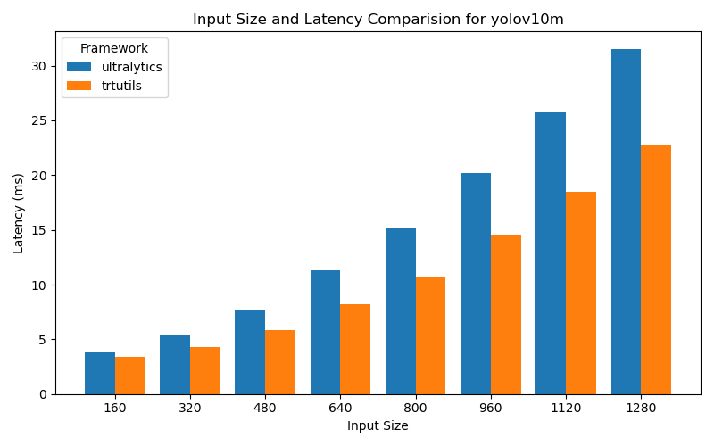
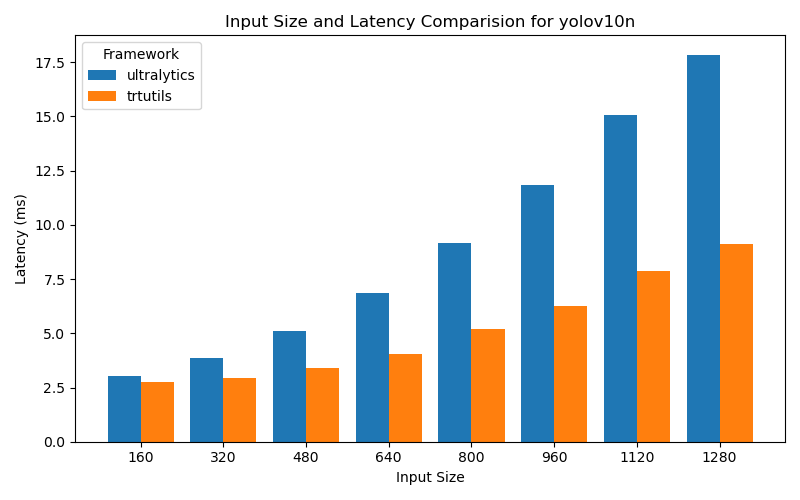
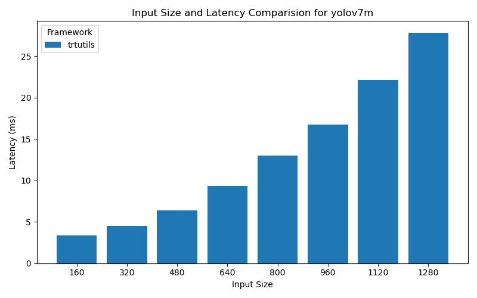
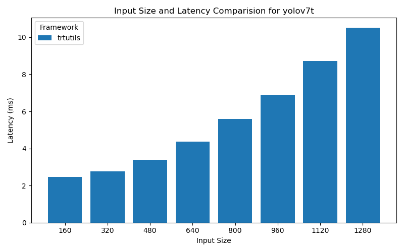
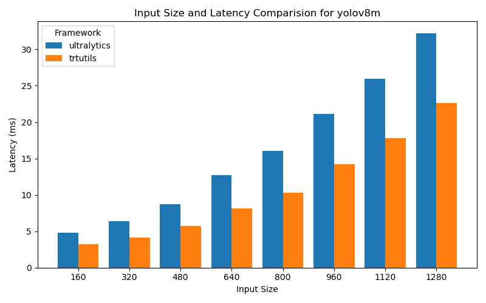
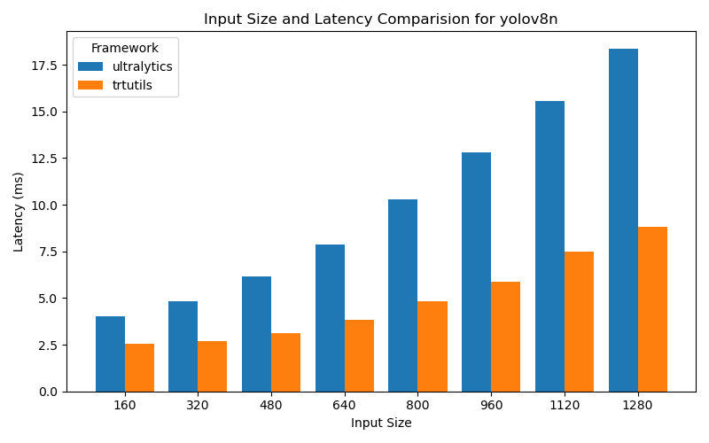
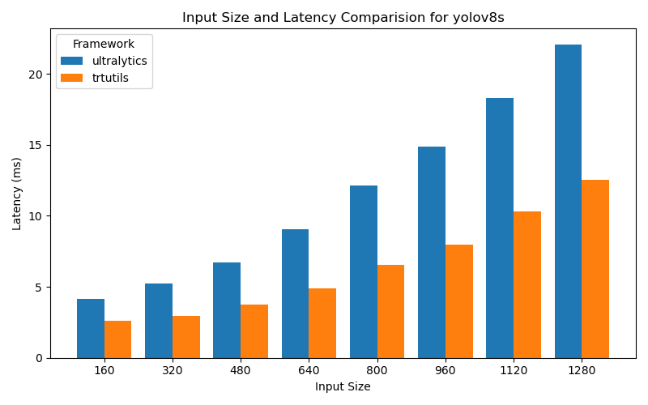
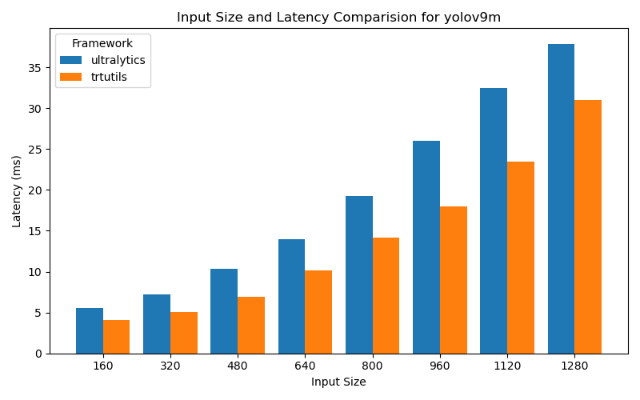
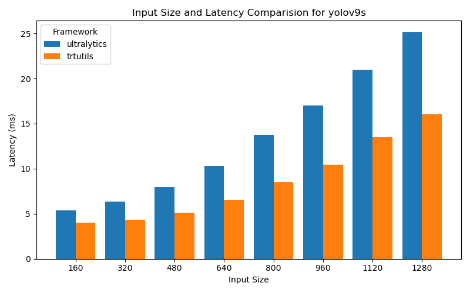
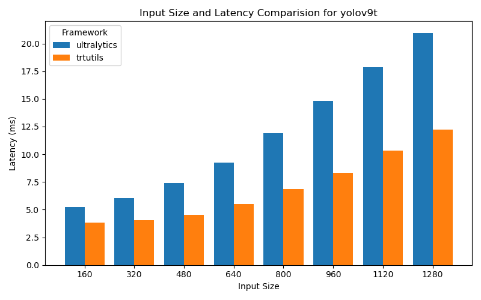

OrinAGX
=======

This section contains benchmarking results for various YOLO models on the OrinAGX platform.

Performance Plots
----------------

The following plots show the performance comparison between different YOLO models and frameworks:

yolov10m
~~~~~~~~

yolov10n
~~~~~~~~

yolov10s
~~~~~~~~

.. image:: ../../benchmark/plots/OrinAGX/yolov10s.png
   :alt: yolov10s performance plot
   :align: center

yolov7m
~~~~~~~~

yolov7t
~~~~~~~~

yolov8m
~~~~~~~~

yolov8n
~~~~~~~~

yolov8s
~~~~~~~~

yolov9m
~~~~~~~~

yolov9s
~~~~~~~~

yolov9t
~~~~~~~~

Performance Table
----------------

The following table shows detailed performance metrics for all tested models:

.. csv-table:: Performance Metrics
   :header: Framework,Model,Input Size,Mean (ms),Median (ms),Min (ms),Max (ms)
   :widths: 10,10,10,10,10,10,10

   yolov10n,ultralytics,160,3.0,3.0,3.0,3.1
   yolov10n,ultralytics,320,3.9,3.9,3.8,4.1
   yolov10n,ultralytics,480,5.1,5.1,5.0,5.4
   yolov10n,ultralytics,640,6.9,6.9,6.8,7.5
   yolov10n,ultralytics,800,9.2,9.2,9.1,11.1
   yolov10n,ultralytics,960,11.8,11.9,11.4,12.2
   yolov10n,ultralytics,1120,15.0,15.0,14.9,16.9
   yolov10n,ultralytics,1280,17.9,17.8,17.7,18.5
   yolov10s,ultralytics,160,3.2,3.2,3.1,3.5
   yolov10s,ultralytics,320,4.3,4.2,4.2,4.8
   yolov10s,ultralytics,480,5.8,5.7,5.7,6.2
   yolov10s,ultralytics,640,8.0,8.0,7.9,8.4
   yolov10s,ultralytics,800,11.5,11.5,11.1,66.2
   yolov10s,ultralytics,960,14.4,14.3,14.3,15.0
   yolov10s,ultralytics,1120,18.5,18.5,18.3,20.3
   yolov10s,ultralytics,1280,22.3,22.3,22.2,24.1
   yolov10m,ultralytics,160,3.8,3.8,3.8,4.3
   yolov10m,ultralytics,320,5.4,5.3,5.3,5.9
   yolov10m,ultralytics,480,7.6,7.6,7.6,8.3
   yolov10m,ultralytics,640,11.3,11.3,11.0,13.3
   yolov10m,ultralytics,800,15.2,15.1,15.0,22.0
   yolov10m,ultralytics,960,20.2,20.1,20.0,84.5
   yolov10m,ultralytics,1120,25.7,25.7,25.4,27.6
   yolov10m,ultralytics,1280,31.5,31.5,31.4,33.4
   yolov9t,ultralytics,160,5.2,5.2,5.1,5.9
   yolov9t,ultralytics,320,6.0,6.0,5.9,7.0
   yolov9t,ultralytics,480,7.4,7.4,7.3,7.9
   yolov9t,ultralytics,640,9.3,9.2,9.1,11.2
   yolov9t,ultralytics,800,11.9,11.9,11.5,12.5
   yolov9t,ultralytics,960,14.8,14.7,14.5,105.8
   yolov9t,ultralytics,1120,17.8,17.8,17.6,19.4
   yolov9t,ultralytics,1280,21.0,20.9,20.7,22.8
   yolov9s,ultralytics,160,5.4,5.4,5.3,5.8
   yolov9s,ultralytics,320,6.3,6.3,6.2,6.6
   yolov9s,ultralytics,480,8.0,8.0,7.8,9.0
   yolov9s,ultralytics,640,10.3,10.3,10.2,12.3
   yolov9s,ultralytics,800,13.8,13.8,13.5,14.3
   yolov9s,ultralytics,960,17.0,16.9,16.7,74.3
   yolov9s,ultralytics,1120,20.9,20.9,20.7,22.9
   yolov9s,ultralytics,1280,25.2,25.1,25.0,26.0
   yolov9m,ultralytics,160,5.5,5.4,5.3,7.1
   yolov9m,ultralytics,320,7.2,7.1,7.0,8.2
   yolov9m,ultralytics,480,10.4,10.3,10.1,11.7
   yolov9m,ultralytics,640,14.0,13.9,13.5,16.2
   yolov9m,ultralytics,800,19.3,19.2,19.1,21.1
   yolov9m,ultralytics,960,26.0,25.7,25.4,361.6
   yolov9m,ultralytics,1120,32.4,32.4,32.3,34.4
   yolov9m,ultralytics,1280,37.9,37.9,37.7,39.6
   yolov8n,ultralytics,160,4.0,4.0,3.9,4.2
   yolov8n,ultralytics,320,4.8,4.8,4.7,6.1
   yolov8n,ultralytics,480,6.2,6.2,6.0,6.5
   yolov8n,ultralytics,640,7.9,7.9,7.7,8.5
   yolov8n,ultralytics,800,10.3,10.3,10.1,10.8
   yolov8n,ultralytics,960,12.8,12.8,12.7,13.2
   yolov8n,ultralytics,1120,15.6,15.5,15.2,16.0
   yolov8n,ultralytics,1280,18.4,18.4,18.3,18.7
   yolov8s,ultralytics,160,4.2,4.2,4.1,4.6
   yolov8s,ultralytics,320,5.2,5.2,5.1,5.5
   yolov8s,ultralytics,480,6.7,6.7,6.6,7.6
   yolov8s,ultralytics,640,9.0,9.0,8.9,9.6
   yolov8s,ultralytics,800,12.2,12.2,12.0,12.5
   yolov8s,ultralytics,960,14.9,14.9,14.8,17.1
   yolov8s,ultralytics,1120,18.3,18.3,18.1,18.7
   yolov8s,ultralytics,1280,22.1,22.1,21.9,22.5
   yolov8m,ultralytics,160,4.8,4.8,4.7,5.3
   yolov8m,ultralytics,320,6.4,6.4,6.3,6.9
   yolov8m,ultralytics,480,8.7,8.7,8.6,9.2
   yolov8m,ultralytics,640,12.7,12.7,12.6,13.1
   yolov8m,ultralytics,800,16.1,16.1,15.9,16.5
   yolov8m,ultralytics,960,21.1,21.1,21.0,21.5
   yolov8m,ultralytics,1120,26.0,26.0,25.9,26.5
   yolov8m,ultralytics,1280,32.2,32.2,32.0,34.0
   yolov10n,trtutils,160,2.7,2.7,2.7,4.1
   yolov10n,trtutils,320,2.9,2.9,2.9,3.7
   yolov10n,trtutils,480,3.4,3.4,3.4,3.8
   yolov10n,trtutils,640,4.1,4.0,4.0,4.7
   yolov10n,trtutils,800,5.2,5.2,5.1,6.0
   yolov10n,trtutils,960,6.3,6.2,6.2,6.9
   yolov10n,trtutils,1120,7.9,7.9,7.8,8.7
   yolov10n,trtutils,1280,9.1,9.1,9.1,10.2
   yolov10s,trtutils,160,2.8,2.8,2.7,3.5
   yolov10s,trtutils,320,3.2,3.2,3.1,3.7
   yolov10s,trtutils,480,4.0,4.0,4.0,4.5
   yolov10s,trtutils,640,5.2,5.1,5.1,5.8
   yolov10s,trtutils,800,7.0,7.0,7.0,7.8
   yolov10s,trtutils,960,8.7,8.7,8.6,10.1
   yolov10s,trtutils,1120,11.3,11.2,11.2,12.3
   yolov10s,trtutils,1280,13.5,13.5,13.4,14.4
   yolov10m,trtutils,160,3.4,3.4,3.3,4.0
   yolov10m,trtutils,320,4.3,4.3,4.2,4.8
   yolov10m,trtutils,480,5.8,5.8,5.8,6.3
   yolov10m,trtutils,640,8.2,8.2,8.2,9.0
   yolov10m,trtutils,800,10.7,10.6,10.6,11.3
   yolov10m,trtutils,960,14.4,14.4,14.3,15.2
   yolov10m,trtutils,1120,18.5,18.5,18.4,19.5
   yolov10m,trtutils,1280,22.8,22.8,22.7,23.6
   yolov9t,trtutils,160,3.9,3.8,3.8,4.6
   yolov9t,trtutils,320,4.0,4.0,3.9,4.7
   yolov9t,trtutils,480,4.5,4.5,4.4,5.1
   yolov9t,trtutils,640,5.5,5.5,5.4,6.1
   yolov9t,trtutils,800,6.9,6.8,6.8,7.5
   yolov9t,trtutils,960,8.3,8.3,8.2,9.0
   yolov9t,trtutils,1120,10.3,10.3,10.2,11.0
   yolov9t,trtutils,1280,12.2,12.2,12.1,13.2
   yolov9s,trtutils,160,4.0,4.0,3.9,4.8
   yolov9s,trtutils,320,4.3,4.3,4.3,5.1
   yolov9s,trtutils,480,5.1,5.1,5.0,5.8
   yolov9s,trtutils,640,6.5,6.5,6.5,7.4
   yolov9s,trtutils,800,8.5,8.5,8.4,9.3
   yolov9s,trtutils,960,10.5,10.5,10.4,11.6
   yolov9s,trtutils,1120,13.5,13.5,13.4,14.3
   yolov9s,trtutils,1280,16.0,16.0,15.9,16.9
   yolov9m,trtutils,160,4.0,4.0,4.0,4.8
   yolov9m,trtutils,320,5.1,5.1,5.0,5.8
   yolov9m,trtutils,480,6.9,6.9,6.8,7.8
   yolov9m,trtutils,640,10.1,10.1,10.0,11.2
   yolov9m,trtutils,800,14.2,14.2,14.1,14.9
   yolov9m,trtutils,960,18.0,17.9,17.8,18.8
   yolov9m,trtutils,1120,23.5,23.5,23.3,24.5
   yolov9m,trtutils,1280,31.0,30.9,30.8,32.1
   yolov8n,trtutils,160,2.5,2.5,2.4,3.6
   yolov8n,trtutils,320,2.7,2.6,2.6,3.3
   yolov8n,trtutils,480,3.1,3.1,3.0,3.8
   yolov8n,trtutils,640,3.8,3.8,3.7,4.7
   yolov8n,trtutils,800,4.8,4.8,4.7,5.8
   yolov8n,trtutils,960,5.9,5.9,5.8,6.9
   yolov8n,trtutils,1120,7.5,7.5,7.4,8.5
   yolov8n,trtutils,1280,8.8,8.8,8.7,10.0
   yolov8s,trtutils,160,2.6,2.6,2.5,3.2
   yolov8s,trtutils,320,3.0,2.9,2.9,3.8
   yolov8s,trtutils,480,3.7,3.7,3.7,4.4
   yolov8s,trtutils,640,4.9,4.8,4.8,5.6
   yolov8s,trtutils,800,6.5,6.5,6.4,7.4
   yolov8s,trtutils,960,8.0,8.0,7.9,9.1
   yolov8s,trtutils,1120,10.3,10.3,10.2,11.3
   yolov8s,trtutils,1280,12.6,12.5,12.5,13.7
   yolov8m,trtutils,160,3.2,3.1,3.1,3.8
   yolov8m,trtutils,320,4.2,4.1,4.1,4.9
   yolov8m,trtutils,480,5.7,5.7,5.6,6.3
   yolov8m,trtutils,640,8.2,8.1,8.1,9.1
   yolov8m,trtutils,800,10.3,10.3,10.2,11.4
   yolov8m,trtutils,960,14.2,14.2,14.1,15.4
   yolov8m,trtutils,1120,17.8,17.8,17.7,18.7
   yolov8m,trtutils,1280,22.6,22.5,22.4,23.5
   yolov7t,trtutils,160,2.5,2.5,2.4,3.2
   yolov7t,trtutils,320,2.8,2.8,2.7,3.3
   yolov7t,trtutils,480,3.4,3.4,3.3,3.8
   yolov7t,trtutils,640,4.4,4.4,4.3,5.0
   yolov7t,trtutils,800,5.6,5.6,5.5,6.3
   yolov7t,trtutils,960,6.9,6.9,6.8,7.6
   yolov7t,trtutils,1120,8.7,8.7,8.6,9.5
   yolov7t,trtutils,1280,10.5,10.5,10.5,11.5
   yolov7m,trtutils,160,3.3,3.3,3.3,4.0
   yolov7m,trtutils,320,4.5,4.5,4.5,5.1
   yolov7m,trtutils,480,6.4,6.4,6.3,6.9
   yolov7m,trtutils,640,9.3,9.3,9.3,10.1
   yolov7m,trtutils,800,13.0,13.0,12.9,14.2
   yolov7m,trtutils,960,16.8,16.8,16.7,17.6
   yolov7m,trtutils,1120,22.2,22.2,21.9,23.5
   yolov7m,trtutils,1280,27.9,27.9,27.4,28.6
