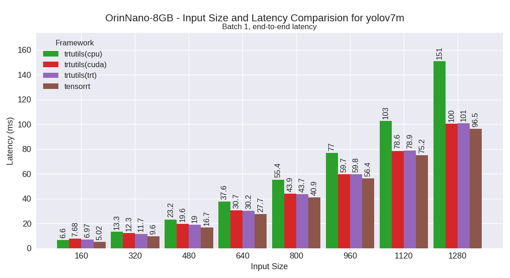
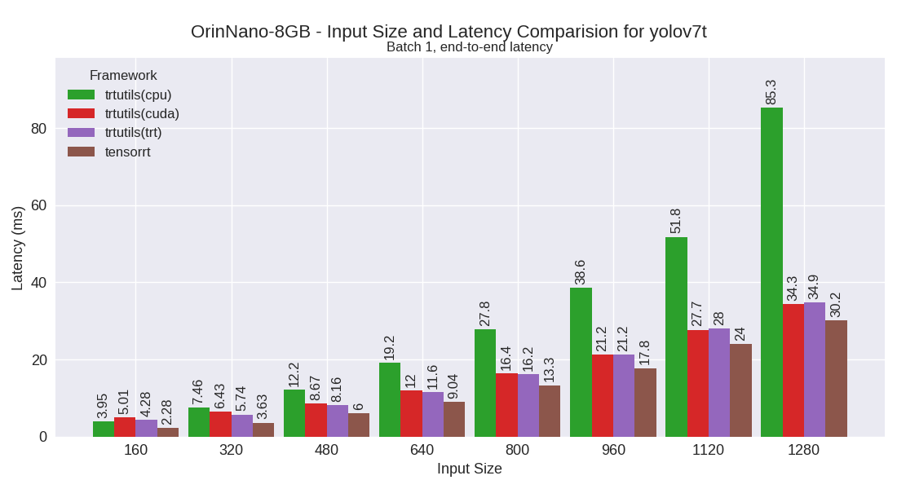
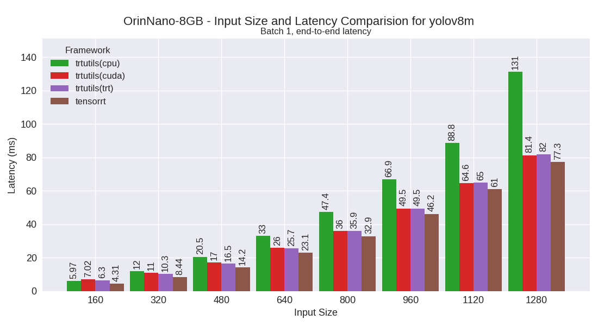
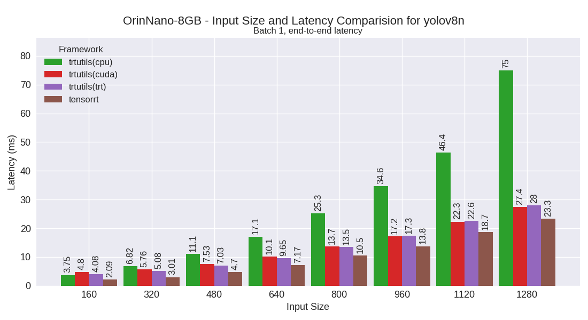
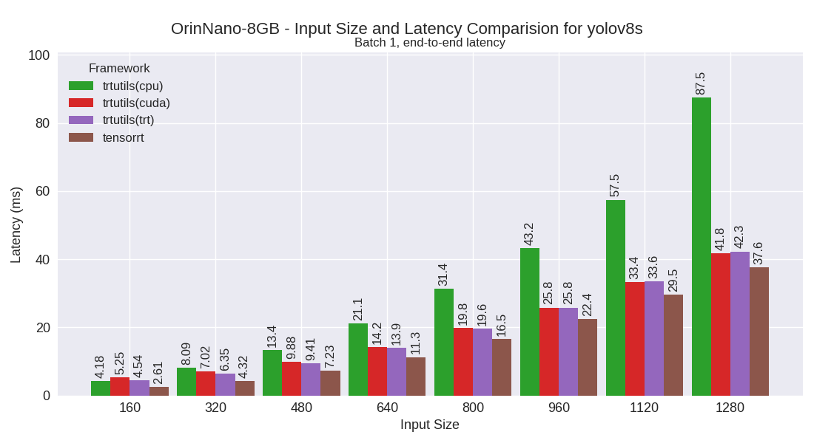
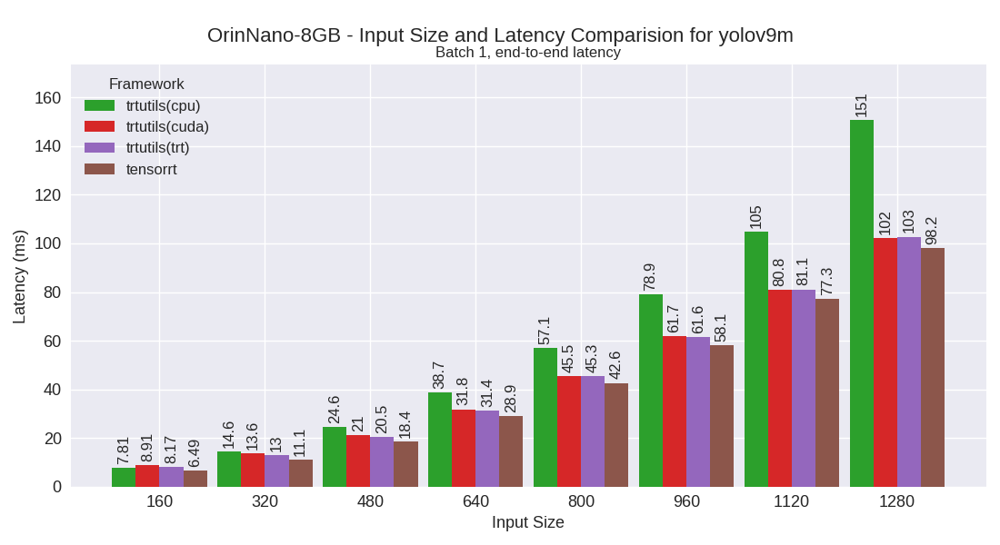

OrinNano-8GB
============

Developer Kit with Jetpack 5

This section contains benchmarking results for various YOLO models on the OrinNano-8GB platform.

Performance Plots
----------------

The following plots show the performance comparison between different YOLO models and frameworks:

yolov7m
~~~~~~~~

yolov7t
~~~~~~~~

yolov8m
~~~~~~~~

yolov8n
~~~~~~~~

yolov8s
~~~~~~~~

yolov9m
~~~~~~~~

yolov9s
~~~~~~~~

yolov9t
~~~~~~~~

Performance Table
----------------

The following table shows detailed performance metrics for all tested models:

.. csv-table:: Performance Metrics
   :header: Framework,Model,Input Size,Mean (ms),Median (ms),Min (ms),Max (ms)
   :widths: 10,10,10,10,10,10,10

   trtutils,yolov8n,160,5.1,5.0,4.9,6.5
   trtutils,yolov8n,320,6.1,6.1,6.0,6.8
   trtutils,yolov8n,480,8.1,8.1,8.1,10.0
   trtutils,yolov8n,640,11.1,11.1,10.9,13.0
   trtutils,yolov8n,800,15.2,15.1,14.9,16.9
   trtutils,yolov8n,960,19.2,19.1,18.9,21.1
   trtutils,yolov8n,1120,24.8,24.8,24.5,26.7
   trtutils,yolov8n,1280,31.8,32.3,30.1,32.6
   trtutils,yolov7t,160,5.4,5.3,5.1,6.4
   trtutils,yolov7t,320,6.8,6.8,6.7,7.4
   trtutils,yolov7t,480,9.3,9.3,9.2,10.3
   trtutils,yolov7t,640,13.2,13.1,12.8,14.7
   trtutils,yolov7t,800,18.1,17.9,17.6,20.0
   trtutils,yolov7t,960,24.5,25.1,22.9,25.4
   trtutils,yolov7t,1120,32.4,32.4,30.3,32.6
   trtutils,yolov7t,1280,37.5,37.5,37.1,39.8
   trtutils,yolov8s,160,5.4,5.4,5.3,7.0
   trtutils,yolov8s,320,7.3,7.3,7.2,7.9
   trtutils,yolov8s,480,10.5,10.5,10.4,11.4
   trtutils,yolov8s,640,15.3,15.2,15.0,17.0
   trtutils,yolov8s,800,21.3,21.3,20.9,23.2
   trtutils,yolov8s,960,27.9,27.8,27.4,29.8
   trtutils,yolov8s,1120,37.2,37.7,35.4,38.1
   trtutils,yolov8s,1280,46.8,46.8,44.6,47.0
   trtutils,yolov8m,160,7.2,7.2,7.1,8.4
   trtutils,yolov8m,320,11.4,11.3,11.2,12.3
   trtutils,yolov8m,480,18.0,17.9,17.6,19.8
   trtutils,yolov8m,640,28.5,29.0,26.9,29.4
   trtutils,yolov8m,800,38.7,39.3,37.4,39.8
   trtutils,yolov8m,960,51.9,51.8,51.1,53.8
   trtutils,yolov8m,1120,67.7,67.6,66.9,69.7
   trtutils,yolov8m,1280,86.1,86.8,84.4,87.3
   trtutils,yolov9t,160,8.0,8.0,7.9,9.3
   trtutils,yolov9t,320,9.3,9.3,9.2,9.8
   trtutils,yolov9t,480,11.9,11.9,11.8,12.7
   trtutils,yolov9t,640,15.8,15.7,15.6,16.5
   trtutils,yolov9t,800,21.2,21.1,20.8,26.8
   trtutils,yolov9t,960,27.0,26.8,26.5,28.9
   trtutils,yolov9t,1120,34.9,34.9,34.5,36.8
   trtutils,yolov9t,1280,42.1,42.1,41.6,44.1
   trtutils,yolov9s,160,8.4,8.3,8.1,9.3
   trtutils,yolov9s,320,10.5,10.5,10.4,16.5
   trtutils,yolov9s,480,14.6,14.6,14.4,16.4
   trtutils,yolov9s,640,20.8,20.6,20.4,22.4
   trtutils,yolov9s,800,28.4,28.3,27.9,30.2
   trtutils,yolov9s,960,36.5,36.5,36.0,38.5
   trtutils,yolov9s,1120,48.0,48.0,47.4,50.1
   trtutils,yolov9s,1280,59.7,59.5,58.8,61.6
   trtutils,yolov9m,160,9.1,9.1,9.0,10.2
   trtutils,yolov9m,320,14.0,14.0,13.9,14.9
   trtutils,yolov9m,480,21.9,21.8,21.5,23.7
   trtutils,yolov9m,640,33.0,33.0,32.5,34.9
   trtutils,yolov9m,800,47.8,47.3,46.8,49.3
   trtutils,yolov9m,960,63.8,63.8,62.9,65.7
   trtutils,yolov9m,1120,83.9,83.9,83.3,85.8
   trtutils,yolov9m,1280,106.1,106.1,105.1,107.3
   trtutils,yolov7m,160,7.9,7.8,7.7,9.0
   trtutils,yolov7m,320,13.0,12.8,12.5,15.5
   trtutils,yolov7m,480,20.9,20.3,20.0,22.7
   trtutils,yolov7m,640,33.2,32.8,32.2,105.2
   trtutils,yolov7m,800,45.6,45.6,44.9,47.6
   trtutils,yolov7m,960,68.7,68.9,61.6,143.7
   trtutils,yolov7m,1120,82.0,81.7,80.9,117.3
   trtutils,yolov7m,1280,104.5,105.1,103.1,106.3
