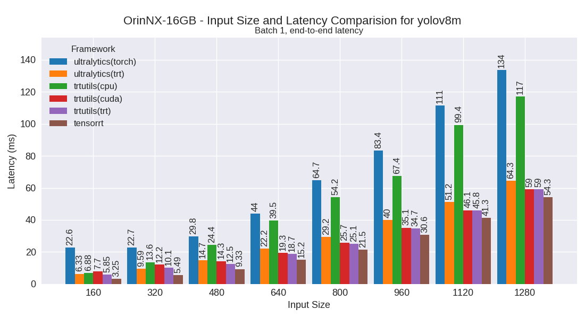

OrinNX-16GB
===========

Developer Kit with Jetpack 6

This section contains benchmarking results for various YOLO models on the OrinNX-16GB platform.

Performance Plots
-----------------

The following plots show the performance comparison between different YOLO models and frameworks:

yolov10m
~~~~~~~~

.. image:: ../../benchmark/plots/OrinNX-16GB/yolov10m.png
   :alt: yolov10m performance plot
   :align: center

yolov10n
~~~~~~~~

.. image:: ../../benchmark/plots/OrinNX-16GB/yolov10n.png
   :alt: yolov10n performance plot
   :align: center

yolov10s
~~~~~~~~

.. image:: ../../benchmark/plots/OrinNX-16GB/yolov10s.png
   :alt: yolov10s performance plot
   :align: center

yolov7m
~~~~~~~~

yolov7t
~~~~~~~~

yolov8m
~~~~~~~~

yolov8n
~~~~~~~~

.. image:: ../../benchmark/plots/OrinNX-16GB/yolov8n.png
   :alt: yolov8n performance plot
   :align: center

yolov8s
~~~~~~~~

.. image:: ../../benchmark/plots/OrinNX-16GB/yolov8s.png
   :alt: yolov8s performance plot
   :align: center

yolov9m
~~~~~~~~

.. image:: ../../benchmark/plots/OrinNX-16GB/yolov9m.png
   :alt: yolov9m performance plot
   :align: center

yolov9s
~~~~~~~~

.. image:: ../../benchmark/plots/OrinNX-16GB/yolov9s.png
   :alt: yolov9s performance plot
   :align: center

yolov9t
~~~~~~~~

.. image:: ../../benchmark/plots/OrinNX-16GB/yolov9t.png
   :alt: yolov9t performance plot
   :align: center

yoloxm
~~~~~~~~

yoloxn
~~~~~~~~

yoloxs
~~~~~~~~

.. image:: ../../benchmark/plots/OrinNX-16GB/yoloxs.png
   :alt: yoloxs performance plot
   :align: center

yoloxt
~~~~~~~~

.. image:: ../../benchmark/plots/OrinNX-16GB/yoloxt.png
   :alt: yoloxt performance plot
   :align: center

Performance Table
-----------------

The following table shows detailed performance metrics for all tested models:

.. csv-table:: Performance Metrics
   :header: Framework,Model,Input Size,Mean (ms),Median (ms),Min (ms),Max (ms)
   :widths: 10,10,10,10,10,10,10

   trtutils,yolov10n,160,3.4,3.4,3.3,4.6
   trtutils,yolov10n,320,4.0,4.0,4.0,4.5
   trtutils,yolov10n,480,5.4,5.4,5.3,6.5
   trtutils,yolov10n,640,7.2,7.2,7.1,8.2
   trtutils,yolov10n,800,9.9,9.9,9.8,11.0
   trtutils,yolov10n,960,12.4,12.4,12.3,13.4
   trtutils,yolov10n,1120,16.4,16.4,16.4,17.6
   trtutils,yolov10n,1280,19.6,19.6,19.5,20.7
   trtutils,yolov10s,160,3.7,3.7,3.6,4.5
   trtutils,yolov10s,320,4.9,4.9,4.9,5.6
   trtutils,yolov10s,480,7.0,7.0,6.9,7.7
   trtutils,yolov10s,640,10.1,10.1,10.0,11.1
   trtutils,yolov10s,800,14.2,14.2,14.1,15.4
   trtutils,yolov10s,960,18.4,18.4,18.3,20.6
   trtutils,yolov10s,1120,24.4,24.4,24.3,25.2
   trtutils,yolov10s,1280,30.0,30.0,29.9,31.0
   trtutils,yolov10m,160,4.6,4.5,4.5,5.3
   trtutils,yolov10m,320,7.1,7.1,7.0,7.8
   trtutils,yolov10m,480,11.2,11.2,11.1,11.9
   trtutils,yolov10m,640,17.0,17.0,16.9,17.9
   trtutils,yolov10m,800,23.9,23.9,23.8,24.8
   trtutils,yolov10m,960,32.7,32.6,32.5,33.7
   trtutils,yolov10m,1120,43.4,43.4,43.2,44.3
   trtutils,yolov10m,1280,53.9,53.8,53.7,57.3
   trtutils,yolov9t,160,4.7,4.7,4.6,5.3
   trtutils,yolov9t,320,5.5,5.4,5.4,6.2
   trtutils,yolov9t,480,7.1,7.0,7.0,12.4
   trtutils,yolov9t,640,9.6,9.5,9.4,10.5
   trtutils,yolov9t,800,12.8,12.8,12.6,13.9
   trtutils,yolov9t,960,16.3,16.3,16.2,17.1
   trtutils,yolov9t,1120,20.9,20.9,20.8,21.8
   trtutils,yolov9t,1280,25.5,25.5,25.4,26.7
   trtutils,yolov9s,160,5.0,5.0,4.9,5.6
   trtutils,yolov9s,320,6.2,6.2,6.1,6.9
   trtutils,yolov9s,480,8.6,8.6,8.5,9.3
   trtutils,yolov9s,640,12.2,12.1,12.0,13.1
   trtutils,yolov9s,800,16.9,16.9,16.8,17.8
   trtutils,yolov9s,960,22.0,22.0,21.9,22.9
   trtutils,yolov9s,1120,28.9,28.8,28.7,29.7
   trtutils,yolov9s,1280,35.7,35.7,35.6,36.9
   trtutils,yolov9m,160,5.4,5.4,5.4,6.0
   trtutils,yolov9m,320,8.4,8.4,8.3,9.2
   trtutils,yolov9m,480,13.3,13.3,13.2,13.7
   trtutils,yolov9m,640,20.6,20.6,20.5,21.3
   trtutils,yolov9m,800,29.6,29.5,29.5,30.6
   trtutils,yolov9m,960,40.4,40.1,40.0,41.8
   trtutils,yolov9m,1120,53.5,53.3,53.2,54.4
   trtutils,yolov9m,1280,67.2,67.1,66.3,68.7
   trtutils,yolov8n,160,2.9,2.9,2.9,3.9
   trtutils,yolov8n,320,3.7,3.6,3.6,4.3
   trtutils,yolov8n,480,5.0,4.9,4.9,5.6
   trtutils,yolov8n,640,6.9,6.8,6.7,7.9
   trtutils,yolov8n,800,9.5,9.5,9.4,10.6
   trtutils,yolov8n,960,12.1,12.1,12.1,13.1
   trtutils,yolov8n,1120,16.0,16.0,15.9,17.1
   trtutils,yolov8n,1280,19.5,19.5,19.5,20.9
   trtutils,yolov8s,160,3.3,3.3,3.2,3.9
   trtutils,yolov8s,320,4.5,4.4,4.4,5.3
   trtutils,yolov8s,480,6.4,6.4,6.3,7.1
   trtutils,yolov8s,640,9.4,9.4,9.4,10.4
   trtutils,yolov8s,800,13.4,13.3,13.3,14.8
   trtutils,yolov8s,960,17.5,17.5,17.4,18.2
   trtutils,yolov8s,1120,22.8,22.8,22.7,23.7
   trtutils,yolov8s,1280,28.5,28.5,28.4,29.6
   trtutils,yolov8m,160,4.4,4.3,4.3,5.2
   trtutils,yolov8m,320,7.0,7.0,6.9,7.7
   trtutils,yolov8m,480,11.1,11.1,11.0,11.8
   trtutils,yolov8m,640,17.1,17.1,17.0,18.1
   trtutils,yolov8m,800,23.8,23.8,23.7,25.5
   trtutils,yolov8m,960,32.9,32.8,32.6,35.2
   trtutils,yolov8m,1120,43.1,43.0,42.9,45.0
   trtutils,yolov8m,1280,55.0,54.9,54.1,57.2
   trtutils,yolov7t,160,3.1,3.0,3.0,3.7
   trtutils,yolov7t,320,4.0,4.0,3.9,4.9
   trtutils,yolov7t,480,5.6,5.6,5.5,6.4
   trtutils,yolov7t,640,7.9,7.9,7.8,8.9
   trtutils,yolov7t,800,10.9,10.9,10.8,12.1
   trtutils,yolov7t,960,14.2,14.2,14.2,15.3
   trtutils,yolov7t,1120,18.6,18.5,18.4,19.8
   trtutils,yolov7t,1280,23.3,23.2,23.1,24.3
   trtutils,yolov7m,160,4.7,4.7,4.6,5.4
   trtutils,yolov7m,320,7.8,7.8,7.7,8.7
   trtutils,yolov7m,480,12.7,12.7,12.6,13.9
   trtutils,yolov7m,640,20.2,20.2,20.1,21.2
   trtutils,yolov7m,800,29.6,29.8,29.0,30.8
   trtutils,yolov7m,960,41.4,41.2,39.6,43.5
   trtutils,yolov7m,1120,55.6,55.3,53.1,59.1
   trtutils,yolov7m,1280,73.9,74.0,70.5,77.1
   trtutils,yoloxt,160,3.0,3.0,2.9,4.7
   trtutils,yoloxt,320,4.0,4.0,4.0,5.0
   trtutils,yoloxt,480,5.7,5.7,5.6,6.4
   trtutils,yoloxt,640,8.2,8.2,8.2,9.1
   trtutils,yoloxt,800,11.2,11.2,11.1,12.5
   trtutils,yoloxt,960,14.9,14.8,14.8,15.9
   trtutils,yoloxt,1120,19.1,19.1,19.0,20.3
   trtutils,yoloxt,1280,24.3,24.3,24.2,25.2
   trtutils,yoloxn,160,3.0,3.0,2.9,3.6
   trtutils,yoloxn,320,3.8,3.7,3.6,4.6
   trtutils,yoloxn,480,4.9,4.9,4.8,5.6
   trtutils,yoloxn,640,6.6,6.6,6.6,9.5
   trtutils,yoloxn,800,9.1,9.1,9.0,10.2
   trtutils,yoloxn,960,11.8,11.7,11.6,12.8
   trtutils,yoloxn,1120,15.5,15.5,15.4,16.4
   trtutils,yoloxn,1280,19.0,19.0,18.9,20.1
   trtutils,yoloxs,160,3.1,3.1,3.0,4.1
   trtutils,yoloxs,320,4.3,4.2,4.2,5.2
   trtutils,yoloxs,480,6.2,6.2,6.1,6.6
   trtutils,yoloxs,640,9.0,9.0,8.9,9.8
   trtutils,yoloxs,800,12.6,12.6,12.5,13.8
   trtutils,yoloxs,960,16.6,16.6,16.5,17.5
   trtutils,yoloxs,1120,21.5,21.5,21.4,22.6
   trtutils,yoloxs,1280,27.3,27.3,27.2,28.3
   trtutils,yoloxm,160,4.1,4.1,4.0,4.8
   trtutils,yoloxm,320,6.6,6.5,6.5,7.6
   trtutils,yoloxm,480,10.3,10.3,10.2,11.2
   trtutils,yoloxm,640,16.1,16.1,16.0,17.1
   trtutils,yoloxm,800,22.1,22.1,22.0,23.2
   trtutils,yoloxm,960,30.6,30.5,30.4,32.2
   trtutils,yoloxm,1120,40.2,40.0,39.9,43.0
   trtutils,yoloxm,1280,52.5,52.4,51.6,57.7
   ultralytics(trt),yolov10n,160,3.7,3.7,3.6,6.1
   ultralytics(trt),yolov10n,320,5.0,5.0,4.9,5.4
   ultralytics(trt),yolov10n,480,7.2,7.2,7.1,7.7
   ultralytics(trt),yolov10n,640,10.3,10.2,10.1,11.2
   ultralytics(trt),yolov10n,800,14.4,14.4,14.2,16.6
   ultralytics(trt),yolov10n,960,18.2,18.1,17.9,20.3
   ultralytics(trt),yolov10n,1120,23.4,23.4,23.3,25.5
   ultralytics(trt),yolov10n,1280,28.4,28.3,28.1,32.6
   ultralytics(trt),yolov10s,160,4.0,4.0,3.9,6.3
   ultralytics(trt),yolov10s,320,6.0,6.0,5.9,6.3
   ultralytics(trt),yolov10s,480,8.9,8.9,8.8,11.5
   ultralytics(trt),yolov10s,640,13.1,13.1,13.0,15.2
   ultralytics(trt),yolov10s,800,18.9,18.9,18.8,20.9
   ultralytics(trt),yolov10s,960,24.2,24.2,24.0,24.6
   ultralytics(trt),yolov10s,1120,31.6,31.5,31.3,34.2
   ultralytics(trt),yolov10s,1280,38.8,38.7,38.5,41.4
   ultralytics(trt),yolov10m,160,5.1,5.1,5.0,5.3
   ultralytics(trt),yolov10m,320,8.3,8.3,8.2,9.1
   ultralytics(trt),yolov10m,480,13.4,13.3,13.2,13.8
   ultralytics(trt),yolov10m,640,20.8,20.8,20.6,21.7
   ultralytics(trt),yolov10m,800,28.6,28.6,28.4,30.5
   ultralytics(trt),yolov10m,960,39.1,39.1,38.8,42.1
   ultralytics(trt),yolov10m,1120,50.8,50.6,50.4,53.6
   ultralytics(trt),yolov10m,1280,62.7,62.5,62.2,65.6
   ultralytics(trt),yolov9t,160,6.2,6.2,6.1,6.8
   ultralytics(trt),yolov9t,320,7.6,7.6,7.5,8.3
   ultralytics(trt),yolov9t,480,10.1,10.1,9.9,10.7
   ultralytics(trt),yolov9t,640,13.7,13.7,13.5,14.3
   ultralytics(trt),yolov9t,800,17.3,17.3,17.1,19.2
   ultralytics(trt),yolov9t,960,21.9,21.8,21.6,22.9
   ultralytics(trt),yolov9t,1120,27.7,27.7,27.5,29.9
   ultralytics(trt),yolov9t,1280,32.5,32.4,32.2,35.8
   ultralytics(trt),yolov9s,160,6.5,6.5,6.4,7.2
   ultralytics(trt),yolov9s,320,8.3,8.3,8.2,8.7
   ultralytics(trt),yolov9s,480,11.4,11.4,11.3,11.7
   ultralytics(trt),yolov9s,640,16.4,16.4,16.3,18.4
   ultralytics(trt),yolov9s,800,21.6,21.6,21.5,23.8
   ultralytics(trt),yolov9s,960,27.5,27.5,27.3,29.5
   ultralytics(trt),yolov9s,1120,35.6,35.6,35.4,38.3
   ultralytics(trt),yolov9s,1280,44.3,44.3,44.1,48.6
   ultralytics(trt),yolov9m,160,7.1,7.1,7.0,7.4
   ultralytics(trt),yolov9m,320,10.9,10.8,10.7,12.3
   ultralytics(trt),yolov9m,480,18.0,18.0,17.8,20.4
   ultralytics(trt),yolov9m,640,25.1,25.0,24.8,27.7
   ultralytics(trt),yolov9m,800,36.4,36.3,36.2,38.7
   ultralytics(trt),yolov9m,960,50.7,50.5,50.3,53.3
   ultralytics(trt),yolov9m,1120,65.7,65.6,64.5,68.3
   ultralytics(trt),yolov9m,1280,77.2,77.1,76.7,80.0
   ultralytics(trt),yolov8n,160,4.7,4.7,4.6,5.5
   ultralytics(trt),yolov8n,320,6.1,6.1,5.9,6.3
   ultralytics(trt),yolov8n,480,8.3,8.2,8.1,9.2
   ultralytics(trt),yolov8n,640,11.4,11.4,11.2,11.6
   ultralytics(trt),yolov8n,800,15.0,15.0,14.8,17.8
   ultralytics(trt),yolov8n,960,18.5,18.5,18.3,20.4
   ultralytics(trt),yolov8n,1120,23.2,23.2,23.0,25.4
   ultralytics(trt),yolov8n,1280,27.8,27.7,27.6,29.6
   ultralytics(trt),yolov8s,160,5.1,5.1,5.0,5.8
   ultralytics(trt),yolov8s,320,7.0,7.0,6.9,7.4
   ultralytics(trt),yolov8s,480,9.8,9.8,9.7,10.3
   ultralytics(trt),yolov8s,640,13.9,13.9,13.8,16.0
   ultralytics(trt),yolov8s,800,18.9,18.9,18.7,20.8
   ultralytics(trt),yolov8s,960,23.7,23.6,23.4,25.7
   ultralytics(trt),yolov8s,1120,30.0,29.9,29.8,31.8
   ultralytics(trt),yolov8s,1280,36.8,36.7,36.5,43.2
   ultralytics(trt),yolov8m,160,6.3,6.3,6.2,9.2
   ultralytics(trt),yolov8m,320,9.6,9.6,9.5,11.8
   ultralytics(trt),yolov8m,480,14.7,14.7,14.6,15.3
   ultralytics(trt),yolov8m,640,22.2,22.2,22.0,25.1
   ultralytics(trt),yolov8m,800,29.2,29.2,29.1,32.0
   ultralytics(trt),yolov8m,960,40.0,39.8,39.6,43.1
   ultralytics(trt),yolov8m,1120,51.2,51.0,50.1,53.1
   ultralytics(trt),yolov8m,1280,64.3,64.1,62.4,68.4
   ultralytics(torch),yolov10n,160,24.2,24.2,23.9,25.9
   ultralytics(torch),yolov10n,320,25.0,25.0,24.7,26.3
   ultralytics(torch),yolov10n,480,26.0,26.0,25.6,29.3
   ultralytics(torch),yolov10n,640,27.8,27.7,27.4,30.7
   ultralytics(torch),yolov10n,800,29.3,29.3,28.9,32.2
   ultralytics(torch),yolov10n,960,31.9,31.8,31.3,36.8
   ultralytics(torch),yolov10n,1120,41.0,40.9,40.7,43.7
   ultralytics(torch),yolov10n,1280,47.6,47.5,47.4,50.2
   ultralytics(torch),yolov10s,160,24.7,24.7,24.5,26.7
   ultralytics(torch),yolov10s,320,25.5,25.5,25.3,28.4
   ultralytics(torch),yolov10s,480,26.5,26.5,26.2,30.2
   ultralytics(torch),yolov10s,640,28.5,28.5,27.7,31.9
   ultralytics(torch),yolov10s,800,36.8,36.8,36.7,38.9
   ultralytics(torch),yolov10s,960,47.6,47.6,47.4,49.6
   ultralytics(torch),yolov10s,1120,67.0,67.0,66.8,69.3
   ultralytics(torch),yolov10s,1280,78.3,78.2,78.0,80.9
   ultralytics(torch),yolov10m,160,30.0,30.0,29.7,32.9
   ultralytics(torch),yolov10m,320,30.6,30.6,30.3,33.7
   ultralytics(torch),yolov10m,480,32.1,32.1,31.7,34.6
   ultralytics(torch),yolov10m,640,42.7,42.7,42.6,44.9
   ultralytics(torch),yolov10m,800,67.6,67.5,67.4,69.9
   ultralytics(torch),yolov10m,960,86.9,86.9,86.7,89.3
   ultralytics(torch),yolov10m,1120,120.4,120.3,120.0,123.1
   ultralytics(torch),yolov10m,1280,143.0,143.0,142.2,150.5
   ultralytics(torch),yolov9t,160,41.5,41.4,40.4,44.4
   ultralytics(torch),yolov9t,320,41.6,41.5,41.1,44.4
   ultralytics(torch),yolov9t,480,42.8,42.7,42.1,46.6
   ultralytics(torch),yolov9t,640,44.6,44.6,44.2,47.3
   ultralytics(torch),yolov9t,800,46.8,46.7,46.2,50.3
   ultralytics(torch),yolov9t,960,49.6,49.6,48.7,54.6
   ultralytics(torch),yolov9t,1120,53.8,53.8,52.9,55.9
   ultralytics(torch),yolov9t,1280,56.0,55.9,55.5,58.8
   ultralytics(torch),yolov9s,160,42.1,42.0,41.6,45.0
   ultralytics(torch),yolov9s,320,43.0,43.0,42.4,46.1
   ultralytics(torch),yolov9s,480,44.0,43.9,43.6,46.7
   ultralytics(torch),yolov9s,640,45.6,45.6,44.9,48.4
   ultralytics(torch),yolov9s,800,48.3,48.3,47.9,50.7
   ultralytics(torch),yolov9s,960,52.5,52.5,52.4,54.5
   ultralytics(torch),yolov9s,1120,71.3,71.3,71.1,74.0
   ultralytics(torch),yolov9s,1280,84.2,84.2,84.0,86.3
   ultralytics(torch),yolov9m,160,33.9,33.8,33.2,36.6
   ultralytics(torch),yolov9m,320,35.1,35.2,34.3,38.7
   ultralytics(torch),yolov9m,480,39.2,39.2,38.4,41.8
   ultralytics(torch),yolov9m,640,49.4,49.4,49.3,56.9
   ultralytics(torch),yolov9m,800,70.9,70.8,70.5,73.4
   ultralytics(torch),yolov9m,960,94.1,94.0,93.5,96.5
   ultralytics(torch),yolov9m,1120,125.3,125.2,123.5,129.1
   ultralytics(torch),yolov9m,1280,156.2,156.2,154.6,158.9
   ultralytics(torch),yolov8n,160,17.5,17.5,17.3,18.2
   ultralytics(torch),yolov8n,320,18.2,18.2,18.0,20.3
   ultralytics(torch),yolov8n,480,19.1,19.1,18.9,21.9
   ultralytics(torch),yolov8n,640,20.8,20.7,20.3,24.6
   ultralytics(torch),yolov8n,800,23.0,22.9,22.4,24.6
   ultralytics(torch),yolov8n,960,26.6,26.6,26.5,28.6
   ultralytics(torch),yolov8n,1120,35.3,35.3,35.2,37.3
   ultralytics(torch),yolov8n,1280,40.7,40.7,40.5,42.6
   ultralytics(torch),yolov8s,160,17.7,17.7,17.5,19.2
   ultralytics(torch),yolov8s,320,18.4,18.3,18.1,20.9
   ultralytics(torch),yolov8s,480,19.2,19.2,19.0,21.8
   ultralytics(torch),yolov8s,640,23.1,23.1,23.0,25.2
   ultralytics(torch),yolov8s,800,32.6,32.6,32.5,34.7
   ultralytics(torch),yolov8s,960,41.1,41.1,40.9,43.1
   ultralytics(torch),yolov8s,1120,55.2,55.2,54.9,57.4
   ultralytics(torch),yolov8s,1280,65.4,65.3,65.0,68.3
   ultralytics(torch),yolov8m,160,22.4,22.3,21.8,23.7
   ultralytics(torch),yolov8m,320,22.7,22.6,22.5,23.5
   ultralytics(torch),yolov8m,480,29.8,29.7,29.6,31.8
   ultralytics(torch),yolov8m,640,44.0,44.0,43.8,46.0
   ultralytics(torch),yolov8m,800,64.7,64.7,64.5,66.7
   ultralytics(torch),yolov8m,960,83.4,83.4,83.2,85.5
   ultralytics(torch),yolov8m,1120,111.5,111.4,111.1,113.7
   ultralytics(torch),yolov8m,1280,133.7,133.7,132.8,136.3
