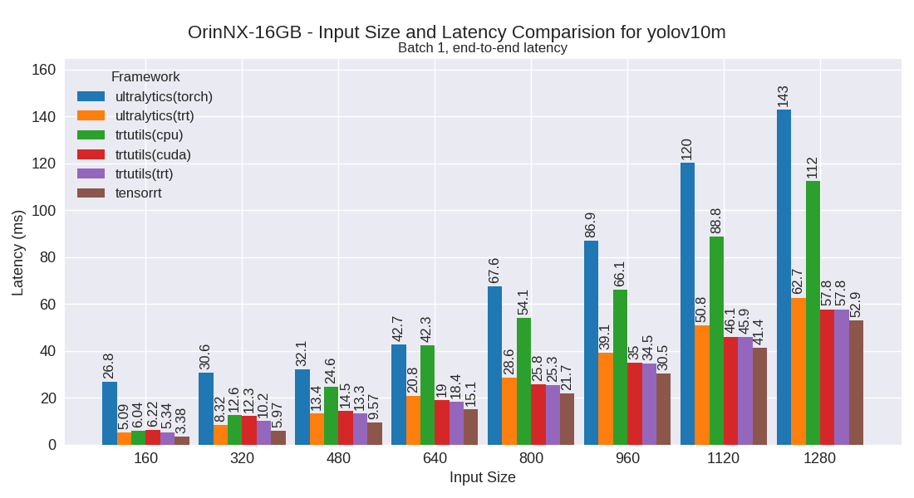
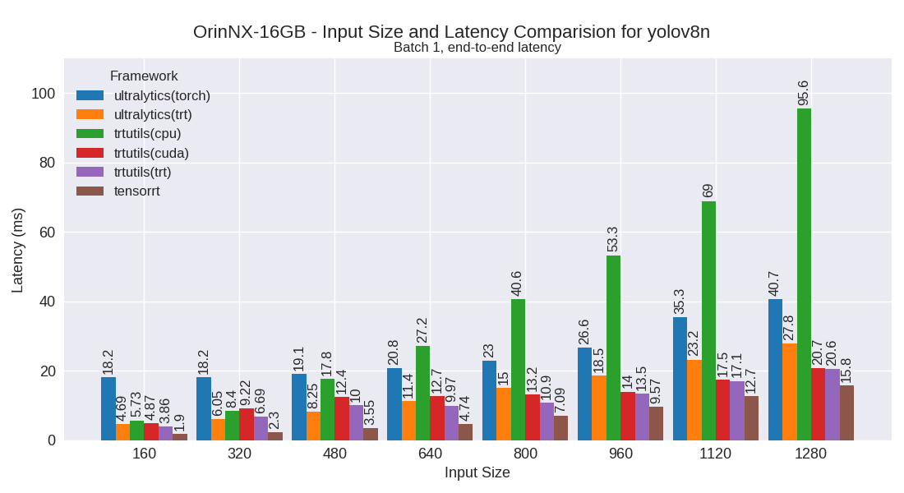
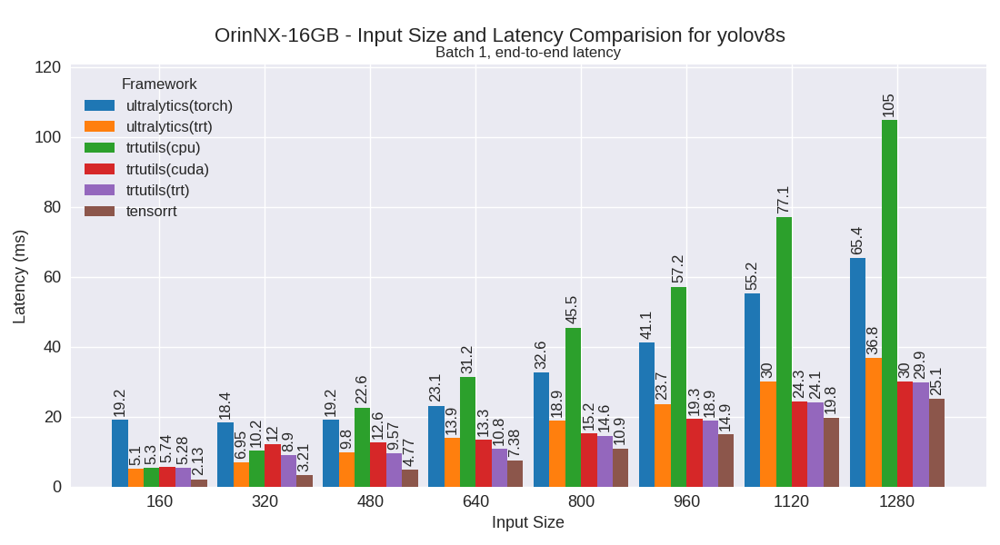
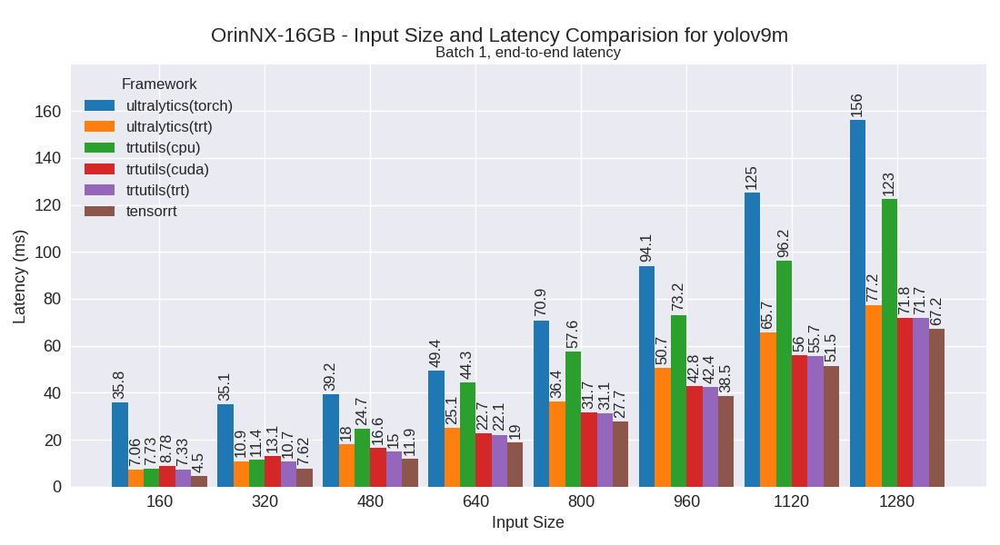
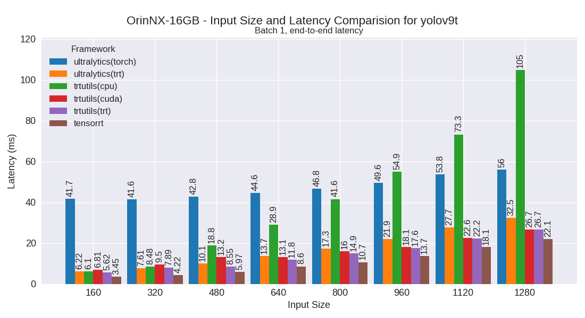
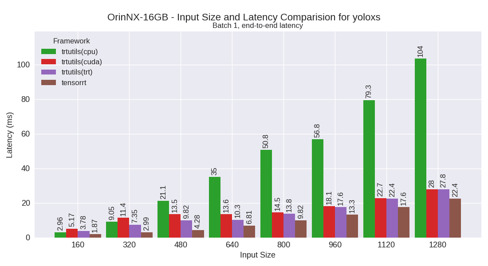

OrinNX-16GB
===========

Developer Kit with Jetpack 6

This section contains benchmarking results for various YOLO models on the OrinNX-16GB platform.

Performance Plots
-----------------

The following plots show the performance comparison between different YOLO models and frameworks:

yolov10m
~~~~~~~~

yolov10n
~~~~~~~~

yolov10s
~~~~~~~~

yolov7m
~~~~~~~~

.. image:: ../../benchmark/plots/OrinNX-16GB/yolov7m.png
   :alt: yolov7m performance plot
   :align: center

yolov7t
~~~~~~~~

.. image:: ../../benchmark/plots/OrinNX-16GB/yolov7t.png
   :alt: yolov7t performance plot
   :align: center

yolov8m
~~~~~~~~

.. image:: ../../benchmark/plots/OrinNX-16GB/yolov8m.png
   :alt: yolov8m performance plot
   :align: center

yolov8n
~~~~~~~~

yolov8s
~~~~~~~~

yolov9m
~~~~~~~~

yolov9s
~~~~~~~~

yolov9t
~~~~~~~~

yoloxm
~~~~~~~~

.. image:: ../../benchmark/plots/OrinNX-16GB/yoloxm.png
   :alt: yoloxm performance plot
   :align: center

yoloxn
~~~~~~~~

.. image:: ../../benchmark/plots/OrinNX-16GB/yoloxn.png
   :alt: yoloxn performance plot
   :align: center

yoloxs
~~~~~~~~

yoloxt
~~~~~~~~

Performance Table
-----------------

The following table shows detailed performance metrics for all tested models:

.. csv-table:: Performance Metrics
   :header: Framework,Model,Input Size,Mean (ms),Median (ms),Min (ms),Max (ms)
   :widths: 10,10,10,10,10,10,10

   tensorrt,yolov10n,160,2.1,1.9,1.8,3.5
   tensorrt,yolov10n,320,2.5,2.4,2.4,3.9
   tensorrt,yolov10n,480,3.9,3.8,3.7,5.4
   tensorrt,yolov10n,640,5.0,5.0,4.9,7.4
   tensorrt,yolov10n,800,7.3,7.3,7.2,8.2
   tensorrt,yolov10n,960,9.5,9.4,9.4,9.7
   tensorrt,yolov10n,1120,13.0,13.0,12.8,13.4
   tensorrt,yolov10n,1280,15.4,15.5,15.3,15.7
   tensorrt,yolov10s,160,2.4,2.2,2.2,3.8
   tensorrt,yolov10s,320,3.4,3.4,3.3,4.7
   tensorrt,yolov10s,480,5.3,5.4,5.2,6.3
   tensorrt,yolov10s,640,8.0,7.9,7.9,8.2
   tensorrt,yolov10s,800,11.8,11.8,11.5,12.0
   tensorrt,yolov10s,960,15.8,15.8,15.6,15.9
   tensorrt,yolov10s,1120,21.2,21.2,21.0,21.8
   tensorrt,yolov10s,1280,26.4,26.4,26.2,26.8
   tensorrt,yolov10m,160,3.4,3.4,3.3,3.7
   tensorrt,yolov10m,320,6.0,5.9,5.9,6.2
   tensorrt,yolov10m,480,9.6,9.6,9.5,9.8
   tensorrt,yolov10m,640,15.1,15.1,14.9,15.3
   tensorrt,yolov10m,800,21.7,21.8,21.4,22.3
   tensorrt,yolov10m,960,30.5,30.5,30.3,31.0
   tensorrt,yolov10m,1120,41.4,41.4,41.2,42.2
   tensorrt,yolov10m,1280,52.9,52.9,52.6,53.7
   tensorrt,yolov9t,160,3.5,3.4,3.4,4.2
   tensorrt,yolov9t,320,4.2,4.2,4.1,5.1
   tensorrt,yolov9t,480,6.0,5.9,5.9,7.3
   tensorrt,yolov9t,640,8.6,8.6,8.1,9.5
   tensorrt,yolov9t,800,10.7,10.6,10.5,12.0
   tensorrt,yolov9t,960,13.7,13.8,13.6,13.9
   tensorrt,yolov9t,1120,18.1,18.1,18.0,18.6
   tensorrt,yolov9t,1280,22.1,22.1,21.9,22.6
   tensorrt,yolov9s,160,3.7,3.7,3.7,4.0
   tensorrt,yolov9s,320,5.1,5.1,5.0,5.7
   tensorrt,yolov9s,480,7.8,7.8,7.7,8.2
   tensorrt,yolov9s,640,10.4,10.3,10.2,10.7
   tensorrt,yolov9s,800,14.9,14.9,14.7,15.1
   tensorrt,yolov9s,960,19.7,19.7,19.5,20.2
   tensorrt,yolov9s,1120,25.9,25.9,25.8,26.4
   tensorrt,yolov9s,1280,32.3,32.3,32.1,32.7
   tensorrt,yolov9m,160,4.5,4.4,4.4,5.4
   tensorrt,yolov9m,320,7.6,7.6,7.5,7.9
   tensorrt,yolov9m,480,11.9,11.9,11.7,12.1
   tensorrt,yolov9m,640,19.0,18.9,18.7,19.3
   tensorrt,yolov9m,800,27.7,27.7,27.4,28.1
   tensorrt,yolov9m,960,38.5,38.5,38.3,39.3
   tensorrt,yolov9m,1120,51.5,51.5,51.2,52.4
   tensorrt,yolov9m,1280,67.2,67.2,66.8,69.0
   tensorrt,yolov8n,160,1.9,1.8,1.5,3.5
   tensorrt,yolov8n,320,2.3,2.1,2.1,4.1
   tensorrt,yolov8n,480,3.6,3.5,3.4,6.2
   tensorrt,yolov8n,640,4.7,4.7,4.6,6.9
   tensorrt,yolov8n,800,7.1,7.1,7.0,8.2
   tensorrt,yolov8n,960,9.6,9.6,9.4,9.7
   tensorrt,yolov8n,1120,12.7,12.7,12.6,13.2
   tensorrt,yolov8n,1280,15.8,15.8,15.6,16.1
   tensorrt,yolov8s,160,2.1,1.9,1.8,3.5
   tensorrt,yolov8s,320,3.2,3.0,3.0,4.8
   tensorrt,yolov8s,480,4.8,4.7,4.7,6.2
   tensorrt,yolov8s,640,7.4,7.4,7.3,7.6
   tensorrt,yolov8s,800,10.9,10.9,10.8,11.3
   tensorrt,yolov8s,960,14.9,14.9,14.7,15.3
   tensorrt,yolov8s,1120,19.8,19.8,19.5,20.3
   tensorrt,yolov8s,1280,25.1,25.1,24.9,26.1
   tensorrt,yolov8m,160,3.3,3.2,3.1,4.4
   tensorrt,yolov8m,320,5.5,5.4,5.3,6.1
   tensorrt,yolov8m,480,9.3,9.3,9.2,9.6
   tensorrt,yolov8m,640,15.2,15.2,15.0,15.4
   tensorrt,yolov8m,800,21.5,21.4,21.3,22.1
   tensorrt,yolov8m,960,30.6,30.6,30.4,31.2
   tensorrt,yolov8m,1120,41.3,41.3,41.0,42.0
   tensorrt,yolov8m,1280,54.3,54.3,53.8,55.1
   tensorrt,yolov7t,160,1.9,1.7,1.6,3.0
   tensorrt,yolov7t,320,2.6,2.5,2.4,3.9
   tensorrt,yolov7t,480,3.8,3.7,3.7,6.2
   tensorrt,yolov7t,640,6.0,6.1,5.9,6.9
   tensorrt,yolov7t,800,8.4,8.4,8.3,8.8
   tensorrt,yolov7t,960,11.4,11.3,11.3,11.6
   tensorrt,yolov7t,1120,15.0,15.0,14.9,15.6
   tensorrt,yolov7t,1280,19.3,19.2,19.2,19.8
   tensorrt,yolov7m,160,3.3,3.3,3.2,3.7
   tensorrt,yolov7m,320,6.3,6.3,6.2,6.8
   tensorrt,yolov7m,480,11.0,11.0,10.9,11.4
   tensorrt,yolov7m,640,18.4,18.4,18.3,18.8
   tensorrt,yolov7m,800,28.7,28.7,28.5,29.3
   tensorrt,yolov7m,960,41.2,41.2,40.8,42.3
   tensorrt,yolov7m,1120,53.8,53.8,53.4,56.0
   tensorrt,yolov7m,1280,69.6,69.6,69.1,71.3
   tensorrt,yoloxt,160,1.7,1.7,1.7,2.2
   tensorrt,yoloxt,320,2.7,2.6,2.6,4.3
   tensorrt,yoloxt,480,3.9,3.8,3.8,6.0
   tensorrt,yoloxt,640,6.0,5.9,5.9,7.3
   tensorrt,yoloxt,800,8.4,8.4,8.3,8.6
   tensorrt,yoloxt,960,11.7,11.6,11.6,12.0
   tensorrt,yoloxt,1120,15.0,15.0,14.9,15.5
   tensorrt,yoloxt,1280,19.2,19.1,19.1,19.6
   tensorrt,yoloxn,160,1.7,1.6,1.6,2.2
   tensorrt,yoloxn,320,2.3,2.2,2.2,3.5
   tensorrt,yoloxn,480,3.3,3.2,3.2,5.4
   tensorrt,yoloxn,640,4.2,4.2,4.2,6.2
   tensorrt,yoloxn,800,6.2,6.2,6.1,7.8
   tensorrt,yoloxn,960,8.4,8.4,8.3,9.3
   tensorrt,yoloxn,1120,10.7,10.6,10.6,11.1
   tensorrt,yoloxn,1280,13.4,13.3,13.3,13.9
   tensorrt,yoloxs,160,1.9,1.8,1.8,2.3
   tensorrt,yoloxs,320,3.0,2.9,2.9,4.6
   tensorrt,yoloxs,480,4.3,4.2,4.2,6.3
   tensorrt,yoloxs,640,6.8,6.8,6.7,7.1
   tensorrt,yoloxs,800,9.8,9.8,9.8,10.0
   tensorrt,yoloxs,960,13.3,13.3,13.1,13.5
   tensorrt,yoloxs,1120,17.6,17.6,17.4,17.9
   tensorrt,yoloxs,1280,22.4,22.4,22.1,23.0
   tensorrt,yoloxm,160,3.1,3.1,3.0,3.4
   tensorrt,yoloxm,320,5.0,4.9,4.9,5.6
   tensorrt,yoloxm,480,8.4,8.4,8.4,8.6
   tensorrt,yoloxm,640,13.9,13.8,13.8,14.1
   tensorrt,yoloxm,800,20.0,20.0,19.8,20.3
   tensorrt,yoloxm,960,27.6,27.6,27.4,27.9
   tensorrt,yoloxm,1120,37.9,37.9,37.7,38.7
   tensorrt,yoloxm,1280,49.1,49.2,48.7,50.0
   trtutils(trt),yolov10n,160,3.8,3.8,3.3,4.3
   trtutils(trt),yolov10n,320,7.0,7.0,5.8,7.9
   trtutils(trt),yolov10n,480,9.1,9.0,8.7,10.7
   trtutils(trt),yolov10n,640,9.4,9.1,8.9,12.4
   trtutils(trt),yolov10n,800,10.8,10.7,9.9,13.3
   trtutils(trt),yolov10n,960,13.1,13.0,11.8,15.1
   trtutils(trt),yolov10n,1120,16.9,17.0,15.4,19.7
   trtutils(trt),yolov10n,1280,20.0,20.0,19.1,23.2
   trtutils(trt),yolov10s,160,4.0,4.0,3.5,4.6
   trtutils(trt),yolov10s,320,8.0,8.0,6.5,8.4
   trtutils(trt),yolov10s,480,10.0,9.9,9.1,11.1
   trtutils(trt),yolov10s,640,11.3,11.2,11.1,13.4
   trtutils(trt),yolov10s,800,15.3,15.3,13.7,17.5
   trtutils(trt),yolov10s,960,19.7,19.7,18.0,22.8
   trtutils(trt),yolov10s,1120,25.5,25.5,24.0,30.5
   trtutils(trt),yolov10s,1280,31.2,31.2,29.6,37.4
   trtutils(trt),yolov10m,160,5.3,5.4,4.5,5.8
   trtutils(trt),yolov10m,320,10.2,10.2,8.3,10.8
   trtutils(trt),yolov10m,480,13.3,13.5,12.4,14.5
   trtutils(trt),yolov10m,640,18.4,18.4,16.7,19.0
   trtutils(trt),yolov10m,800,25.3,25.3,23.7,26.8
   trtutils(trt),yolov10m,960,34.5,34.5,33.0,37.0
   trtutils(trt),yolov10m,1120,45.9,45.8,44.4,55.3
   trtutils(trt),yolov10m,1280,57.8,57.8,56.7,70.4
   trtutils(trt),yolov9t,160,5.6,5.6,5.5,6.0
   trtutils(trt),yolov9t,320,7.9,7.9,6.8,8.3
   trtutils(trt),yolov9t,480,8.6,8.0,7.8,11.5
   trtutils(trt),yolov9t,640,11.8,11.8,11.0,13.7
   trtutils(trt),yolov9t,800,14.9,15.4,13.9,17.4
   trtutils(trt),yolov9t,960,17.6,17.5,15.8,21.5
   trtutils(trt),yolov9t,1120,22.2,22.2,20.6,25.9
   trtutils(trt),yolov9t,1280,26.7,26.6,25.1,31.9
   trtutils(trt),yolov9s,160,6.1,6.0,5.9,6.4
   trtutils(trt),yolov9s,320,9.4,9.4,8.0,10.0
   trtutils(trt),yolov9s,480,10.5,10.3,9.1,12.7
   trtutils(trt),yolov9s,640,14.8,14.8,14.3,16.7
   trtutils(trt),yolov9s,800,18.3,18.3,17.4,23.1
   trtutils(trt),yolov9s,960,23.4,23.4,21.9,26.7
   trtutils(trt),yolov9s,1120,30.1,30.2,28.9,35.5
   trtutils(trt),yolov9s,1280,37.0,37.0,36.1,44.9
   trtutils(trt),yolov9m,160,7.3,7.3,6.4,7.7
   trtutils(trt),yolov9m,320,10.7,10.8,9.7,12.4
   trtutils(trt),yolov9m,480,15.0,14.9,14.7,17.3
   trtutils(trt),yolov9m,640,22.1,22.1,20.7,25.0
   trtutils(trt),yolov9m,800,31.1,31.0,29.7,33.7
   trtutils(trt),yolov9m,960,42.4,42.4,41.1,46.0
   trtutils(trt),yolov9m,1120,55.7,55.7,54.7,60.9
   trtutils(trt),yolov9m,1280,71.7,71.7,70.7,84.4
   trtutils(trt),yolov8n,160,3.9,4.0,3.1,4.2
   trtutils(trt),yolov8n,320,6.7,6.7,5.4,7.5
   trtutils(trt),yolov8n,480,10.0,10.0,8.4,10.7
   trtutils(trt),yolov8n,640,10.0,9.6,9.3,13.7
   trtutils(trt),yolov8n,800,10.9,10.7,10.2,14.5
   trtutils(trt),yolov8n,960,13.5,13.5,12.0,14.8
   trtutils(trt),yolov8n,1120,17.1,17.1,15.8,19.7
   trtutils(trt),yolov8n,1280,20.6,20.6,20.0,24.2
   trtutils(trt),yolov8s,160,5.3,5.2,3.4,6.6
   trtutils(trt),yolov8s,320,8.9,9.0,7.2,9.2
   trtutils(trt),yolov8s,480,9.6,9.3,9.1,11.5
   trtutils(trt),yolov8s,640,10.8,10.8,10.2,12.7
   trtutils(trt),yolov8s,800,14.6,14.5,13.2,16.6
   trtutils(trt),yolov8s,960,18.9,18.8,17.8,21.3
   trtutils(trt),yolov8s,1120,24.1,24.1,22.4,28.3
   trtutils(trt),yolov8s,1280,29.9,29.9,28.9,36.0
   trtutils(trt),yolov8m,160,5.9,5.9,4.3,6.7
   trtutils(trt),yolov8m,320,10.1,10.1,8.3,10.4
   trtutils(trt),yolov8m,480,12.5,12.5,11.7,13.3
   trtutils(trt),yolov8m,640,18.7,18.6,17.1,20.7
   trtutils(trt),yolov8m,800,25.1,25.0,23.7,27.1
   trtutils(trt),yolov8m,960,34.7,34.7,33.3,37.1
   trtutils(trt),yolov8m,1120,45.8,45.8,44.7,56.2
   trtutils(trt),yolov8m,1280,59.0,59.0,57.9,72.2
   trtutils(trt),yolov7t,160,3.9,4.1,3.2,4.4
   trtutils(trt),yolov7t,320,7.8,7.9,6.0,8.4
   trtutils(trt),yolov7t,480,9.5,9.4,9.2,11.2
   trtutils(trt),yolov7t,640,9.3,8.9,8.8,13.1
   trtutils(trt),yolov7t,800,12.2,12.1,11.6,14.5
   trtutils(trt),yolov7t,960,15.4,15.4,13.7,17.1
   trtutils(trt),yolov7t,1120,19.4,19.4,17.9,22.3
   trtutils(trt),yolov7t,1280,24.1,24.1,23.8,28.9
   trtutils(trt),yolov7m,160,7.2,7.0,5.3,8.0
   trtutils(trt),yolov7m,320,9.8,9.3,9.0,11.5
   trtutils(trt),yolov7m,480,14.2,14.1,12.9,15.5
   trtutils(trt),yolov7m,640,22.0,22.0,20.6,22.8
   trtutils(trt),yolov7m,800,32.4,32.4,30.9,34.8
   trtutils(trt),yolov7m,960,45.2,45.2,43.6,49.9
   trtutils(trt),yolov7m,1120,58.1,58.1,57.2,71.7
   trtutils(trt),yolov7m,1280,74.4,74.4,72.8,88.4
   trtutils(trt),yoloxt,160,3.6,3.6,3.2,3.9
   trtutils(trt),yoloxt,320,6.5,6.5,5.4,7.5
   trtutils(trt),yoloxt,480,9.9,9.9,8.4,10.2
   trtutils(trt),yoloxt,640,10.5,10.3,9.8,14.2
   trtutils(trt),yoloxt,800,12.4,12.3,11.8,15.9
   trtutils(trt),yoloxt,960,16.0,15.9,15.5,19.0
   trtutils(trt),yoloxt,1120,19.9,19.9,18.6,24.7
   trtutils(trt),yoloxt,1280,24.7,24.7,23.2,31.2
   trtutils(trt),yoloxn,160,3.4,3.3,3.3,3.9
   trtutils(trt),yoloxn,320,6.4,6.4,5.4,6.8
   trtutils(trt),yoloxn,480,9.2,9.2,7.7,9.6
   trtutils(trt),yoloxn,640,10.3,10.0,9.8,12.9
   trtutils(trt),yoloxn,800,11.5,11.2,11.0,14.1
   trtutils(trt),yoloxn,960,13.3,13.2,12.8,15.4
   trtutils(trt),yoloxn,1120,16.2,16.1,16.0,19.3
   trtutils(trt),yoloxn,1280,19.8,19.8,18.1,24.5
   trtutils(trt),yoloxs,160,3.8,3.8,3.3,4.2
   trtutils(trt),yoloxs,320,7.4,7.4,5.9,8.1
   trtutils(trt),yoloxs,480,9.8,9.6,8.5,11.1
   trtutils(trt),yoloxs,640,10.3,10.0,8.6,13.6
   trtutils(trt),yoloxs,800,13.8,13.8,13.3,16.3
   trtutils(trt),yoloxs,960,17.6,17.6,16.1,20.9
   trtutils(trt),yoloxs,1120,22.4,22.4,21.2,28.1
   trtutils(trt),yoloxs,1280,27.8,27.8,26.3,34.9
   trtutils(trt),yoloxm,160,5.4,5.5,4.6,5.7
   trtutils(trt),yoloxm,320,9.4,9.4,7.6,9.7
   trtutils(trt),yoloxm,480,12.5,12.5,12.1,14.4
   trtutils(trt),yoloxm,640,17.4,17.4,16.0,19.9
   trtutils(trt),yoloxm,800,23.9,23.9,22.4,26.1
   trtutils(trt),yoloxm,960,32.0,32.0,30.4,35.0
   trtutils(trt),yoloxm,1120,42.9,42.8,41.6,48.0
   trtutils(trt),yoloxm,1280,54.6,54.6,53.5,69.0
   trtutils(cuda),yolov10n,160,5.6,6.0,3.7,6.5
   trtutils(cuda),yolov10n,320,9.7,9.7,7.6,10.2
   trtutils(cuda),yolov10n,480,12.1,11.9,11.2,14.4
   trtutils(cuda),yolov10n,640,13.2,13.1,12.6,20.2
   trtutils(cuda),yolov10n,800,13.8,13.6,13.3,20.8
   trtutils(cuda),yolov10n,960,14.2,14.1,13.9,18.4
   trtutils(cuda),yolov10n,1120,17.8,17.7,15.5,21.9
   trtutils(cuda),yolov10n,1280,20.6,20.5,18.4,27.1
   trtutils(cuda),yolov10s,160,5.6,5.7,4.0,6.2
   trtutils(cuda),yolov10s,320,10.7,10.8,8.2,11.3
   trtutils(cuda),yolov10s,480,13.1,13.2,10.6,13.5
   trtutils(cuda),yolov10s,640,12.5,12.1,11.8,16.5
   trtutils(cuda),yolov10s,800,16.0,15.9,15.4,18.9
   trtutils(cuda),yolov10s,960,20.1,20.1,17.9,23.0
   trtutils(cuda),yolov10s,1120,25.7,25.8,23.9,29.7
   trtutils(cuda),yolov10s,1280,31.2,31.2,29.6,41.0
   trtutils(cuda),yolov10m,160,6.2,6.3,5.2,6.6
   trtutils(cuda),yolov10m,320,12.3,12.3,9.6,12.9
   trtutils(cuda),yolov10m,480,14.5,14.4,12.6,16.8
   trtutils(cuda),yolov10m,640,19.0,19.0,16.9,22.7
   trtutils(cuda),yolov10m,800,25.8,25.9,23.8,30.5
   trtutils(cuda),yolov10m,960,35.0,35.0,32.9,41.1
   trtutils(cuda),yolov10m,1120,46.1,46.1,44.3,53.3
   trtutils(cuda),yolov10m,1280,57.8,57.7,55.5,63.9
   trtutils(cuda),yolov9t,160,6.8,6.8,6.1,7.3
   trtutils(cuda),yolov9t,320,9.5,9.5,8.0,9.9
   trtutils(cuda),yolov9t,480,13.2,13.2,11.5,14.3
   trtutils(cuda),yolov9t,640,13.1,12.9,12.0,15.3
   trtutils(cuda),yolov9t,800,16.0,15.9,13.8,19.1
   trtutils(cuda),yolov9t,960,18.1,18.0,17.5,24.6
   trtutils(cuda),yolov9t,1120,22.6,22.6,20.7,25.7
   trtutils(cuda),yolov9t,1280,26.7,26.6,25.2,35.0
   trtutils(cuda),yolov9s,160,7.3,7.3,6.2,7.7
   trtutils(cuda),yolov9s,320,11.8,11.9,9.3,12.4
   trtutils(cuda),yolov9s,480,13.3,13.1,11.8,15.1
   trtutils(cuda),yolov9s,640,15.5,15.4,15.1,17.8
   trtutils(cuda),yolov9s,800,18.9,18.9,18.6,22.9
   trtutils(cuda),yolov9s,960,23.9,23.9,22.0,27.1
   trtutils(cuda),yolov9s,1120,30.4,30.4,28.3,35.5
   trtutils(cuda),yolov9s,1280,37.1,37.1,35.6,44.2
   trtutils(cuda),yolov9m,160,8.8,8.8,7.0,9.4
   trtutils(cuda),yolov9m,320,13.1,12.9,11.7,14.6
   trtutils(cuda),yolov9m,480,16.6,16.6,14.8,18.1
   trtutils(cuda),yolov9m,640,22.7,22.7,20.8,27.2
   trtutils(cuda),yolov9m,800,31.7,31.7,29.8,37.4
   trtutils(cuda),yolov9m,960,42.8,42.8,41.0,51.3
   trtutils(cuda),yolov9m,1120,56.0,56.0,54.4,64.0
   trtutils(cuda),yolov9m,1280,71.8,71.8,69.9,80.7
   trtutils(cuda),yolov8n,160,4.9,5.2,3.4,5.5
   trtutils(cuda),yolov8n,320,9.2,9.2,7.0,10.0
   trtutils(cuda),yolov8n,480,12.4,12.9,10.6,13.6
   trtutils(cuda),yolov8n,640,12.7,12.5,11.2,14.7
   trtutils(cuda),yolov8n,800,13.2,12.9,11.9,17.0
   trtutils(cuda),yolov8n,960,14.0,13.8,12.0,17.8
   trtutils(cuda),yolov8n,1120,17.5,17.5,15.7,21.9
   trtutils(cuda),yolov8n,1280,20.7,20.7,19.2,26.6
   trtutils(cuda),yolov8s,160,5.7,6.2,3.7,6.9
   trtutils(cuda),yolov8s,320,12.0,12.2,9.3,12.4
   trtutils(cuda),yolov8s,480,12.6,12.6,10.4,14.6
   trtutils(cuda),yolov8s,640,13.3,13.2,11.6,15.7
   trtutils(cuda),yolov8s,800,15.2,15.2,13.3,19.6
   trtutils(cuda),yolov8s,960,19.3,19.3,17.1,21.6
   trtutils(cuda),yolov8s,1120,24.3,24.4,22.2,27.8
   trtutils(cuda),yolov8s,1280,30.0,30.0,28.4,35.4
   trtutils(cuda),yolov8m,160,7.7,8.0,4.9,8.4
   trtutils(cuda),yolov8m,320,12.2,12.2,9.8,12.7
   trtutils(cuda),yolov8m,480,14.3,14.2,13.9,16.5
   trtutils(cuda),yolov8m,640,19.3,19.2,19.0,22.7
   trtutils(cuda),yolov8m,800,25.7,25.7,24.3,30.6
   trtutils(cuda),yolov8m,960,35.1,35.2,33.0,41.4
   trtutils(cuda),yolov8m,1120,46.1,46.1,44.7,55.5
   trtutils(cuda),yolov8m,1280,59.0,59.1,57.6,65.7
   trtutils(cuda),yolov7t,160,5.0,5.5,3.4,5.8
   trtutils(cuda),yolov7t,320,10.5,10.5,7.8,11.1
   trtutils(cuda),yolov7t,480,12.1,12.2,9.4,12.6
   trtutils(cuda),yolov7t,640,13.3,13.2,12.1,15.1
   trtutils(cuda),yolov7t,800,13.0,12.7,12.3,16.4
   trtutils(cuda),yolov7t,960,15.9,15.8,13.8,19.1
   trtutils(cuda),yolov7t,1120,19.7,19.6,17.7,24.8
   trtutils(cuda),yolov7t,1280,24.2,24.2,22.6,32.7
   trtutils(cuda),yolov7m,160,9.2,9.3,6.2,9.7
   trtutils(cuda),yolov7m,320,12.5,12.4,10.8,13.7
   trtutils(cuda),yolov7m,480,15.0,14.9,14.6,17.7
   trtutils(cuda),yolov7m,640,22.6,22.6,20.6,26.0
   trtutils(cuda),yolov7m,800,33.0,33.0,31.6,39.2
   trtutils(cuda),yolov7m,960,45.7,45.7,43.5,55.0
   trtutils(cuda),yolov7m,1120,58.6,58.6,56.9,69.8
   trtutils(cuda),yolov7m,1280,74.7,74.7,72.4,82.4
   trtutils(cuda),yoloxt,160,5.0,5.4,3.4,6.3
   trtutils(cuda),yoloxt,320,10.2,10.3,8.0,10.6
   trtutils(cuda),yoloxt,480,12.4,12.5,9.8,13.1
   trtutils(cuda),yoloxt,640,13.6,13.5,11.4,15.1
   trtutils(cuda),yoloxt,800,13.4,12.9,12.7,17.7
   trtutils(cuda),yoloxt,960,16.4,16.4,14.8,20.7
   trtutils(cuda),yoloxt,1120,20.3,20.2,19.9,25.3
   trtutils(cuda),yoloxt,1280,24.9,24.8,22.9,35.0
   trtutils(cuda),yoloxn,160,4.0,4.1,3.2,4.6
   trtutils(cuda),yoloxn,320,8.8,8.8,6.9,9.3
   trtutils(cuda),yoloxn,480,12.4,12.4,9.8,12.8
   trtutils(cuda),yoloxn,640,13.7,13.7,11.1,14.0
   trtutils(cuda),yoloxn,800,16.0,15.9,15.7,18.7
   trtutils(cuda),yoloxn,960,16.0,15.9,15.7,19.1
   trtutils(cuda),yoloxn,1120,16.7,16.5,16.3,21.4
   trtutils(cuda),yoloxn,1280,20.0,19.9,17.9,26.6
   trtutils(cuda),yoloxs,160,5.2,5.4,3.4,6.2
   trtutils(cuda),yoloxs,320,11.4,11.5,8.0,12.0
   trtutils(cuda),yoloxs,480,13.5,13.6,10.8,14.2
   trtutils(cuda),yoloxs,640,13.6,13.4,12.7,16.5
   trtutils(cuda),yoloxs,800,14.5,14.4,13.5,19.1
   trtutils(cuda),yoloxs,960,18.1,17.9,16.0,23.5
   trtutils(cuda),yoloxs,1120,22.7,22.6,21.5,29.9
   trtutils(cuda),yoloxs,1280,28.0,27.9,26.0,38.8
   trtutils(cuda),yoloxm,160,7.5,7.7,4.6,8.5
   trtutils(cuda),yoloxm,320,11.4,11.4,8.7,12.1
   trtutils(cuda),yoloxm,480,13.4,13.3,11.2,15.1
   trtutils(cuda),yoloxm,640,18.2,18.2,16.2,21.4
   trtutils(cuda),yoloxm,800,24.5,24.5,22.7,29.3
   trtutils(cuda),yoloxm,960,32.4,32.4,30.4,39.1
   trtutils(cuda),yoloxm,1120,43.1,43.0,41.4,53.6
   trtutils(cuda),yoloxm,1280,54.7,54.7,52.9,62.6
   trtutils(cpu),yolov10n,160,5.0,4.9,4.8,6.4
   trtutils(cpu),yolov10n,320,7.6,8.1,5.0,8.8
   trtutils(cpu),yolov10n,480,15.2,15.0,9.0,18.8
   trtutils(cpu),yolov10n,640,30.0,30.5,18.1,31.1
   trtutils(cpu),yolov10n,800,43.1,43.7,23.8,45.2
   trtutils(cpu),yolov10n,960,55.4,56.2,30.1,57.8
   trtutils(cpu),yolov10n,1120,65.0,64.2,37.6,73.4
   trtutils(cpu),yolov10n,1280,88.5,91.9,55.9,96.3
   trtutils(cpu),yolov10s,160,5.7,5.7,5.6,6.7
   trtutils(cpu),yolov10s,320,8.5,9.2,5.9,9.5
   trtutils(cpu),yolov10s,480,20.5,21.4,12.5,22.3
   trtutils(cpu),yolov10s,640,32.1,32.8,18.7,33.1
   trtutils(cpu),yolov10s,800,46.6,47.4,26.2,48.3
   trtutils(cpu),yolov10s,960,58.7,61.3,36.7,63.4
   trtutils(cpu),yolov10s,1120,79.4,82.2,53.9,87.3
   trtutils(cpu),yolov10s,1280,104.8,105.5,70.3,113.0
   trtutils(cpu),yolov10m,160,6.0,6.0,5.4,6.9
   trtutils(cpu),yolov10m,320,12.6,13.5,9.4,14.0
   trtutils(cpu),yolov10m,480,24.6,25.0,17.8,27.6
   trtutils(cpu),yolov10m,640,42.3,43.0,28.0,44.1
   trtutils(cpu),yolov10m,800,54.1,56.0,39.8,58.4
   trtutils(cpu),yolov10m,960,66.1,67.3,52.6,70.9
   trtutils(cpu),yolov10m,1120,88.8,88.7,76.2,100.8
   trtutils(cpu),yolov10m,1280,112.4,113.1,96.7,115.0
   trtutils(cpu),yolov9t,160,6.1,5.8,5.7,7.6
   trtutils(cpu),yolov9t,320,8.5,8.7,6.9,9.2
   trtutils(cpu),yolov9t,480,18.8,19.7,11.8,20.7
   trtutils(cpu),yolov9t,640,28.9,29.2,19.4,30.9
   trtutils(cpu),yolov9t,800,41.6,42.1,29.1,43.9
   trtutils(cpu),yolov9t,960,54.9,55.4,34.1,58.0
   trtutils(cpu),yolov9t,1120,73.3,77.5,52.3,79.7
   trtutils(cpu),yolov9t,1280,104.9,105.0,65.9,117.2
   trtutils(cpu),yolov9s,160,5.3,5.0,4.6,7.9
   trtutils(cpu),yolov9s,320,9.0,9.1,7.8,9.6
   trtutils(cpu),yolov9s,480,20.2,20.7,14.3,21.8
   trtutils(cpu),yolov9s,640,31.8,32.2,22.2,33.2
   trtutils(cpu),yolov9s,800,48.9,47.2,31.2,54.4
   trtutils(cpu),yolov9s,960,58.0,60.3,40.9,62.3
   trtutils(cpu),yolov9s,1120,80.2,82.7,59.2,86.6
   trtutils(cpu),yolov9s,1280,111.6,110.2,76.2,124.9
   trtutils(cpu),yolov9m,160,7.7,7.7,7.4,8.7
   trtutils(cpu),yolov9m,320,11.4,11.4,11.1,13.4
   trtutils(cpu),yolov9m,480,24.7,24.9,20.1,25.6
   trtutils(cpu),yolov9m,640,44.3,44.9,32.2,45.5
   trtutils(cpu),yolov9m,800,57.6,59.3,45.0,60.3
   trtutils(cpu),yolov9m,960,73.2,75.0,59.8,77.5
   trtutils(cpu),yolov9m,1120,96.2,96.3,86.7,105.5
   trtutils(cpu),yolov9m,1280,122.6,122.9,110.9,125.1
   trtutils(cpu),yolov8n,160,5.7,5.6,5.5,6.6
   trtutils(cpu),yolov8n,320,8.4,9.7,4.8,10.4
   trtutils(cpu),yolov8n,480,17.8,18.9,9.5,19.7
   trtutils(cpu),yolov8n,640,27.2,27.8,15.6,29.2
   trtutils(cpu),yolov8n,800,40.6,41.4,23.1,42.4
   trtutils(cpu),yolov8n,960,53.3,54.1,30.6,55.7
   trtutils(cpu),yolov8n,1120,69.0,74.0,45.1,76.2
   trtutils(cpu),yolov8n,1280,95.6,98.5,61.6,100.6
   trtutils(cpu),yolov8s,160,5.3,5.2,5.1,6.4
   trtutils(cpu),yolov8s,320,10.2,11.0,6.0,12.6
   trtutils(cpu),yolov8s,480,22.6,24.0,12.5,24.4
   trtutils(cpu),yolov8s,640,31.2,31.8,19.1,32.3
   trtutils(cpu),yolov8s,800,45.5,46.1,28.1,47.7
   trtutils(cpu),yolov8s,960,57.2,59.9,36.3,61.5
   trtutils(cpu),yolov8s,1120,77.1,79.2,54.0,84.5
   trtutils(cpu),yolov8s,1280,104.8,106.1,69.2,112.1
   trtutils(cpu),yolov8m,160,6.9,6.9,6.7,7.6
   trtutils(cpu),yolov8m,320,13.6,13.9,10.3,14.4
   trtutils(cpu),yolov8m,480,24.4,24.6,18.9,25.0
   trtutils(cpu),yolov8m,640,39.5,39.9,29.1,40.2
   trtutils(cpu),yolov8m,800,54.2,55.8,40.1,58.1
   trtutils(cpu),yolov8m,960,67.4,69.1,53.2,71.6
   trtutils(cpu),yolov8m,1120,99.4,98.1,76.7,109.5
   trtutils(cpu),yolov8m,1280,117.0,116.7,98.5,125.2
   trtutils(cpu),yolov7t,160,4.6,4.6,4.0,5.1
   trtutils(cpu),yolov7t,320,8.3,9.1,5.2,9.6
   trtutils(cpu),yolov7t,480,20.0,21.0,11.2,21.6
   trtutils(cpu),yolov7t,640,32.7,33.9,17.1,34.0
   trtutils(cpu),yolov7t,800,45.5,46.1,24.9,47.6
   trtutils(cpu),yolov7t,960,55.9,59.3,32.4,60.6
   trtutils(cpu),yolov7t,1120,72.3,72.1,48.2,83.0
   trtutils(cpu),yolov7t,1280,99.6,99.9,65.1,110.6
   trtutils(cpu),yolov7m,160,5.1,5.3,4.6,5.7
   trtutils(cpu),yolov7m,320,14.7,15.2,11.2,15.7
   trtutils(cpu),yolov7m,480,26.6,27.0,20.6,27.4
   trtutils(cpu),yolov7m,640,42.3,44.7,32.8,45.3
   trtutils(cpu),yolov7m,800,56.7,58.5,47.7,60.0
   trtutils(cpu),yolov7m,960,74.1,75.2,63.3,78.3
   trtutils(cpu),yolov7m,1120,98.8,98.9,87.7,102.0
   trtutils(cpu),yolov7m,1280,126.2,126.3,114.1,129.2
   trtutils(cpu),yoloxt,160,2.6,2.6,2.4,3.0
   trtutils(cpu),yoloxt,320,8.3,9.0,5.2,9.6
   trtutils(cpu),yoloxt,480,20.1,21.1,11.0,21.7
   trtutils(cpu),yoloxt,640,32.8,33.8,18.4,34.1
   trtutils(cpu),yoloxt,800,45.5,46.4,24.4,46.9
   trtutils(cpu),yoloxt,960,58.1,61.1,33.1,62.9
   trtutils(cpu),yoloxt,1120,75.7,79.1,50.0,85.3
   trtutils(cpu),yoloxt,1280,100.1,101.0,65.7,111.1
   trtutils(cpu),yoloxn,160,2.6,2.6,2.2,4.2
   trtutils(cpu),yoloxn,320,6.8,7.2,5.0,7.6
   trtutils(cpu),yoloxn,480,15.6,16.6,8.9,17.7
   trtutils(cpu),yoloxn,640,25.2,25.9,15.2,28.1
   trtutils(cpu),yoloxn,800,37.2,37.9,21.3,39.2
   trtutils(cpu),yoloxn,960,49.6,50.4,28.7,53.1
   trtutils(cpu),yoloxn,1120,67.3,70.9,44.9,72.0
   trtutils(cpu),yoloxn,1280,90.8,92.7,59.2,94.1
   trtutils(cpu),yoloxs,160,3.0,2.9,2.8,3.4
   trtutils(cpu),yoloxs,320,9.1,10.0,5.6,10.9
   trtutils(cpu),yoloxs,480,21.1,22.4,11.7,23.1
   trtutils(cpu),yoloxs,640,35.0,36.1,17.7,36.5
   trtutils(cpu),yoloxs,800,50.8,52.1,26.8,52.6
   trtutils(cpu),yoloxs,960,56.8,56.6,35.1,67.7
   trtutils(cpu),yoloxs,1120,79.3,79.6,53.0,93.7
   trtutils(cpu),yoloxs,1280,103.6,102.6,66.8,120.1
   trtutils(cpu),yoloxm,160,4.2,4.2,3.7,4.7
   trtutils(cpu),yoloxm,320,12.8,13.0,9.4,13.6
   trtutils(cpu),yoloxm,480,24.9,25.3,17.8,25.8
   trtutils(cpu),yoloxm,640,41.0,41.5,27.8,41.7
   trtutils(cpu),yoloxm,800,57.4,60.2,38.1,60.9
   trtutils(cpu),yoloxm,960,64.8,65.3,50.3,73.0
   trtutils(cpu),yoloxm,1120,97.0,97.8,74.3,104.2
   trtutils(cpu),yoloxm,1280,114.4,114.1,93.4,131.8
   ultralytics(trt),yolov10n,160,3.7,3.7,3.6,6.1
   ultralytics(trt),yolov10n,320,5.0,5.0,4.9,5.4
   ultralytics(trt),yolov10n,480,7.2,7.2,7.1,7.7
   ultralytics(trt),yolov10n,640,10.3,10.2,10.1,11.2
   ultralytics(trt),yolov10n,800,14.4,14.4,14.2,16.6
   ultralytics(trt),yolov10n,960,18.2,18.1,17.9,20.3
   ultralytics(trt),yolov10n,1120,23.4,23.4,23.3,25.5
   ultralytics(trt),yolov10n,1280,28.4,28.3,28.1,32.6
   ultralytics(trt),yolov10s,160,4.0,4.0,3.9,6.3
   ultralytics(trt),yolov10s,320,6.0,6.0,5.9,6.3
   ultralytics(trt),yolov10s,480,8.9,8.9,8.8,11.5
   ultralytics(trt),yolov10s,640,13.1,13.1,13.0,15.2
   ultralytics(trt),yolov10s,800,18.9,18.9,18.8,20.9
   ultralytics(trt),yolov10s,960,24.2,24.2,24.0,24.6
   ultralytics(trt),yolov10s,1120,31.6,31.5,31.3,34.2
   ultralytics(trt),yolov10s,1280,38.8,38.7,38.5,41.4
   ultralytics(trt),yolov10m,160,5.1,5.1,5.0,5.3
   ultralytics(trt),yolov10m,320,8.3,8.3,8.2,9.1
   ultralytics(trt),yolov10m,480,13.4,13.3,13.2,13.8
   ultralytics(trt),yolov10m,640,20.8,20.8,20.6,21.7
   ultralytics(trt),yolov10m,800,28.6,28.6,28.4,30.5
   ultralytics(trt),yolov10m,960,39.1,39.1,38.8,42.1
   ultralytics(trt),yolov10m,1120,50.8,50.6,50.4,53.6
   ultralytics(trt),yolov10m,1280,62.7,62.5,62.2,65.6
   ultralytics(trt),yolov9t,160,6.2,6.2,6.1,6.8
   ultralytics(trt),yolov9t,320,7.6,7.6,7.5,8.3
   ultralytics(trt),yolov9t,480,10.1,10.1,9.9,10.7
   ultralytics(trt),yolov9t,640,13.7,13.7,13.5,14.3
   ultralytics(trt),yolov9t,800,17.3,17.3,17.1,19.2
   ultralytics(trt),yolov9t,960,21.9,21.8,21.6,22.9
   ultralytics(trt),yolov9t,1120,27.7,27.7,27.5,29.9
   ultralytics(trt),yolov9t,1280,32.5,32.4,32.2,35.8
   ultralytics(trt),yolov9s,160,6.5,6.5,6.4,7.2
   ultralytics(trt),yolov9s,320,8.3,8.3,8.2,8.7
   ultralytics(trt),yolov9s,480,11.4,11.4,11.3,11.7
   ultralytics(trt),yolov9s,640,16.4,16.4,16.3,18.4
   ultralytics(trt),yolov9s,800,21.6,21.6,21.5,23.8
   ultralytics(trt),yolov9s,960,27.5,27.5,27.3,29.5
   ultralytics(trt),yolov9s,1120,35.6,35.6,35.4,38.3
   ultralytics(trt),yolov9s,1280,44.3,44.3,44.1,48.6
   ultralytics(trt),yolov9m,160,7.1,7.1,7.0,7.4
   ultralytics(trt),yolov9m,320,10.9,10.8,10.7,12.3
   ultralytics(trt),yolov9m,480,18.0,18.0,17.8,20.4
   ultralytics(trt),yolov9m,640,25.1,25.0,24.8,27.7
   ultralytics(trt),yolov9m,800,36.4,36.3,36.2,38.7
   ultralytics(trt),yolov9m,960,50.7,50.5,50.3,53.3
   ultralytics(trt),yolov9m,1120,65.7,65.6,64.5,68.3
   ultralytics(trt),yolov9m,1280,77.2,77.1,76.7,80.0
   ultralytics(trt),yolov8n,160,4.7,4.7,4.6,5.5
   ultralytics(trt),yolov8n,320,6.1,6.1,5.9,6.3
   ultralytics(trt),yolov8n,480,8.3,8.2,8.1,9.2
   ultralytics(trt),yolov8n,640,11.4,11.4,11.2,11.6
   ultralytics(trt),yolov8n,800,15.0,15.0,14.8,17.8
   ultralytics(trt),yolov8n,960,18.5,18.5,18.3,20.4
   ultralytics(trt),yolov8n,1120,23.2,23.2,23.0,25.4
   ultralytics(trt),yolov8n,1280,27.8,27.7,27.6,29.6
   ultralytics(trt),yolov8s,160,5.1,5.1,5.0,5.8
   ultralytics(trt),yolov8s,320,7.0,7.0,6.9,7.4
   ultralytics(trt),yolov8s,480,9.8,9.8,9.7,10.3
   ultralytics(trt),yolov8s,640,13.9,13.9,13.8,16.0
   ultralytics(trt),yolov8s,800,18.9,18.9,18.7,20.8
   ultralytics(trt),yolov8s,960,23.7,23.6,23.4,25.7
   ultralytics(trt),yolov8s,1120,30.0,29.9,29.8,31.8
   ultralytics(trt),yolov8s,1280,36.8,36.7,36.5,43.2
   ultralytics(trt),yolov8m,160,6.3,6.3,6.2,9.2
   ultralytics(trt),yolov8m,320,9.6,9.6,9.5,11.8
   ultralytics(trt),yolov8m,480,14.7,14.7,14.6,15.3
   ultralytics(trt),yolov8m,640,22.2,22.2,22.0,25.1
   ultralytics(trt),yolov8m,800,29.2,29.2,29.1,32.0
   ultralytics(trt),yolov8m,960,40.0,39.8,39.6,43.1
   ultralytics(trt),yolov8m,1120,51.2,51.0,50.1,53.1
   ultralytics(trt),yolov8m,1280,64.3,64.1,62.4,68.4
   ultralytics(torch),yolov10n,160,20.8,20.8,20.4,23.7
   ultralytics(torch),yolov10n,320,25.0,25.0,24.7,26.3
   ultralytics(torch),yolov10n,480,26.0,26.0,25.6,29.3
   ultralytics(torch),yolov10n,640,27.8,27.7,27.4,30.7
   ultralytics(torch),yolov10n,800,29.3,29.3,28.9,32.2
   ultralytics(torch),yolov10n,960,31.9,31.8,31.3,36.8
   ultralytics(torch),yolov10n,1120,41.0,40.9,40.7,43.7
   ultralytics(torch),yolov10n,1280,47.6,47.5,47.4,50.2
   ultralytics(torch),yolov10s,160,21.5,21.5,21.2,28.3
   ultralytics(torch),yolov10s,320,25.5,25.5,25.3,28.4
   ultralytics(torch),yolov10s,480,26.5,26.5,26.2,30.2
   ultralytics(torch),yolov10s,640,28.5,28.5,27.7,31.9
   ultralytics(torch),yolov10s,800,36.8,36.8,36.7,38.9
   ultralytics(torch),yolov10s,960,47.6,47.6,47.4,49.6
   ultralytics(torch),yolov10s,1120,67.0,67.0,66.8,69.3
   ultralytics(torch),yolov10s,1280,78.3,78.2,78.0,80.9
   ultralytics(torch),yolov10m,160,26.8,26.8,26.5,35.4
   ultralytics(torch),yolov10m,320,30.6,30.6,30.3,33.7
   ultralytics(torch),yolov10m,480,32.1,32.1,31.7,34.6
   ultralytics(torch),yolov10m,640,42.7,42.7,42.6,44.9
   ultralytics(torch),yolov10m,800,67.6,67.5,67.4,69.9
   ultralytics(torch),yolov10m,960,86.9,86.9,86.7,89.3
   ultralytics(torch),yolov10m,1120,120.4,120.3,120.0,123.1
   ultralytics(torch),yolov10m,1280,143.0,143.0,142.2,150.5
   ultralytics(torch),yolov9t,160,41.7,41.7,41.3,47.3
   ultralytics(torch),yolov9t,320,41.6,41.5,41.1,44.4
   ultralytics(torch),yolov9t,480,42.8,42.7,42.1,46.6
   ultralytics(torch),yolov9t,640,44.6,44.6,44.2,47.3
   ultralytics(torch),yolov9t,800,46.8,46.7,46.2,50.3
   ultralytics(torch),yolov9t,960,49.6,49.6,48.7,54.6
   ultralytics(torch),yolov9t,1120,53.8,53.8,52.9,55.9
   ultralytics(torch),yolov9t,1280,56.0,55.9,55.5,58.8
   ultralytics(torch),yolov9s,160,43.9,43.8,43.3,50.3
   ultralytics(torch),yolov9s,320,43.0,43.0,42.4,46.1
   ultralytics(torch),yolov9s,480,44.0,43.9,43.6,46.7
   ultralytics(torch),yolov9s,640,45.6,45.6,44.9,48.4
   ultralytics(torch),yolov9s,800,48.3,48.3,47.9,50.7
   ultralytics(torch),yolov9s,960,52.5,52.5,52.4,54.5
   ultralytics(torch),yolov9s,1120,71.3,71.3,71.1,74.0
   ultralytics(torch),yolov9s,1280,84.2,84.2,84.0,86.3
   ultralytics(torch),yolov9m,160,35.8,35.7,35.1,44.9
   ultralytics(torch),yolov9m,320,35.1,35.2,34.3,38.7
   ultralytics(torch),yolov9m,480,39.2,39.2,38.4,41.8
   ultralytics(torch),yolov9m,640,49.4,49.4,49.3,56.9
   ultralytics(torch),yolov9m,800,70.9,70.8,70.5,73.4
   ultralytics(torch),yolov9m,960,94.1,94.0,93.5,96.5
   ultralytics(torch),yolov9m,1120,125.3,125.2,123.5,129.1
   ultralytics(torch),yolov9m,1280,156.2,156.2,154.6,158.9
   ultralytics(torch),yolov8n,160,18.2,18.2,18.1,18.6
   ultralytics(torch),yolov8n,320,18.2,18.2,18.0,20.3
   ultralytics(torch),yolov8n,480,19.1,19.1,18.9,21.9
   ultralytics(torch),yolov8n,640,20.8,20.7,20.3,24.6
   ultralytics(torch),yolov8n,800,23.0,22.9,22.4,24.6
   ultralytics(torch),yolov8n,960,26.6,26.6,26.5,28.6
   ultralytics(torch),yolov8n,1120,35.3,35.3,35.2,37.3
   ultralytics(torch),yolov8n,1280,40.7,40.7,40.5,42.6
   ultralytics(torch),yolov8s,160,19.2,19.2,18.8,19.5
   ultralytics(torch),yolov8s,320,18.4,18.3,18.1,20.9
   ultralytics(torch),yolov8s,480,19.2,19.2,19.0,21.8
   ultralytics(torch),yolov8s,640,23.1,23.1,23.0,25.2
   ultralytics(torch),yolov8s,800,32.6,32.6,32.5,34.7
   ultralytics(torch),yolov8s,960,41.1,41.1,40.9,43.1
   ultralytics(torch),yolov8s,1120,55.2,55.2,54.9,57.4
   ultralytics(torch),yolov8s,1280,65.4,65.3,65.0,68.3
   ultralytics(torch),yolov8m,160,22.6,22.6,22.4,23.0
   ultralytics(torch),yolov8m,320,22.7,22.6,22.5,23.5
   ultralytics(torch),yolov8m,480,29.8,29.7,29.6,31.8
   ultralytics(torch),yolov8m,640,44.0,44.0,43.8,46.0
   ultralytics(torch),yolov8m,800,64.7,64.7,64.5,66.7
   ultralytics(torch),yolov8m,960,83.4,83.4,83.2,85.5
   ultralytics(torch),yolov8m,1120,111.5,111.4,111.1,113.7
   ultralytics(torch),yolov8m,1280,133.7,133.7,132.8,136.3
