TitanRTX
========

Titan RTX in a workstation with AMD 7950X CPU

This section contains benchmarking results for various YOLO models on the TitanRTX platform.

Performance Plots
-----------------

The following plots show the performance comparison between different YOLO models and frameworks:

yolov10m
~~~~~~~~

yolov10n
~~~~~~~~

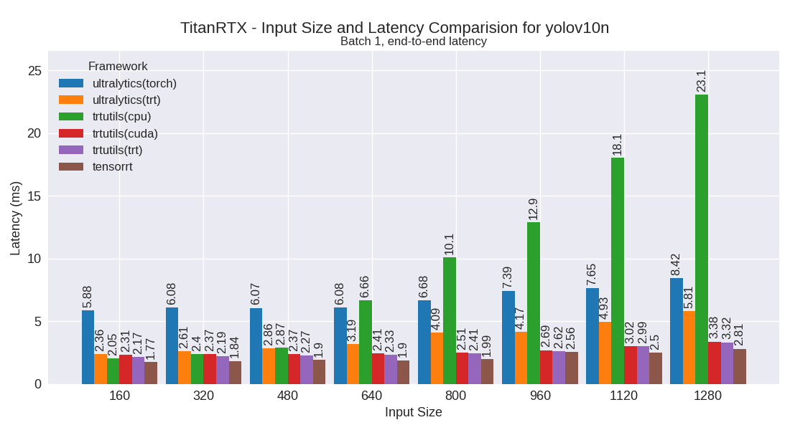

yolov10s
~~~~~~~~

yolov7m
~~~~~~~~

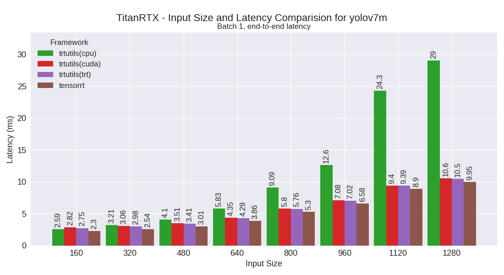

yolov7t
~~~~~~~~

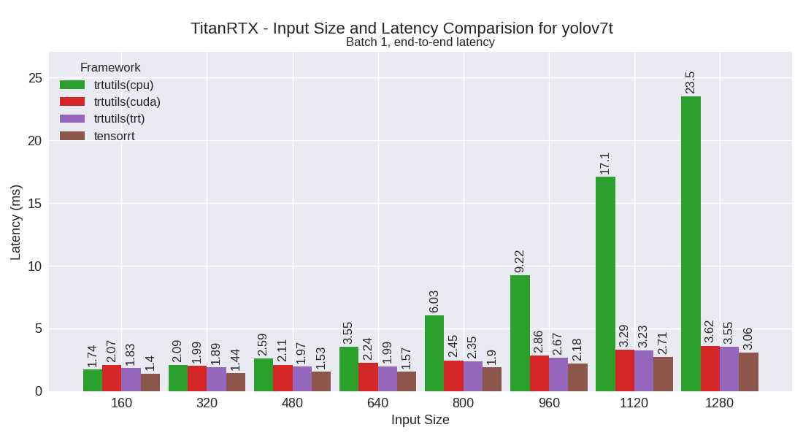

yolov8m
~~~~~~~~

.. image:: ../../benchmark/plots/TitanRTX/yolov8m.png
   :alt: yolov8m performance plot
   :align: center

yolov8n
~~~~~~~~

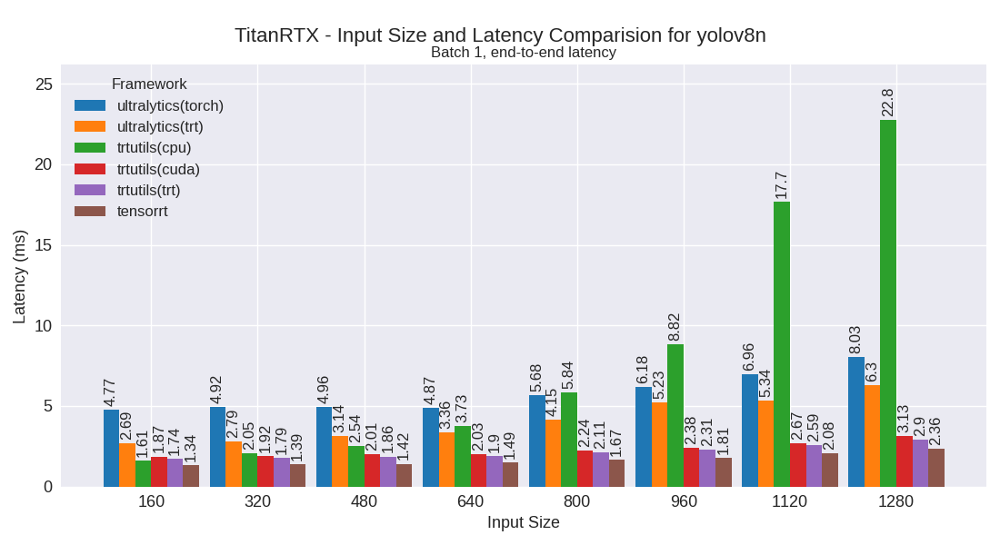

yolov8s
~~~~~~~~

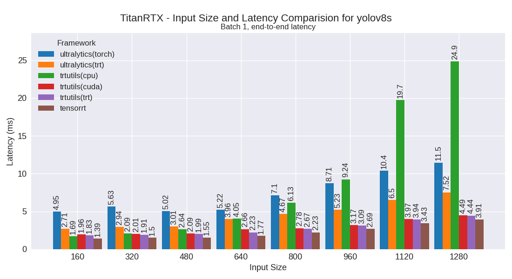

yolov9m
~~~~~~~~

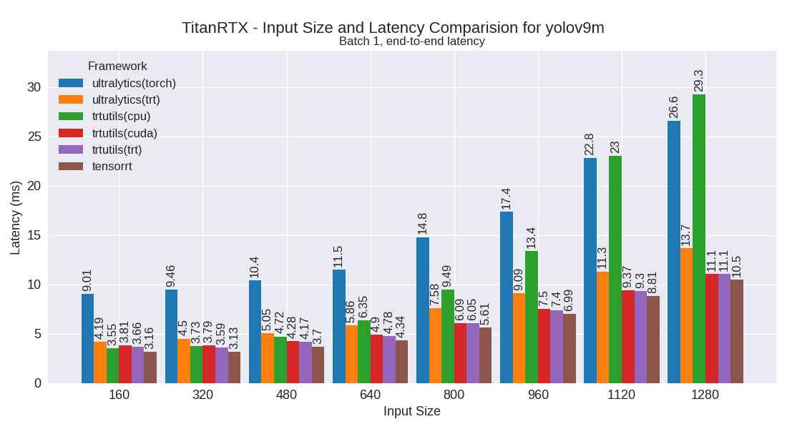

yolov9s
~~~~~~~~

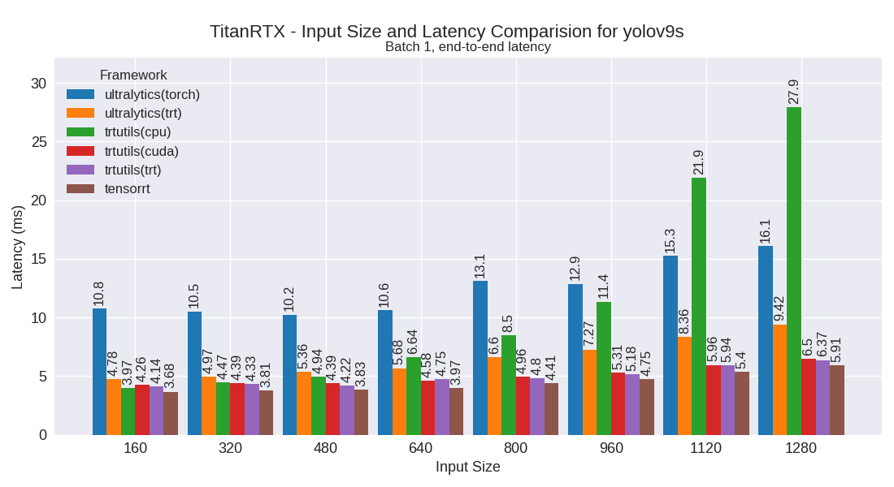

yolov9t
~~~~~~~~

yoloxm
~~~~~~~~

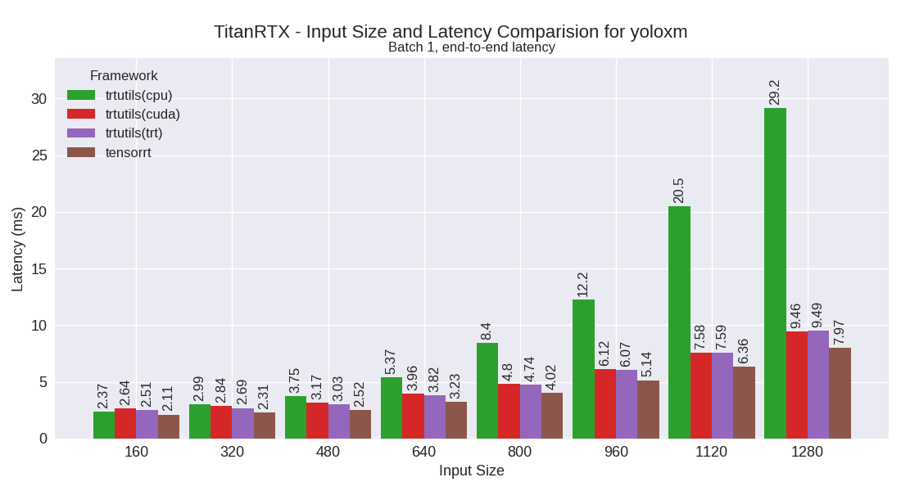

yoloxn
~~~~~~~~

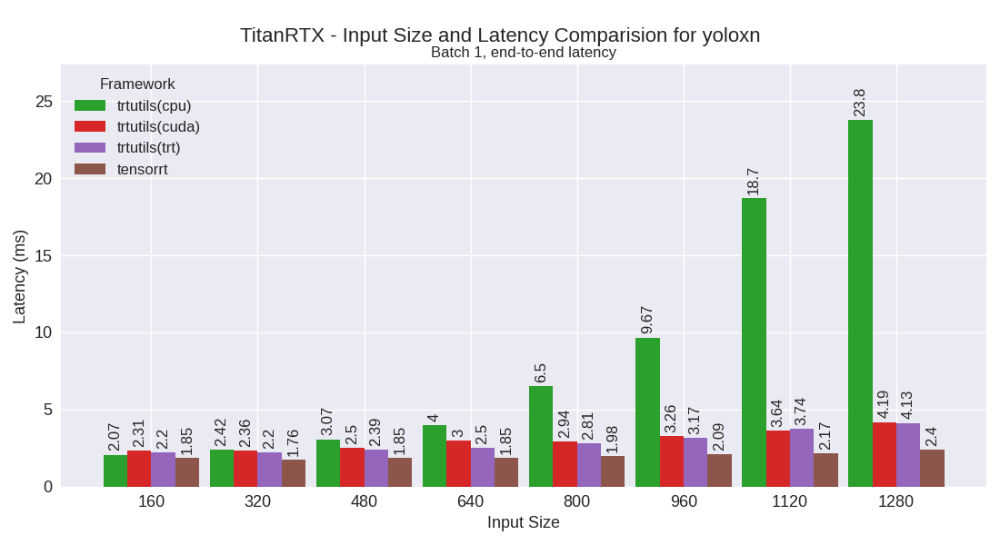

yoloxs
~~~~~~~~

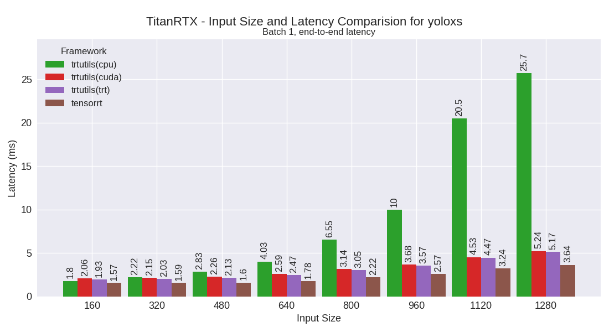

yoloxt
~~~~~~~~

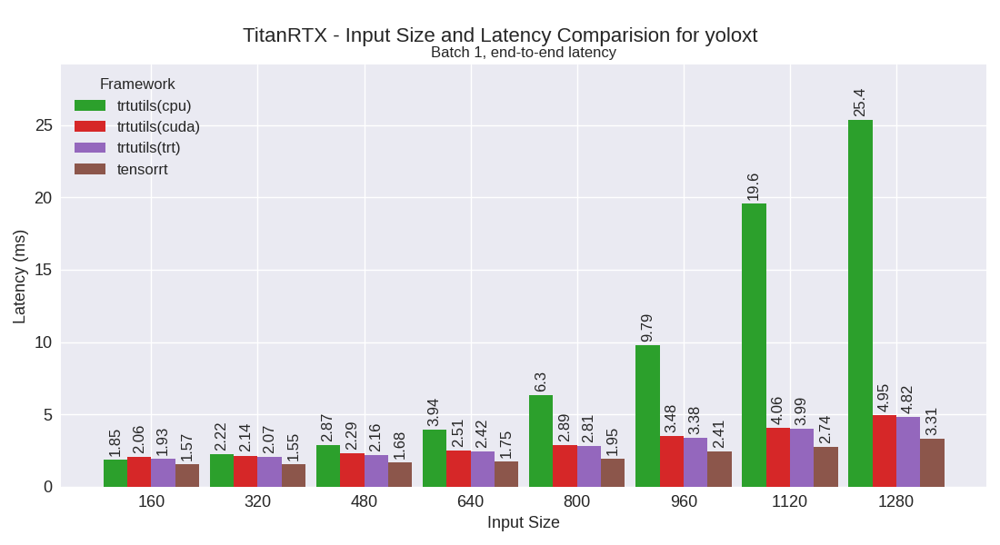

Performance Table
-----------------

The following table shows detailed performance metrics for all tested models:

.. csv-table:: Performance Metrics
   :header: Framework,Model,Input Size,Mean (ms),Median (ms),Min (ms),Max (ms)
   :widths: 10,10,10,10,10,10,10

   trtutils,yolov10n,160,2.3,2.2,1.9,3.6
   trtutils,yolov10n,320,2.3,2.2,2.0,3.7
   trtutils,yolov10n,480,2.3,2.3,2.0,3.5
   trtutils,yolov10n,640,2.4,2.3,2.1,3.6
   trtutils,yolov10n,800,2.6,2.5,2.3,4.1
   trtutils,yolov10n,960,2.8,2.7,2.5,4.0
   trtutils,yolov10n,1120,3.1,3.0,2.9,4.2
   trtutils,yolov10n,1280,3.5,3.4,3.3,5.0
   trtutils,yolov10s,160,2.3,2.3,2.0,3.3
   trtutils,yolov10s,320,2.3,2.3,2.0,2.9
   trtutils,yolov10s,480,2.4,2.4,2.1,3.3
   trtutils,yolov10s,640,2.6,2.6,2.5,4.9
   trtutils,yolov10s,800,3.1,3.0,2.9,5.4
   trtutils,yolov10s,960,3.5,3.4,3.3,5.3
   trtutils,yolov10s,1120,4.5,4.3,4.2,6.2
   trtutils,yolov10s,1280,4.9,4.8,4.7,6.8
   trtutils,yolov10m,160,3.0,2.9,2.6,11.0
   trtutils,yolov10m,320,3.2,3.0,2.9,5.3
   trtutils,yolov10m,480,3.5,3.4,3.2,4.9
   trtutils,yolov10m,640,4.1,3.9,3.7,6.0
   trtutils,yolov10m,800,5.0,4.9,4.7,6.6
   trtutils,yolov10m,960,6.1,5.9,5.7,8.0
   trtutils,yolov10m,1120,7.6,7.4,7.2,9.8
   trtutils,yolov10m,1280,9.2,9.0,8.8,11.4
   trtutils,yolov9t,160,4.1,3.9,3.5,6.3
   trtutils,yolov9t,320,4.2,4.0,3.7,6.3
   trtutils,yolov9t,480,4.3,4.1,3.5,7.8
   trtutils,yolov9t,640,4.3,4.1,3.7,6.5
   trtutils,yolov9t,800,4.4,4.3,3.7,6.0
   trtutils,yolov9t,960,4.8,4.6,4.0,6.8
   trtutils,yolov9t,1120,4.9,4.8,4.3,6.5
   trtutils,yolov9t,1280,5.4,5.3,4.8,8.6
   trtutils,yolov9s,160,5.1,4.7,3.7,11.3
   trtutils,yolov9s,320,4.6,4.4,3.9,7.2
   trtutils,yolov9s,480,4.9,4.5,3.7,10.3
   trtutils,yolov9s,640,4.9,4.7,4.0,7.2
   trtutils,yolov9s,800,5.0,4.8,4.4,7.0
   trtutils,yolov9s,960,5.3,5.2,4.8,7.2
   trtutils,yolov9s,1120,6.0,5.8,5.6,9.7
   trtutils,yolov9s,1280,6.5,6.3,6.2,10.6
   trtutils,yolov9m,160,3.7,3.6,3.2,5.6
   trtutils,yolov9m,320,3.8,3.6,3.3,10.4
   trtutils,yolov9m,480,4.2,4.1,3.8,6.0
   trtutils,yolov9m,640,4.9,4.8,4.6,6.5
   trtutils,yolov9m,800,6.2,5.9,5.8,9.6
   trtutils,yolov9m,960,7.4,7.3,7.1,10.1
   trtutils,yolov9m,1120,9.3,9.1,8.8,11.2
   trtutils,yolov9m,1280,11.0,10.7,10.6,13.1
   trtutils,yolov8n,160,1.9,1.8,1.6,2.8
   trtutils,yolov8n,320,1.9,1.8,1.6,3.1
   trtutils,yolov8n,480,2.0,1.9,1.7,3.0
   trtutils,yolov8n,640,2.0,1.9,1.7,3.0
   trtutils,yolov8n,800,2.2,2.1,2.0,3.3
   trtutils,yolov8n,960,2.4,2.3,2.2,3.6
   trtutils,yolov8n,1120,2.8,2.6,2.5,4.1
   trtutils,yolov8n,1280,3.0,2.9,2.8,4.7
   trtutils,yolov8s,160,2.2,2.0,1.7,3.7
   trtutils,yolov8s,320,2.2,2.0,1.8,3.5
   trtutils,yolov8s,480,2.2,2.1,1.9,4.9
   trtutils,yolov8s,640,2.4,2.3,2.2,4.2
   trtutils,yolov8s,800,2.8,2.7,2.6,4.6
   trtutils,yolov8s,960,3.2,3.1,3.0,6.8
   trtutils,yolov8s,1120,4.0,3.9,3.8,6.3
   trtutils,yolov8s,1280,4.4,4.4,4.2,14.7
   trtutils,yolov8m,160,2.5,2.5,2.3,3.7
   trtutils,yolov8m,320,2.6,2.6,2.5,4.0
   trtutils,yolov8m,480,3.0,3.0,2.9,4.4
   trtutils,yolov8m,640,3.8,3.7,3.6,6.4
   trtutils,yolov8m,800,4.9,4.8,4.6,6.5
   trtutils,yolov8m,960,6.3,5.9,5.7,9.4
   trtutils,yolov8m,1120,7.8,7.4,7.1,9.8
   trtutils,yolov8m,1280,9.4,9.0,8.5,18.7
   trtutils,yolov7t,160,1.8,1.8,1.7,3.3
   trtutils,yolov7t,320,2.1,1.9,1.7,4.5
   trtutils,yolov7t,480,2.0,2.0,1.8,4.6
   trtutils,yolov7t,640,2.1,2.0,1.9,2.9
   trtutils,yolov7t,800,2.4,2.4,2.3,3.5
   trtutils,yolov7t,960,2.8,2.7,2.6,4.2
   trtutils,yolov7t,1120,3.5,3.3,3.2,7.3
   trtutils,yolov7t,1280,3.6,3.6,3.5,5.7
   trtutils,yolov7m,160,2.9,2.7,2.6,6.8
   trtutils,yolov7m,320,3.2,3.0,2.8,6.4
   trtutils,yolov7m,480,3.6,3.5,3.3,6.1
   trtutils,yolov7m,640,4.5,4.2,4.1,7.3
   trtutils,yolov7m,800,5.6,5.6,5.5,7.9
   trtutils,yolov7m,960,7.1,6.9,6.6,9.9
   trtutils,yolov7m,1120,9.5,9.2,9.0,12.1
   trtutils,yolov7m,1280,10.5,10.3,9.7,17.3
   trtutils,yoloxt,160,1.9,1.9,1.7,4.0
   trtutils,yoloxt,320,2.0,2.0,1.8,3.9
   trtutils,yoloxt,480,2.2,2.2,2.0,5.8
   trtutils,yoloxt,640,2.5,2.4,2.3,4.9
   trtutils,yoloxt,800,2.9,2.8,2.7,8.1
   trtutils,yoloxt,960,3.5,3.4,3.4,7.7
   trtutils,yoloxt,1120,4.0,4.0,4.0,7.6
   trtutils,yoloxt,1280,4.9,4.8,4.8,8.4
   trtutils,yoloxn,160,2.2,2.1,2.0,7.2
   trtutils,yoloxn,320,2.3,2.2,2.0,7.2
   trtutils,yoloxn,480,2.4,2.4,2.2,8.0
   trtutils,yoloxn,640,2.6,2.5,2.3,3.9
   trtutils,yoloxn,800,2.9,2.8,2.6,7.1
   trtutils,yoloxn,960,3.3,3.2,3.0,7.3
   trtutils,yoloxn,1120,3.6,3.6,3.4,6.6
   trtutils,yoloxn,1280,4.3,4.2,4.0,7.1
   trtutils,yoloxs,160,2.1,1.9,1.7,7.1
   trtutils,yoloxs,320,2.1,2.0,1.8,14.7
   trtutils,yoloxs,480,2.1,2.1,2.0,4.4
   trtutils,yoloxs,640,2.5,2.5,2.4,6.6
   trtutils,yoloxs,800,3.1,3.1,3.0,3.8
   trtutils,yoloxs,960,3.7,3.6,3.5,5.3
   trtutils,yoloxs,1120,4.6,4.5,4.4,9.2
   trtutils,yoloxs,1280,5.3,5.2,5.1,7.2
   trtutils,yoloxm,160,2.5,2.5,2.3,9.8
   trtutils,yoloxm,320,2.7,2.7,2.5,10.8
   trtutils,yoloxm,480,3.1,3.0,3.0,13.0
   trtutils,yoloxm,640,3.9,3.8,3.8,5.2
   trtutils,yoloxm,800,4.7,4.7,4.6,9.4
   trtutils,yoloxm,960,6.1,6.0,5.8,9.1
   trtutils,yoloxm,1120,7.9,7.5,7.2,11.9
   trtutils,yoloxm,1280,9.3,9.3,9.0,10.7
   ultralytics(trt),yolov10n,160,2.4,2.2,2.0,4.1
   ultralytics(trt),yolov10n,320,2.6,2.5,2.2,4.1
   ultralytics(trt),yolov10n,480,2.9,2.7,2.4,4.4
   ultralytics(trt),yolov10n,640,3.2,3.1,2.8,4.8
   ultralytics(trt),yolov10n,800,4.1,4.0,3.3,6.8
   ultralytics(trt),yolov10n,960,4.2,4.1,3.9,6.7
   ultralytics(trt),yolov10n,1120,4.9,4.9,4.7,7.0
   ultralytics(trt),yolov10n,1280,5.8,5.7,5.4,7.5
   ultralytics(trt),yolov10s,160,2.6,2.4,2.2,3.9
   ultralytics(trt),yolov10s,320,2.9,2.7,2.4,4.1
   ultralytics(trt),yolov10s,480,3.2,3.0,2.7,5.0
   ultralytics(trt),yolov10s,640,3.6,3.4,3.2,6.8
   ultralytics(trt),yolov10s,800,4.4,4.2,4.0,6.4
   ultralytics(trt),yolov10s,960,5.1,5.0,4.7,6.7
   ultralytics(trt),yolov10s,1120,6.5,6.3,6.1,8.8
   ultralytics(trt),yolov10s,1280,7.8,7.6,7.2,10.2
   ultralytics(trt),yolov10m,160,3.8,3.3,2.8,7.3
   ultralytics(trt),yolov10m,320,3.6,3.5,3.2,5.2
   ultralytics(trt),yolov10m,480,4.3,4.0,3.7,8.1
   ultralytics(trt),yolov10m,640,4.9,4.7,4.5,6.9
   ultralytics(trt),yolov10m,800,6.6,6.2,5.8,10.6
   ultralytics(trt),yolov10m,960,7.7,7.4,7.0,10.2
   ultralytics(trt),yolov10m,1120,9.5,9.3,9.0,11.8
   ultralytics(trt),yolov10m,1280,11.6,11.4,10.9,18.3
   ultralytics(trt),yolov9t,160,4.2,4.1,3.7,7.7
   ultralytics(trt),yolov9t,320,4.5,4.3,3.9,7.9
   ultralytics(trt),yolov9t,480,4.8,4.6,4.2,7.0
   ultralytics(trt),yolov9t,640,5.0,4.9,4.4,7.6
   ultralytics(trt),yolov9t,800,5.6,5.4,5.0,10.9
   ultralytics(trt),yolov9t,960,6.9,6.8,5.8,10.2
   ultralytics(trt),yolov9t,1120,8.6,8.6,6.6,13.7
   ultralytics(trt),yolov9t,1280,8.6,8.5,7.3,13.3
   ultralytics(trt),yolov9s,160,4.8,4.6,3.9,15.0
   ultralytics(trt),yolov9s,320,5.0,4.8,4.1,7.1
   ultralytics(trt),yolov9s,480,5.4,5.2,4.3,8.7
   ultralytics(trt),yolov9s,640,5.7,5.5,4.9,9.1
   ultralytics(trt),yolov9s,800,6.6,6.4,5.6,15.1
   ultralytics(trt),yolov9s,960,7.3,7.0,6.3,15.5
   ultralytics(trt),yolov9s,1120,8.4,8.2,7.6,11.6
   ultralytics(trt),yolov9s,1280,9.4,9.2,8.7,19.9
   ultralytics(trt),yolov9m,160,4.2,4.0,3.6,8.3
   ultralytics(trt),yolov9m,320,4.5,4.2,3.9,9.8
   ultralytics(trt),yolov9m,480,5.1,4.8,4.5,7.1
   ultralytics(trt),yolov9m,640,5.9,5.7,5.4,14.0
   ultralytics(trt),yolov9m,800,7.6,7.3,7.0,10.5
   ultralytics(trt),yolov9m,960,9.1,8.9,8.5,13.2
   ultralytics(trt),yolov9m,1120,11.3,11.2,10.6,13.8
   ultralytics(trt),yolov9m,1280,13.7,13.4,12.8,21.7
   ultralytics(trt),yolov8n,160,2.7,2.5,2.2,5.3
   ultralytics(trt),yolov8n,320,2.8,2.7,2.4,5.5
   ultralytics(trt),yolov8n,480,3.1,3.0,2.7,6.3
   ultralytics(trt),yolov8n,640,3.4,3.3,2.9,4.9
   ultralytics(trt),yolov8n,800,4.2,4.1,3.5,29.2
   ultralytics(trt),yolov8n,960,5.2,5.3,4.1,11.2
   ultralytics(trt),yolov8n,1120,5.3,5.2,4.9,8.1
   ultralytics(trt),yolov8n,1280,6.3,6.1,5.6,9.1
   ultralytics(trt),yolov8s,160,2.7,2.5,2.3,5.5
   ultralytics(trt),yolov8s,320,2.9,2.8,2.6,8.3
   ultralytics(trt),yolov8s,480,3.0,3.0,2.8,5.8
   ultralytics(trt),yolov8s,640,4.0,3.7,3.3,9.0
   ultralytics(trt),yolov8s,800,4.7,4.5,4.2,8.7
   ultralytics(trt),yolov8s,960,5.2,5.0,4.9,8.6
   ultralytics(trt),yolov8s,1120,6.5,6.4,6.2,10.3
   ultralytics(trt),yolov8s,1280,7.5,7.3,7.0,16.8
   ultralytics(trt),yolov8m,160,3.4,3.2,2.9,7.2
   ultralytics(trt),yolov8m,320,3.5,3.4,3.3,5.1
   ultralytics(trt),yolov8m,480,4.4,4.2,3.8,18.6
   ultralytics(trt),yolov8m,640,5.1,5.1,4.9,6.7
   ultralytics(trt),yolov8m,800,7.0,6.6,6.1,10.6
   ultralytics(trt),yolov8m,960,8.5,8.3,7.4,15.7
   ultralytics(trt),yolov8m,1120,9.9,9.7,9.3,13.3
   ultralytics(trt),yolov8m,1280,11.9,11.8,11.4,14.6
   ultralytics(torch),yolov10n,160,5.9,5.7,5.3,9.4
   ultralytics(torch),yolov10n,320,6.1,5.9,5.4,8.7
   ultralytics(torch),yolov10n,480,6.1,5.8,5.5,9.1
   ultralytics(torch),yolov10n,640,6.1,5.9,5.6,8.9
   ultralytics(torch),yolov10n,800,6.7,6.5,6.0,14.4
   ultralytics(torch),yolov10n,960,7.4,7.1,6.3,16.4
   ultralytics(torch),yolov10n,1120,7.6,7.5,7.1,12.3
   ultralytics(torch),yolov10n,1280,8.4,8.3,7.8,10.8
   ultralytics(torch),yolov10s,160,5.9,5.7,5.6,8.3
   ultralytics(torch),yolov10s,320,6.7,6.2,5.6,14.7
   ultralytics(torch),yolov10s,480,6.5,6.1,5.7,11.7
   ultralytics(torch),yolov10s,640,6.8,6.9,5.9,8.7
   ultralytics(torch),yolov10s,800,7.6,7.2,6.9,11.6
   ultralytics(torch),yolov10s,960,9.4,9.1,8.9,13.4
   ultralytics(torch),yolov10s,1120,11.3,11.0,10.7,14.0
   ultralytics(torch),yolov10s,1280,13.1,12.8,12.5,18.2
   ultralytics(torch),yolov10m,160,7.9,7.7,6.7,15.4
   ultralytics(torch),yolov10m,320,7.5,7.0,6.8,14.0
   ultralytics(torch),yolov10m,480,8.2,7.5,7.0,23.8
   ultralytics(torch),yolov10m,640,9.3,8.7,8.4,23.3
   ultralytics(torch),yolov10m,800,12.2,11.9,11.6,16.4
   ultralytics(torch),yolov10m,960,15.6,15.3,14.9,20.8
   ultralytics(torch),yolov10m,1120,20.5,20.2,19.1,26.9
   ultralytics(torch),yolov10m,1280,24.4,24.1,23.2,28.6
   ultralytics(torch),yolov9t,160,11.3,10.6,9.8,35.6
   ultralytics(torch),yolov9t,320,9.7,9.6,9.1,13.2
   ultralytics(torch),yolov9t,480,10.5,9.9,9.2,33.8
   ultralytics(torch),yolov9t,640,10.7,10.3,9.4,26.8
   ultralytics(torch),yolov9t,800,10.5,10.1,9.6,13.3
   ultralytics(torch),yolov9t,960,11.6,11.1,10.0,20.2
   ultralytics(torch),yolov9t,1120,12.3,11.9,10.9,20.1
   ultralytics(torch),yolov9t,1280,13.7,13.5,11.8,18.8
   ultralytics(torch),yolov9s,160,10.8,10.4,9.7,25.1
   ultralytics(torch),yolov9s,320,10.5,10.1,9.4,20.3
   ultralytics(torch),yolov9s,480,10.2,9.9,9.4,20.0
   ultralytics(torch),yolov9s,640,10.6,10.3,9.7,19.6
   ultralytics(torch),yolov9s,800,13.1,13.0,10.8,20.2
   ultralytics(torch),yolov9s,960,12.9,12.7,11.2,34.9
   ultralytics(torch),yolov9s,1120,15.3,14.9,13.7,31.3
   ultralytics(torch),yolov9s,1280,16.1,15.6,14.4,22.0
   ultralytics(torch),yolov9m,160,9.0,8.5,8.0,27.5
   ultralytics(torch),yolov9m,320,9.5,9.0,8.5,19.4
   ultralytics(torch),yolov9m,480,10.4,10.1,9.4,32.1
   ultralytics(torch),yolov9m,640,11.5,11.3,10.9,14.3
   ultralytics(torch),yolov9m,800,14.8,14.5,13.9,22.2
   ultralytics(torch),yolov9m,960,17.4,17.1,16.5,25.9
   ultralytics(torch),yolov9m,1120,22.8,22.4,21.4,29.8
   ultralytics(torch),yolov9m,1280,26.6,26.2,25.3,32.7
   ultralytics(torch),yolov8n,160,4.8,4.5,4.3,14.0
   ultralytics(torch),yolov8n,320,4.9,4.8,4.4,6.8
   ultralytics(torch),yolov8n,480,5.0,4.8,4.4,7.5
   ultralytics(torch),yolov8n,640,4.9,4.7,4.5,6.8
   ultralytics(torch),yolov8n,800,5.7,5.4,4.9,12.5
   ultralytics(torch),yolov8n,960,6.2,5.7,5.2,11.3
   ultralytics(torch),yolov8n,1120,7.0,6.8,6.4,12.1
   ultralytics(torch),yolov8n,1280,8.0,7.7,7.0,11.2
   ultralytics(torch),yolov8s,160,5.0,4.8,4.6,7.5
   ultralytics(torch),yolov8s,320,5.6,5.2,4.5,11.7
   ultralytics(torch),yolov8s,480,5.0,4.8,4.5,8.6
   ultralytics(torch),yolov8s,640,5.2,5.1,5.0,7.2
   ultralytics(torch),yolov8s,800,7.1,6.8,6.5,12.9
   ultralytics(torch),yolov8s,960,8.7,8.4,8.2,16.3
   ultralytics(torch),yolov8s,1120,10.4,10.0,9.7,15.8
   ultralytics(torch),yolov8s,1280,11.5,11.4,11.2,13.8
   ultralytics(torch),yolov8m,160,7.4,7.0,6.7,19.6
   ultralytics(torch),yolov8m,320,7.0,6.7,6.2,13.2
   ultralytics(torch),yolov8m,480,7.5,6.9,6.6,18.3
   ultralytics(torch),yolov8m,640,9.4,8.9,8.4,18.7
   ultralytics(torch),yolov8m,800,12.2,12.0,11.7,16.6
   ultralytics(torch),yolov8m,960,15.9,15.5,14.4,20.5
   ultralytics(torch),yolov8m,1120,21.2,21.2,19.0,26.3
   ultralytics(torch),yolov8m,1280,24.7,23.8,22.5,31.6
