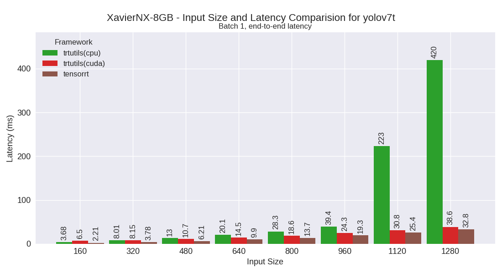
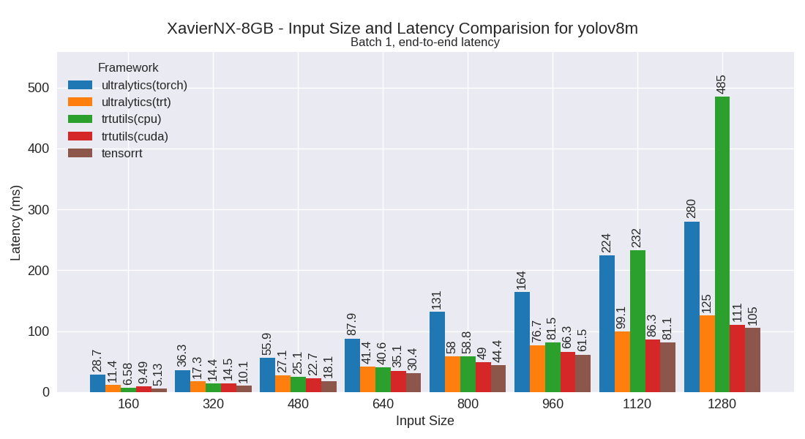
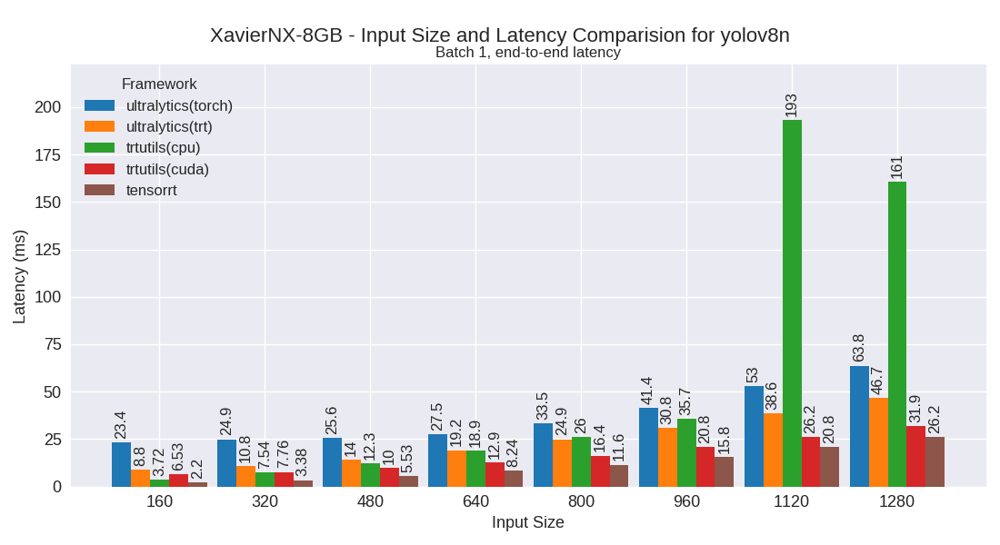
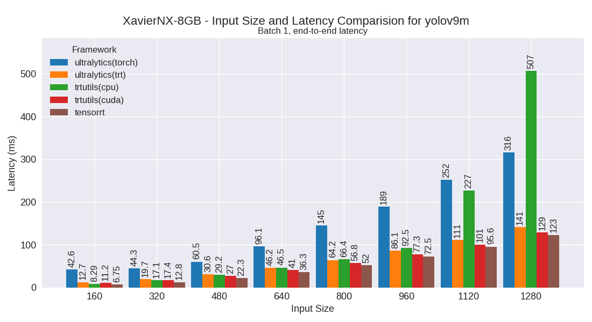
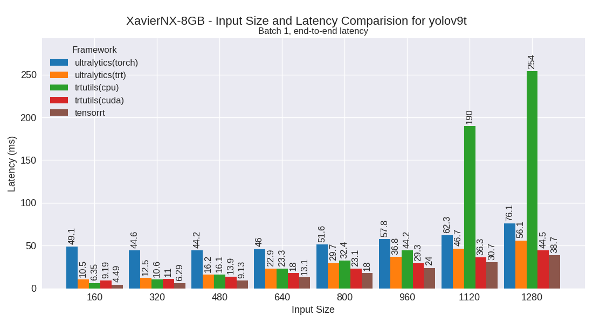

XavierNX-8GB
============

Developer Kit with Jetpack 5

This section contains benchmarking results for various YOLO models on the XavierNX-8GB platform.

Performance Plots
-----------------

The following plots show the performance comparison between different YOLO models and frameworks:

yolov10m
~~~~~~~~

yolov10n
~~~~~~~~

yolov10s
~~~~~~~~

yolov7m
~~~~~~~~

yolov7t
~~~~~~~~

yolov8m
~~~~~~~~

yolov8n
~~~~~~~~

yolov8s
~~~~~~~~

.. image:: ../../benchmark/plots/XavierNX-8GB/yolov8s.png
   :alt: yolov8s performance plot
   :align: center

yolov9m
~~~~~~~~

yolov9s
~~~~~~~~

yolov9t
~~~~~~~~

yoloxm
~~~~~~~~

yoloxn
~~~~~~~~

yoloxs
~~~~~~~~

yoloxt
~~~~~~~~

Performance Table
-----------------

The following table shows detailed performance metrics for all tested models:

.. csv-table:: Performance Metrics
   :header: Framework,Model,Input Size,Mean (ms),Median (ms),Min (ms),Max (ms)
   :widths: 10,10,10,10,10,10,10

   tensorrt,yolov9t,160,4.5,4.5,4.4,5.6
   tensorrt,yolov9t,320,6.3,6.3,6.2,6.7
   tensorrt,yolov9t,480,9.1,9.1,9.1,9.5
   tensorrt,yolov9t,640,13.1,13.1,13.0,13.2
   tensorrt,yolov9t,800,18.0,18.0,17.9,18.4
   tensorrt,yolov9t,960,24.0,24.0,23.9,24.2
   tensorrt,yolov9t,1120,30.7,30.7,30.6,31.2
   tensorrt,yolov9t,1280,38.7,38.7,38.6,39.0
   tensorrt,yolov9s,160,5.6,5.6,5.6,5.7
   tensorrt,yolov9s,320,8.4,8.3,8.3,8.7
   tensorrt,yolov9s,480,13.2,13.2,13.1,13.3
   tensorrt,yolov9s,640,19.5,19.5,19.4,19.7
   tensorrt,yolov9s,800,27.5,27.5,27.4,27.6
   tensorrt,yolov9s,960,37.0,37.0,36.8,37.5
   tensorrt,yolov9s,1120,48.6,48.6,48.4,51.0
   tensorrt,yolov9s,1280,61.5,61.5,61.2,62.0
   tensorrt,yolov9m,160,6.8,6.7,6.7,6.9
   tensorrt,yolov9m,320,12.8,12.8,12.7,12.9
   tensorrt,yolov9m,480,22.3,22.3,22.2,22.5
   tensorrt,yolov9m,640,36.3,36.3,36.0,36.6
   tensorrt,yolov9m,800,52.0,52.0,51.8,52.4
   tensorrt,yolov9m,960,72.5,72.5,72.2,73.0
   tensorrt,yolov9m,1120,95.6,95.6,95.3,95.9
   tensorrt,yolov9m,1280,123.2,123.2,122.7,123.7
   tensorrt,yolov8n,160,2.2,2.2,2.2,2.3
   tensorrt,yolov8n,320,3.4,3.4,3.3,3.9
   tensorrt,yolov8n,480,5.5,5.5,5.5,5.9
   tensorrt,yolov8n,640,8.2,8.2,8.2,8.4
   tensorrt,yolov8n,800,11.6,11.6,11.5,11.8
   tensorrt,yolov8n,960,15.8,15.8,15.7,16.0
   tensorrt,yolov8n,1120,20.8,20.8,20.7,21.3
   tensorrt,yolov8n,1280,26.2,26.2,26.1,26.7
   tensorrt,yolov8s,160,2.9,2.9,2.9,3.0
   tensorrt,yolov8s,320,5.3,5.3,5.2,5.6
   tensorrt,yolov8s,480,9.1,9.1,9.0,9.5
   tensorrt,yolov8s,640,14.3,14.3,14.2,14.4
   tensorrt,yolov8s,800,20.2,20.2,20.2,20.4
   tensorrt,yolov8s,960,28.1,28.1,27.9,28.5
   tensorrt,yolov8s,1120,37.2,37.2,36.9,37.7
   tensorrt,yolov8s,1280,47.0,47.0,46.7,47.3
   tensorrt,yolov8m,160,5.1,5.1,5.1,5.2
   tensorrt,yolov8m,320,10.1,10.1,10.1,10.3
   tensorrt,yolov8m,480,18.1,18.1,18.0,18.3
   tensorrt,yolov8m,640,30.4,30.4,30.2,30.6
   tensorrt,yolov8m,800,44.4,44.4,44.2,44.7
   tensorrt,yolov8m,960,61.5,61.5,61.3,61.8
   tensorrt,yolov8m,1120,81.1,81.1,80.8,81.6
   tensorrt,yolov8m,1280,105.2,105.2,104.7,105.8
   tensorrt,yolov7t,160,2.2,2.2,2.2,2.4
   tensorrt,yolov7t,320,3.8,3.8,3.8,3.9
   tensorrt,yolov7t,480,6.2,6.2,6.1,6.6
   tensorrt,yolov7t,640,9.9,9.9,9.8,10.0
   tensorrt,yolov7t,800,13.7,13.7,13.6,14.0
   tensorrt,yolov7t,960,19.3,19.3,19.2,19.6
   tensorrt,yolov7t,1120,25.4,25.4,25.3,26.0
   tensorrt,yolov7t,1280,32.8,32.8,32.6,33.3
   tensorrt,yolov7m,160,6.0,6.0,5.9,6.1
   tensorrt,yolov7m,320,13.2,13.2,13.1,13.3
   tensorrt,yolov7m,480,24.3,24.3,24.1,24.7
   tensorrt,yolov7m,640,40.0,40.0,39.7,40.3
   tensorrt,yolov7m,800,57.6,57.5,57.2,58.0
   tensorrt,yolov7m,960,81.7,81.7,81.3,82.2
   tensorrt,yolov7m,1120,108.4,108.3,107.8,109.6
   tensorrt,yolov7m,1280,139.9,139.9,139.1,141.8
   tensorrt,yoloxt,160,2.7,2.7,2.6,2.8
   tensorrt,yoloxt,320,4.4,4.4,4.4,4.5
   tensorrt,yoloxt,480,7.2,7.2,7.1,7.5
   tensorrt,yoloxt,640,11.0,11.0,10.9,11.3
   tensorrt,yoloxt,800,15.8,15.8,15.7,16.0
   tensorrt,yoloxt,960,21.4,21.4,21.3,21.6
   tensorrt,yoloxt,1120,28.3,28.3,28.1,28.9
   tensorrt,yoloxt,1280,36.0,36.0,35.8,36.3
   tensorrt,yoloxn,160,2.2,2.2,2.2,2.4
   tensorrt,yoloxn,320,3.2,3.2,3.2,3.5
   tensorrt,yoloxn,480,5.2,5.2,5.1,5.5
   tensorrt,yoloxn,640,7.4,7.3,7.3,7.7
   tensorrt,yoloxn,800,10.5,10.5,10.5,10.8
   tensorrt,yoloxn,960,14.1,14.1,14.0,18.0
   tensorrt,yoloxn,1120,18.2,18.2,18.1,18.6
   tensorrt,yoloxn,1280,22.8,22.8,22.7,23.4
   tensorrt,yoloxs,160,2.8,2.8,2.8,3.0
   tensorrt,yoloxs,320,5.1,5.1,5.0,5.5
   tensorrt,yoloxs,480,8.6,8.6,8.5,8.9
   tensorrt,yoloxs,640,13.5,13.5,13.4,13.7
   tensorrt,yoloxs,800,19.2,19.2,19.1,19.5
   tensorrt,yoloxs,960,26.6,26.6,26.5,26.8
   tensorrt,yoloxs,1120,34.9,34.9,34.7,35.6
   tensorrt,yoloxs,1280,44.5,44.5,44.2,44.9
   tensorrt,yoloxm,160,4.8,4.8,4.7,4.9
   tensorrt,yoloxm,320,9.5,9.5,9.5,9.9
   tensorrt,yoloxm,480,17.2,17.2,17.1,17.3
   tensorrt,yoloxm,640,28.7,28.7,28.5,29.0
   tensorrt,yoloxm,800,41.8,41.8,41.6,42.1
   tensorrt,yoloxm,960,58.2,58.2,57.9,58.5
   tensorrt,yoloxm,1120,77.2,77.2,76.9,77.7
   tensorrt,yoloxm,1280,100.0,100.0,99.6,100.6
   trtutils(cuda),yolov8n,160,6.5,6.5,6.4,9.4
   trtutils(cuda),yolov8n,320,7.8,7.7,7.6,10.5
   trtutils(cuda),yolov8n,480,10.0,10.0,9.8,12.1
   trtutils(cuda),yolov8n,640,12.9,12.9,12.7,16.7
   trtutils(cuda),yolov8n,800,16.4,16.3,16.2,20.0
   trtutils(cuda),yolov8n,960,20.8,20.8,20.5,24.8
   trtutils(cuda),yolov8n,1120,26.2,26.2,26.0,29.8
   trtutils(cuda),yolov8n,1280,31.9,31.9,31.7,35.6
   trtutils(cuda),yolov8s,160,7.2,7.2,7.0,10.2
   trtutils(cuda),yolov8s,320,9.7,9.6,9.5,11.8
   trtutils(cuda),yolov8s,480,13.6,13.5,13.3,16.3
   trtutils(cuda),yolov8s,640,18.8,18.8,18.5,21.5
   trtutils(cuda),yolov8s,800,25.1,25.1,24.9,28.7
   trtutils(cuda),yolov8s,960,33.1,33.1,32.8,36.6
   trtutils(cuda),yolov8s,1120,42.3,42.3,41.9,46.0
   trtutils(cuda),yolov8s,1280,52.4,52.4,52.0,56.4
   trtutils(cuda),yolov8m,160,9.5,9.4,9.3,12.2
   trtutils(cuda),yolov8m,320,14.5,14.5,14.1,17.3
   trtutils(cuda),yolov8m,480,22.7,22.6,22.4,25.4
   trtutils(cuda),yolov8m,640,35.1,35.1,34.7,37.8
   trtutils(cuda),yolov8m,800,49.0,49.0,48.7,53.1
   trtutils(cuda),yolov8m,960,66.3,66.2,65.9,69.6
   trtutils(cuda),yolov8m,1120,86.3,86.2,85.9,89.8
   trtutils(cuda),yolov8m,1280,110.7,110.7,110.2,114.6
   trtutils(cuda),yolov9t,160,9.2,9.1,8.8,14.8
   trtutils(cuda),yolov9t,320,11.0,10.9,10.7,13.7
   trtutils(cuda),yolov9t,480,13.9,13.9,13.7,15.9
   trtutils(cuda),yolov9t,640,18.0,18.0,17.7,21.1
   trtutils(cuda),yolov9t,800,23.1,23.1,22.9,27.1
   trtutils(cuda),yolov9t,960,29.3,29.3,29.0,33.3
   trtutils(cuda),yolov9t,1120,36.3,36.3,36.1,39.8
   trtutils(cuda),yolov9t,1280,44.5,44.5,44.3,48.1
   trtutils(cuda),yolov9s,160,10.2,10.1,10.0,12.7
   trtutils(cuda),yolov9s,320,12.9,12.9,12.7,15.8
   trtutils(cuda),yolov9s,480,17.9,17.9,17.7,20.6
   trtutils(cuda),yolov9s,640,24.2,24.2,24.0,27.0
   trtutils(cuda),yolov9s,800,32.5,32.4,32.1,35.9
   trtutils(cuda),yolov9s,960,42.1,42.1,41.8,45.3
   trtutils(cuda),yolov9s,1120,54.0,54.0,53.7,57.7
   trtutils(cuda),yolov9s,1280,67.4,67.4,67.1,71.2
   trtutils(cuda),yolov9m,160,11.2,11.2,11.0,14.0
   trtutils(cuda),yolov9m,320,17.4,17.3,17.1,20.2
   trtutils(cuda),yolov9m,480,27.0,26.9,26.7,29.5
   trtutils(cuda),yolov9m,640,41.0,41.0,40.5,44.1
   trtutils(cuda),yolov9m,800,56.8,56.9,56.3,60.5
   trtutils(cuda),yolov9m,960,77.3,77.3,77.0,80.5
   trtutils(cuda),yolov9m,1120,100.7,100.6,100.2,104.1
   trtutils(cuda),yolov9m,1280,128.7,128.7,128.2,133.0
   trtutils(cuda),yolov7m,160,10.3,10.2,10.1,13.1
   trtutils(cuda),yolov7m,320,17.7,17.6,17.4,20.8
   trtutils(cuda),yolov7m,480,28.8,28.8,28.5,31.4
   trtutils(cuda),yolov7m,640,44.5,44.5,44.1,47.8
   trtutils(cuda),yolov7m,800,62.2,62.1,61.7,66.2
   trtutils(cuda),yolov7m,960,86.4,86.4,86.0,89.9
   trtutils(cuda),yolov7m,1120,113.2,113.2,112.5,117.0
   trtutils(cuda),yolov7m,1280,145.4,145.3,144.4,158.3
   trtutils(cuda),yolov7t,160,6.5,6.5,6.3,17.4
   trtutils(cuda),yolov7t,320,8.2,8.1,8.0,11.0
   trtutils(cuda),yolov7t,480,10.7,10.6,10.4,13.1
   trtutils(cuda),yolov7t,640,14.5,14.5,14.3,17.4
   trtutils(cuda),yolov7t,800,18.6,18.5,18.4,22.1
   trtutils(cuda),yolov7t,960,24.3,24.3,24.0,27.2
   trtutils(cuda),yolov7t,1120,30.8,30.7,30.5,34.4
   trtutils(cuda),yolov7t,1280,38.6,38.6,38.3,43.3
   trtutils(cuda),yoloxt,160,6.9,6.9,6.7,9.8
   trtutils(cuda),yoloxt,320,8.7,8.7,8.5,12.7
   trtutils(cuda),yoloxt,480,11.7,11.7,11.5,17.5
   trtutils(cuda),yoloxt,640,15.8,15.7,15.5,24.3
   trtutils(cuda),yoloxt,800,21.0,21.0,20.8,33.3
   trtutils(cuda),yoloxt,960,26.9,26.9,26.6,42.0
   trtutils(cuda),yoloxt,1120,34.5,34.4,34.1,53.9
   trtutils(cuda),yoloxt,1280,42.9,42.9,42.6,67.1
   trtutils(cuda),yoloxn,160,6.5,6.4,6.3,9.9
   trtutils(cuda),yoloxn,320,7.5,7.5,7.3,11.7
   trtutils(cuda),yoloxn,480,9.7,9.7,9.5,15.3
   trtutils(cuda),yoloxn,640,12.2,12.2,12.1,20.0
   trtutils(cuda),yoloxn,800,16.2,16.1,16.0,28.5
   trtutils(cuda),yoloxn,960,20.2,20.2,20.1,35.3
   trtutils(cuda),yoloxn,1120,25.1,25.0,24.9,45.0
   trtutils(cuda),yoloxn,1280,30.5,30.5,30.3,55.1
   trtutils(cuda),yoloxs,160,7.1,7.0,6.9,10.6
   trtutils(cuda),yoloxs,320,9.4,9.3,9.2,13.7
   trtutils(cuda),yoloxs,480,13.1,13.1,12.9,18.6
   trtutils(cuda),yoloxs,640,18.4,18.3,18.1,26.3
   trtutils(cuda),yoloxs,800,24.4,24.4,24.2,35.7
   trtutils(cuda),yoloxs,960,32.2,32.2,31.9,47.1
   trtutils(cuda),yoloxs,1120,41.2,41.1,40.9,60.5
   trtutils(cuda),yoloxs,1280,51.1,51.0,50.7,75.3
   trtutils(cuda),yoloxm,160,9.1,9.0,8.8,12.2
   trtutils(cuda),yoloxm,320,13.9,13.9,13.5,18.6
   trtutils(cuda),yoloxm,480,21.8,21.7,21.5,27.2
   trtutils(cuda),yoloxm,640,33.5,33.5,33.2,41.3
   trtutils(cuda),yoloxm,800,47.0,47.0,46.7,58.6
   trtutils(cuda),yoloxm,960,63.7,63.7,63.5,79.0
   trtutils(cuda),yoloxm,1120,83.4,83.4,83.1,103.0
   trtutils(cuda),yoloxm,1280,106.8,106.8,106.2,131.4
   trtutils(cpu),yolov9t,160,6.4,6.3,6.0,10.6
   trtutils(cpu),yolov9t,320,10.6,10.6,10.3,12.2
   trtutils(cpu),yolov9t,480,16.1,16.1,15.7,17.9
   trtutils(cpu),yolov9t,640,23.3,23.3,22.8,28.6
   trtutils(cpu),yolov9t,800,32.4,32.4,32.1,38.6
   trtutils(cpu),yolov9t,960,44.2,44.1,43.8,46.6
   trtutils(cpu),yolov9t,1120,189.9,188.9,120.1,298.1
   trtutils(cpu),yolov9t,1280,254.2,252.9,244.7,374.7
   trtutils(cpu),yolov9s,160,7.2,7.2,7.1,8.3
   trtutils(cpu),yolov9s,320,12.7,12.7,12.5,14.1
   trtutils(cpu),yolov9s,480,20.1,20.1,19.6,21.6
   trtutils(cpu),yolov9s,640,29.6,29.6,29.1,32.2
   trtutils(cpu),yolov9s,800,41.8,41.8,41.3,43.5
   trtutils(cpu),yolov9s,960,56.7,56.7,56.2,63.6
   trtutils(cpu),yolov9s,1120,195.1,193.3,184.7,243.0
   trtutils(cpu),yolov9s,1280,474.1,470.8,444.9,577.3
   trtutils(cpu),yolov9m,160,8.3,8.2,8.1,9.4
   trtutils(cpu),yolov9m,320,17.1,17.1,16.6,18.4
   trtutils(cpu),yolov9m,480,29.2,29.2,28.8,30.9
   trtutils(cpu),yolov9m,640,46.5,46.5,45.9,47.8
   trtutils(cpu),yolov9m,800,66.4,66.4,65.8,68.8
   trtutils(cpu),yolov9m,960,92.5,92.4,92.0,94.1
   trtutils(cpu),yolov9m,1120,226.6,209.2,204.0,293.1
   trtutils(cpu),yolov9m,1280,506.8,518.9,408.4,583.3
   trtutils(cpu),yolov8n,160,3.7,3.7,3.6,5.1
   trtutils(cpu),yolov8n,320,7.5,7.6,7.2,11.4
   trtutils(cpu),yolov8n,480,12.3,12.3,11.8,15.8
   trtutils(cpu),yolov8n,640,18.9,18.6,18.1,29.0
   trtutils(cpu),yolov8n,800,26.0,25.9,25.7,29.5
   trtutils(cpu),yolov8n,960,35.7,35.7,35.4,41.8
   trtutils(cpu),yolov8n,1120,193.2,193.9,188.9,233.7
   trtutils(cpu),yolov8n,1280,160.6,170.1,97.1,498.2
   trtutils(cpu),yolov8s,160,4.3,4.3,4.2,5.4
   trtutils(cpu),yolov8s,320,9.5,9.5,9.0,12.8
   trtutils(cpu),yolov8s,480,15.9,15.9,15.6,17.5
   trtutils(cpu),yolov8s,640,24.5,24.4,24.1,26.0
   trtutils(cpu),yolov8s,800,34.6,34.6,34.1,37.5
   trtutils(cpu),yolov8s,960,48.0,47.9,47.4,54.8
   trtutils(cpu),yolov8s,1120,177.1,176.3,173.5,224.2
   trtutils(cpu),yolov8s,1280,253.5,253.2,248.1,404.3
   trtutils(cpu),yolov8m,160,6.6,6.6,6.4,7.9
   trtutils(cpu),yolov8m,320,14.4,14.4,14.0,17.1
   trtutils(cpu),yolov8m,480,25.1,25.0,24.6,26.1
   trtutils(cpu),yolov8m,640,40.6,40.6,40.1,42.7
   trtutils(cpu),yolov8m,800,58.8,58.8,58.3,61.1
   trtutils(cpu),yolov8m,960,81.5,81.5,81.1,94.7
   trtutils(cpu),yolov8m,1120,232.5,233.4,229.1,320.9
   trtutils(cpu),yolov8m,1280,485.3,481.4,474.2,548.4
   trtutils(cpu),yolov7t,160,3.7,3.7,3.6,5.0
   trtutils(cpu),yolov7t,320,8.0,8.0,7.7,10.0
   trtutils(cpu),yolov7t,480,13.0,13.0,12.6,15.6
   trtutils(cpu),yolov7t,640,20.1,20.1,19.7,21.4
   trtutils(cpu),yolov7t,800,28.3,28.2,28.0,34.3
   trtutils(cpu),yolov7t,960,39.4,39.3,38.8,41.4
   trtutils(cpu),yolov7t,1120,222.7,227.1,204.9,281.0
   trtutils(cpu),yolov7t,1280,419.8,419.6,414.3,488.4
   trtutils(cpu),yolov7m,160,7.4,7.4,7.3,8.4
   trtutils(cpu),yolov7m,320,17.5,17.5,17.3,18.4
   trtutils(cpu),yolov7m,480,31.2,31.2,30.7,33.6
   trtutils(cpu),yolov7m,640,50.1,50.1,49.5,51.0
   trtutils(cpu),yolov7m,800,72.1,72.1,71.4,73.8
   trtutils(cpu),yolov7m,960,101.6,101.6,101.1,104.0
   trtutils(cpu),yolov7m,1120,317.9,318.0,312.5,372.4
   trtutils(cpu),yolov7m,1280,462.8,441.6,439.1,593.0
   trtutils(cpu),yoloxt,160,4.1,4.0,3.9,5.3
   trtutils(cpu),yoloxt,320,8.7,8.7,8.3,11.3
   trtutils(cpu),yoloxt,480,14.1,14.1,13.7,17.3
   trtutils(cpu),yoloxt,640,21.3,21.3,20.9,26.9
   trtutils(cpu),yoloxt,800,30.6,30.5,30.1,38.5
   trtutils(cpu),yoloxt,960,41.9,41.9,41.4,54.4
   trtutils(cpu),yoloxt,1120,169.1,197.4,76.8,295.7
   trtutils(cpu),yoloxt,1280,389.2,387.1,382.7,443.7
   trtutils(cpu),yoloxn,160,3.5,3.5,3.4,5.2
   trtutils(cpu),yoloxn,320,7.5,7.4,7.1,10.0
   trtutils(cpu),yoloxn,480,12.0,12.0,11.6,17.4
   trtutils(cpu),yoloxn,640,17.8,17.7,17.3,25.0
   trtutils(cpu),yoloxn,800,25.6,25.6,25.3,34.2
   trtutils(cpu),yoloxn,960,35.1,35.1,34.8,54.0
   trtutils(cpu),yoloxn,1120,222.1,222.0,217.3,260.9
   trtutils(cpu),yoloxn,1280,417.5,414.4,408.2,479.9
   trtutils(cpu),yoloxs,160,4.2,4.1,4.0,5.8
   trtutils(cpu),yoloxs,320,9.3,9.3,8.9,12.4
   trtutils(cpu),yoloxs,480,15.5,15.5,15.3,18.5
   trtutils(cpu),yoloxs,640,23.8,23.8,23.4,28.7
   trtutils(cpu),yoloxs,800,33.9,33.8,33.3,41.7
   trtutils(cpu),yoloxs,960,47.0,47.0,46.4,58.6
   trtutils(cpu),yoloxs,1120,172.9,172.8,165.9,275.9
   trtutils(cpu),yoloxs,1280,429.5,433.1,393.0,541.9
   trtutils(cpu),yoloxm,160,6.2,6.2,6.1,7.9
   trtutils(cpu),yoloxm,320,13.8,13.8,13.3,18.0
   trtutils(cpu),yoloxm,480,24.1,24.1,23.7,27.9
   trtutils(cpu),yoloxm,640,38.9,38.9,38.4,44.3
   trtutils(cpu),yoloxm,800,56.6,56.5,56.1,65.1
   trtutils(cpu),yoloxm,960,78.6,78.5,78.1,90.0
   trtutils(cpu),yoloxm,1120,274.2,274.7,269.0,311.6
   trtutils(cpu),yoloxm,1280,487.7,488.1,473.0,545.7
   ultralytics(trt),yolov9t,160,10.5,10.4,10.0,12.2
   ultralytics(trt),yolov9t,320,12.5,12.5,12.2,13.9
   ultralytics(trt),yolov9t,480,16.2,16.2,15.8,17.8
   ultralytics(trt),yolov9t,640,22.9,22.8,22.5,24.5
   ultralytics(trt),yolov9t,800,29.7,29.6,29.1,34.2
   ultralytics(trt),yolov9t,960,36.8,36.7,36.2,40.4
   ultralytics(trt),yolov9t,1120,46.7,46.6,46.0,53.3
   ultralytics(trt),yolov9t,1280,56.1,55.9,55.5,62.8
   ultralytics(trt),yolov9s,160,11.6,11.5,11.2,13.3
   ultralytics(trt),yolov9s,320,14.8,14.8,14.4,15.8
   ultralytics(trt),yolov9s,480,21.1,21.1,20.5,22.9
   ultralytics(trt),yolov9s,640,29.4,29.3,28.8,34.2
   ultralytics(trt),yolov9s,800,39.2,39.1,38.6,46.0
   ultralytics(trt),yolov9s,960,50.3,50.2,49.6,54.7
   ultralytics(trt),yolov9s,1120,64.4,64.3,63.7,69.2
   ultralytics(trt),yolov9s,1280,79.2,79.0,78.6,89.8
   ultralytics(trt),yolov9m,160,12.7,12.7,12.2,14.0
   ultralytics(trt),yolov9m,320,19.7,19.7,19.2,21.5
   ultralytics(trt),yolov9m,480,30.6,30.5,29.9,38.3
   ultralytics(trt),yolov9m,640,46.2,46.1,45.3,55.0
   ultralytics(trt),yolov9m,800,64.2,64.1,63.5,72.1
   ultralytics(trt),yolov9m,960,86.1,86.0,85.3,97.9
   ultralytics(trt),yolov9m,1120,111.3,111.2,110.6,115.7
   ultralytics(trt),yolov9m,1280,141.3,141.2,140.5,144.8
   ultralytics(trt),yolov8n,160,8.8,8.7,8.2,10.3
   ultralytics(trt),yolov8n,320,10.8,10.7,10.3,12.2
   ultralytics(trt),yolov8n,480,14.0,13.9,13.5,16.4
   ultralytics(trt),yolov8n,640,19.2,19.2,18.6,21.1
   ultralytics(trt),yolov8n,800,24.9,24.8,24.4,29.0
   ultralytics(trt),yolov8n,960,30.8,30.7,30.0,34.9
   ultralytics(trt),yolov8n,1120,38.6,38.5,37.9,45.5
   ultralytics(trt),yolov8n,1280,46.7,46.6,46.1,51.8
   ultralytics(trt),yolov8s,160,9.1,9.0,8.6,10.3
   ultralytics(trt),yolov8s,320,12.4,12.4,12.0,13.9
   ultralytics(trt),yolov8s,480,17.8,17.7,17.1,22.8
   ultralytics(trt),yolov8s,640,25.3,25.2,24.6,29.2
   ultralytics(trt),yolov8s,800,33.1,33.0,32.5,40.1
   ultralytics(trt),yolov8s,960,43.0,42.9,42.3,53.0
   ultralytics(trt),yolov8s,1120,54.3,54.1,53.6,58.8
   ultralytics(trt),yolov8s,1280,67.4,67.3,66.7,73.9
   ultralytics(trt),yolov8m,160,11.4,11.3,10.8,13.8
   ultralytics(trt),yolov8m,320,17.3,17.3,16.8,18.9
   ultralytics(trt),yolov8m,480,27.1,27.1,26.4,35.9
   ultralytics(trt),yolov8m,640,41.4,41.3,40.8,50.4
   ultralytics(trt),yolov8m,800,58.0,57.8,57.3,66.9
   ultralytics(trt),yolov8m,960,76.7,76.5,75.9,84.2
   ultralytics(trt),yolov8m,1120,99.1,98.9,98.4,107.5
   ultralytics(trt),yolov8m,1280,125.4,125.3,124.6,142.3
   ultralytics(torch),yolov10n,160,30.2,29.1,26.5,41.5
   ultralytics(torch),yolov10s,160,30.2,29.6,28.5,39.0
   ultralytics(torch),yolov10m,160,36.9,35.9,33.3,45.3
   ultralytics(torch),yolov9t,160,49.1,47.6,45.0,65.6
   ultralytics(torch),yolov9t,320,44.6,43.6,42.5,95.2
   ultralytics(torch),yolov9t,480,44.2,44.1,43.4,56.0
   ultralytics(torch),yolov9t,640,46.0,45.9,45.2,54.1
   ultralytics(torch),yolov9t,800,51.6,51.0,50.3,57.8
   ultralytics(torch),yolov9t,960,57.8,56.2,54.7,74.6
   ultralytics(torch),yolov9t,1120,62.3,61.4,61.0,71.6
   ultralytics(torch),yolov9t,1280,76.1,76.0,75.5,80.2
   ultralytics(torch),yolov9s,160,44.2,42.7,41.4,55.4
   ultralytics(torch),yolov9s,320,43.9,43.2,41.8,55.4
   ultralytics(torch),yolov9s,480,46.1,45.5,44.5,58.6
   ultralytics(torch),yolov9s,640,51.7,50.5,48.9,61.2
   ultralytics(torch),yolov9s,800,69.2,69.1,68.7,76.5
   ultralytics(torch),yolov9s,960,89.7,89.6,89.1,98.5
   ultralytics(torch),yolov9s,1120,116.8,116.8,116.2,120.5
   ultralytics(torch),yolov9s,1280,142.6,142.6,142.0,147.2
   ultralytics(torch),yolov9m,160,42.6,42.4,39.8,52.8
   ultralytics(torch),yolov9m,320,44.3,43.5,39.9,64.4
   ultralytics(torch),yolov9m,480,60.5,60.4,59.9,68.7
   ultralytics(torch),yolov9m,640,96.1,96.0,95.4,104.1
   ultralytics(torch),yolov9m,800,145.5,145.4,144.8,154.7
   ultralytics(torch),yolov9m,960,188.8,188.7,187.8,193.9
   ultralytics(torch),yolov9m,1120,252.2,252.1,251.4,260.6
   ultralytics(torch),yolov9m,1280,315.7,315.6,314.4,325.4
   ultralytics(torch),yolov8n,160,23.4,23.2,20.7,32.8
   ultralytics(torch),yolov8n,320,24.9,24.8,22.5,32.4
   ultralytics(torch),yolov8n,480,25.6,25.0,23.7,32.4
   ultralytics(torch),yolov8n,640,27.5,27.0,25.5,48.4
   ultralytics(torch),yolov8n,800,33.5,33.4,33.0,39.1
   ultralytics(torch),yolov8n,960,41.4,41.3,40.8,45.7
   ultralytics(torch),yolov8n,1120,53.0,52.9,52.3,57.1
   ultralytics(torch),yolov8n,1280,63.8,63.7,63.0,68.0
   ultralytics(torch),yolov8s,160,23.5,22.7,20.8,35.4
   ultralytics(torch),yolov8s,320,26.2,26.5,22.5,38.6
   ultralytics(torch),yolov8s,480,29.3,29.2,28.7,39.1
   ultralytics(torch),yolov8s,640,42.8,42.8,42.3,50.4
   ultralytics(torch),yolov8s,800,63.3,63.3,62.7,69.5
   ultralytics(torch),yolov8s,960,79.0,78.9,78.4,84.1
   ultralytics(torch),yolov8s,1120,106.0,105.9,105.3,109.5
   ultralytics(torch),yolov8s,1280,128.8,128.7,128.0,136.8
   ultralytics(torch),yolov8m,160,28.7,28.2,25.6,40.0
   ultralytics(torch),yolov8m,320,36.3,36.2,35.7,44.3
   ultralytics(torch),yolov8m,480,55.9,55.9,55.2,65.6
   ultralytics(torch),yolov8m,640,87.9,87.8,87.2,95.1
   ultralytics(torch),yolov8m,800,131.3,131.2,130.1,139.9
   ultralytics(torch),yolov8m,960,163.9,163.9,162.9,169.2
   ultralytics(torch),yolov8m,1120,224.0,223.9,222.9,233.4
   ultralytics(torch),yolov8m,1280,280.1,280.0,278.7,290.0
